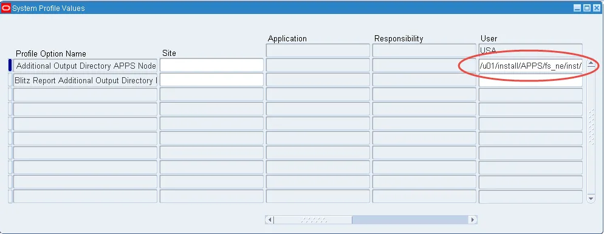
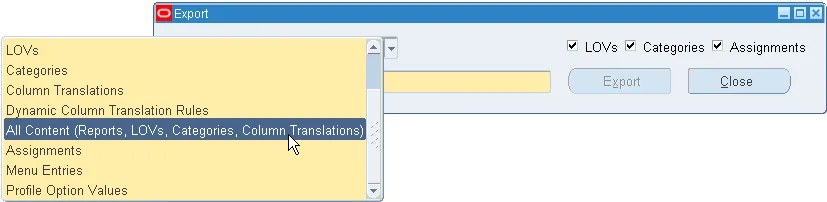
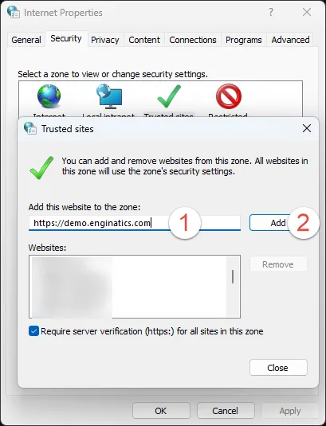

# Blitz Report Developer Guide

## 3. Tips and Tricks

### 3.1 Debugging

If you encounter an error during Blitz Report execution e.g. the message 'Blitz Report output file creation failed.', then this is usually due to an error encountered during SQL execution.

**Debugging steps:**

1. Review the report concurrent logfile for error messages
2. Try to execute the SQL as shown in the logfile directly in a development tool such as Toad or SQL Developer for further debugging
3. The logfile also shows the user entered parameter values and corresponding bind variables

### 3.2 Using Firefox with Oracle EBS

We recommend using Firefox instead of Internet Explorer to access Oracle EBS, as it has better performance and allows automated download and opening of output files without repeatedly prompting for confirmation.

#### Download Historic Version

Since Firefox stopped supporting NPAPI plugins in their latest version, you either need to have Java Web Start installed, or use the last supported 32bit ESR version 52, which can be downloaded from the Mozilla [version history](https://ftp.mozilla.org/pub/firefox/releases/).

#### Remove Mozilla Maintenance Service

To make sure that Firefox does not update itself, remove "Mozilla Maintenance Service" Windows program. The steps may vary depending on your Windows version.

#### Disable Automatic Updates

After installation, ensure that you have disabled automated updates in:

**Options > Advanced > Update**


And check that the Java plugin shows up in:

**Add-ons > Plugins**


If the Java does not appear in this list, check that you have the 32 bit version of the Java RE installed and confirm the 32 bit version 52 of Firefox by navigating to Help Menu > Troubleshooting Information and check that the User Agent string contains 'WOW64'.


### 3.3 Incremental Outbound Interface

Integration with Oracle's concurrent delivery options allows scheduling a Blitz report as an outbound interface or monitoring tool. If you need to transfer incremental data changes only, you can restrict the query to records modified since the previous scheduled request run by a parameter SQL like the following example:

```sql
rctla.last_update_date>=
(select
fcr0.actual_start_date
from
fnd_concurrent_requests fcr,
fnd_concurrent_requests fcr0
where
fcr.request_id=fnd_global.conc_request_id and
fcr.parent_request_id=fcr0.request_id)
```

You can find an example of such a parameter restriction in the seeded report **FND Concurrent Requests**, which uses this logic in parameter 'Incremental Alert Mode' to monitor concurrent request activity and send an alert email e.g. only in case of errors that occurred since the last scheduled report run.


If a scheduled report does not retrieve any data, Blitz Report does not send an empty output file. In case you also want to send empty output files for scheduled reports, set the profile option 'Blitz Report Suppress Empty File Delivery' to 'No'.

If you want to give your outbound interface report an additional level of protection and allow modifications by users with 'System' access profile only, set its type to 'Protected'.

### 3.4 Data Warehouse

Blitz Report's output files can also be used as a simple data warehouse, e.g. by scheduling reports and writing the output files in XLSX or CSV format to a server directory.

#### Configuration

| Profile Option | Description |
|---------------|-------------|
| **Blitz Report Additional Output Directory** | Location of output files (can be set for application or database server) |
| **Blitz Report Additional Output Filename** | Defines the template of the output filename |



Setting the filename profile to a template containing date format string like `<report_name>_<DD-Mon-YYYY>` and scheduling a report every 30 minutes, for example, would write one separate file per day which gets refreshed with current data every 30 minutes.

This generates a time series of data files, which can then be used as data warehouse for analysis by other tools such as:

- Microsoft Power BI
- Qlik Sense
- Tableau
- OBIEE


### 3.5 MS Excel and CSV Files

#### Default Delimiter

When opening a comma-separated CSV file with Microsoft Excel, the data gets parsed and arranged into different columns automatically. For this parser to work, the delimiter used in the output file needs to match the delimiter defined in the client computer's regional settings.

In some countries, the default regional settings use a semicolon instead of a comma separator. To open output files correctly for these cases, there are three options:

| Option | Description |
|--------|-------------|
| **Option 1** | Set the output format for Blitz Reports to TSV (tab-separated-values). Note: Requires additional setup to associate TSV file extensions to Excel. |
| **Option 2** | Change the client computer's regional settings from a semicolon to a comma |
| **Option 3** | Set profile option 'Blitz Report CSV Delimiter' according to the regional settings |

#### Column Type Detection – Retain Leading Zeroes

When opening CSV files, Microsoft Excel automatically detects column datatypes and formats the data accordingly.

If you have alphanumeric data with numeric content, such as serial numbers for example, Excel's automated type detection would import the data as number format and lose any leading zeroes.

This problem can be avoided by prefixing column data with an equal sign and enclosing it in double quotes to retain the alphanumeric format:

```sql
'="'||cii.serial_number||'"' serial_number
```

> **Note:** If you apply this workaround to your report SQLs and run them in XLSX output format instead of CSV, Blitz Report will automatically remove the `'="'` and `'"'` characters from the data to display correctly in Excel.

#### Macro to Filter and Freeze Top Row

One of the most common repetitive tasks when dealing with Excel spreadsheets is adding a filter and freezing the top row. For increased productivity, we recommend creating a Visual Basic macro for this task using Excel's personal macro workbook (see Microsoft's documentation on how to create a VB macro in PERSONAL.XLSB).

**Example Visual Basic code:**

```vb
Sub filter_and_freeze()
'
' macro to apply a filter and freeze the first line
'
' assign shortcut: ctrl+j
'
Selection.AutoFilter
With ActiveWindow
    .SplitColumn = 0
    .SplitRow = 1
End With

ActiveWindow.FreezePanes = True
Rows("1:1").Select
Selection.Font.Bold = True
Range("A1").Select

Dim myColumn As Integer
Dim iColumn As Integer
Cells.Select

With Selection
    .WrapText = False
End With

Range("A1").Select
myColumn = Cells.SpecialCells(xlCellTypeLastCell).Column
Range(Cells(1, 1), Cells(1, myColumn)).EntireColumn.AutoFit

For iColumn = 1 To myColumn
    If Columns(iColumn).ColumnWidth > 40 Then _
        Columns(iColumn).ColumnWidth = 40
Next iColumn
End Sub
```


### 3.6 Blitz Report Production Deployment

High level steps for your Blitz Report migration from test to production:

1. **Upgrade the test environment** to the latest Blitz Report code by downloading the installation .zip file and running `install.sh`

2. **Export all report metadata** from the test environment:
   - Navigate to Setup > Tools > Export > All Content

   

3. **Optionally export profile option values** - If there are many Blitz Report profile option values set up in the test environment and you don't want to set them up manually in production, export the Blitz Report related profile option values, which creates a SQL script that can be run on production to load them automatically

   

4. **Install Blitz Report in production** using instructions from the [installation guide](https://www.enginatics.com/blitz-report-installation-guide/)

5. **Import the XML file** - In the production Blitz Report, navigate to Setup > Tools > Import > XML Upload and select the XML file exported previously

6. **Optionally run the SQL script** generated previously to load the Blitz Report profile option values

### 3.7 MS Excel Blocked Macros Warning

You may face the following warning when using Excel templates with macros after running a report and opening the output:

> **SECURITY RISK** Microsoft has blocked macros from running because the source of this file is untrusted.


#### Solution

To fix this, please add the EBS URL to the trusted sites or ask your system administrator to do it. The required steps may differ depending on your operating system version.

**Steps for Windows 11:**

1. Type 'Internet Options' in the Windows search box
2. Navigate to the Security tab
3. Select "Trusted sites"
4. Click "Sites" button
5. Add your EBS URL to the list





*Source: [Enginatics Blitz Report Developer Guide](https://www.enginatics.com/blitz-report-developer-guide/)*
