## 1. Creating a Blitz Report

### 1.1 Report Creation Steps

With Blitz Report you can easily leverage existing SQL to create reports for your users. There is a  [training video](https://www.enginatics.com/blitz-report-training-videos/) available on creating a report from an SQL query.

A Blitz Report consists of an SQL query to retrieve the data, and optional parameters that enable users to control or restrict data returned by a report.

To create new Reports, the profile option 'Blitz Report Access' must be set to either 'Developer' or 'System'. With this profile setting, the Blitz Report run window shows an additional 'Setup' button, which opens the setup window as shown below.

**Basic steps to create a new report are:**

1. Enter a report name and an optional description
2. Enter the main extraction SQL
3. Define optional parameters and corresponding WHERE clause / SQL text
4. Test the report by clicking the 'Run' button
5. Set up the user access rights

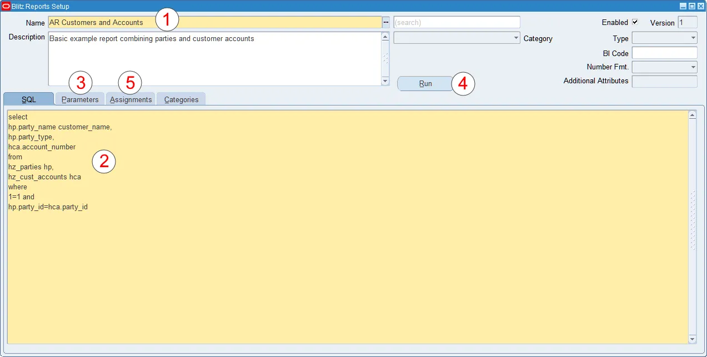

Unlike most reporting tools, Blitz Report creates dynamic SQL at run-time, combining the extraction SQL and the user-specified parameters in an optimal way. This allows unused parameters to be dropped at run-time, thus eliminating a frequent source of non-performant SQL – the very common WHERE clause for optional parameters `column_name=nvl(:bind_variable, column_name)`.

To ensure that there is no unnecessary parsing of the dynamic SQL, Blitz Report's parameterization uses bind variables.

### 1.2 Anchors and Binds

Anchors are 'placeholders' in the extraction SQL, which allow the precise placement of additional (optional) parameterized SQL clauses at run-time. These clauses are constructed from user-specified parameters, which are then inserted into the extraction SQL at run-time. There are two types of Anchors:

#### n=n

WHERE clause SQL anchors, such as `1=1`, `2=2` etc. Blitz Report inserts the associated SQL text directly before these anchors, automatically adding the keyword `and` and a line feed, to create valid SQL. This allows quick parameter creation – no need to consider the precise position of the `and` keyword.

A typical example for a SQL text would be `column_name=:bind_variable`, where `:bind_variable` would be bound with the parameter value entered by the user.

> **Note:** A common coding practice is to write non-Blitz Report SQL with a `where 1=1` clause, usually for formatting purposes. This does no harm when importing the SQL into Blitz Report, and may actually be useful, since it serves as the obvious anchor for any parameterized WHERE clauses.

#### &lexical

Lexical parameter references work in the same way as lexical parameters in sqlplus or Oracle reports. Blitz Report replaces these placeholders completely with the parameter SQL text at run-time. To replace a lexical with the user entered parameter value, use the string in the SQL text field. If a parameter value is left blank, the corresponding reference is removed before SQL execution.

Note that the two different anchor types achieve similar goals, which is to inject additional (optional) parameterized SQL clauses into the extraction SQL.

However, the `n=n` anchor can only be used for WHERE clauses (since the `n=n` syntax remains in the run-time SQL).

The `&lexical` anchor can be used to add whatever SQL 'snippets' are required by the report, featuring (but not limited to):

- WHERE clauses
- Dynamic tables and columns
- ORDER BY, GROUP BY
- HINTS
- Complete subselects or EXISTS clauses

The same anchor may be used multiple times inside a report SQL. Blitz Report inserts the corresponding parameter text for each occurrence.

A lexical parameter SQL text may contain a bind variable, which will be bound with the parameter value entered by the user when running the report.

In case you require the parameter value to show up as lexical text in the SQL, e.g. to purposefully enforce reparsing for different parameter values, you can use placeholder `<parameter_value>` as shown in the examples table below.

#### :bind

Similar to other reporting solutions, Blitz Report also supports the use of bind parameters. To avoid performance issues due to `nvl(:bind_variable, column_name)` coding for optional parameters however, it is recommended to use one of the above anchors for dynamic SQL instead.

Some words are reserved by Oracle and can not be used as bind variables. To find a list of such words use the following query:

```sql
select keyword from v$reserved_words where reserved='Y' or res_semi='Y' order by keyword asc;
```

#### Examples

| Anchor Type | Report SQL | Parameter SQL text | Run-time SQL |
|-------------|------------|-------------------|--------------|
| n=n | `where 1=1` | `fu.user_name=:user_name` | `where fu.user_name=:user_name and 1=1` |
| n=n | `where 1=1` | `furg.user_id in (select fu.user_id from fnd_user fu where fu.user_name=:user_name)` | `where furg.user_id in (select fu.user_id from fnd_user fu where fu.user_name=:user_name) and 1=1` |
| &lexical | `where &account hp.party_id=hca.party_id` | `hca.account_number=:account and` | `where hca.account_number=:account and hp.party_id=hca.party_id` |
| &lexical | `group by &group_by_vendor pha.currency_code` | `pv.vendor_id,` | `group by pv.vendor_id, pha.currency_code` |
| &lexical | `select &columns frv.responsibility_name` | `fu.user_name, fu.email_address,` | `select fu.user_name, fu.email_address, frv.responsibility_name` |
| :bind | `where fu.user_name=:user_name` | | `where fu.user_name=:user_name` |

#### :sheet_name

By default the Excel output's data sheet name is the same as the report name. A parameter referencing the `:sheet_name` anchor allows to define a custom sheet name. It can be set up as a standard visible parameter, but also hidden by using a negative display sequence, for example dependent on another parameter.

Example: The Sheet name parameter inherits its value from the Operating unit parameter concatenated with the word 'suppliers' by using the following default value: `:$flex$.operating_unit||' suppliers'`

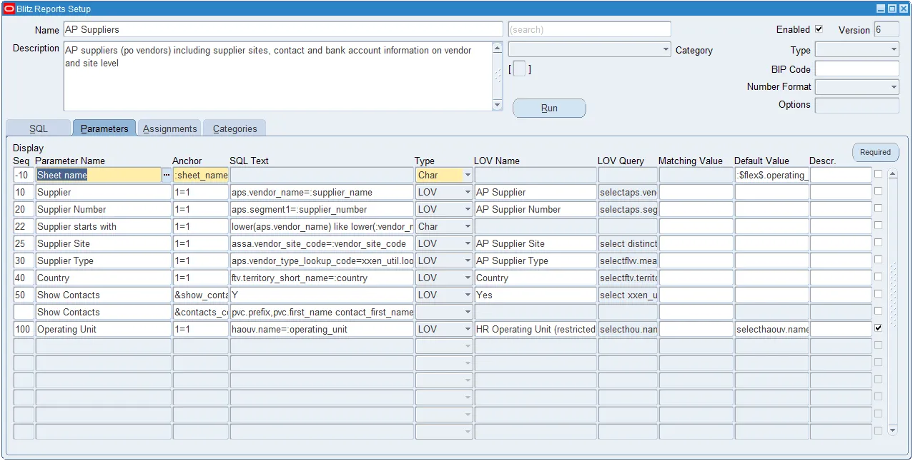

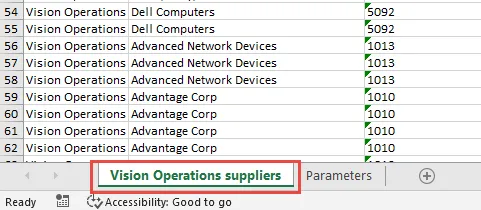

### 1.3 Dynamic SQL Example

#### n=n Anchor Example

A query on parties and accounts (see below) should allow users to extract all customers' information or to restrict the data by optional parameters such as customer name or account number.

```sql
select
hp.party_number,
hp.party_type,
hp.party_name,
hca.account_number
from
hz_parties hp,
hz_cust_accounts hca
where
1=1 and
hp.party_id=hca.party_id
```

A restriction to customer name would require addition of a WHERE clause:

```sql
upper(hp.party_name) like upper(:customer_name)
```

In Blitz Report, the parameterized WHERE clauses are set up separately from the report SQL. Blitz Report only inserts individual WHERE clauses into the extraction SQL (at run-time) if the user enters a value for that particular parameter.

In this example, if the user provides a value for the customer name parameter, Blitz Report would add the above WHERE clause at the position of the anchor `1=1` and execute the below SQL for data extraction:

```sql
select
hp.party_number,
hp.party_type,
hp.party_name,
hca.account_number
from
hz_parties hp,
hz_cust_accounts hca
where
upper(hp.party_name) like upper('George Clooney') and
1=1 and
hp.party_id=hca.party_id
```

#### Pivot Table in SQL

There is possibility to have dynamic pivot table described in SQL. It is done using `&lexical` parameter reference.

For example you need to list your balances grouped by ledger and code combination:

```sql
select
gl.name,
xxen_util.concatenated_segments(gb.code_combination_id),
gb.period_name period_name,
sum(nvl(gb.period_net_dr,0)-nvl(gb.period_net_cr,0)) amount
from
gl_balances gb,
gl_ledgers gl
where
gl.ledger_id=gb.ledger_id
group by
gb.period_name,
gl.name,
gb.code_combination_id;
```

With pivot table parameter:

```sql
select *
from (
select gl.name gl_name
,xxen_util.concatenated_segments(gb.code_combination_id) coa_cc
,gb.period_name
,period_name
,sum(nvl(gb.period_net_dr, 0) - nvl(gb.period_net_cr, 0)) amount
from gl_balances gb
,gl_ledgers gl
where 1 = 1
and gl.ledger_id = gb.ledger_id
group by gb.period_name
,gl.name
,gb.code_combination_id
)
pivot(sum(amount) for period_name in (&gl_period_pivot))
```


### 1.4 Report Header

#### Name

Report name uniquely identifies reports. Names should be short and descriptive.

Good practice is to prefix report names with the appropriate Oracle EBS module short code.

#### Description

An optional report description of maximum 4000 characters may be set up to assist users in understanding and using the report.

#### Search

This Google like search functionality retrieves reports by report name, description or underlying SQL. You can search for example for a table or column name accessed by a SQL, or by parts of the report name or description.

#### Category

Retrieve reports by category.

#### Enabled

Defines whether a report is visible to end users. Disabling a report removes it from the user report list. This may be useful during the development and testing phase. Even if a report is disabled, it may still be run by users having User Admin, Developer or System access.

#### Version

Click on a report's version number to review the change history and previous report SQLs. A new version number is added and stored automatically for each report SQL update. Other report setup modifications such as report name, description or parameter changes are not tracked in the version history.


#### Type

Reports of type 'Protected' or 'System' are visible to users with access profiles set to 'User Admin' or 'Developer', but may only be edited by users which have their access profile set to 'System'.

This serves as an additional level of protection for reports providing important system functionality such as outbound interfaces or search screens.

#### BIP Code

BI Publisher data definition code. When populated, Blitz Report executes the dataTrigger section e.g. beforeReportTrigger of the associated data definition XML template. This allows running BI Publisher report SQLs through Blitz Report where the data extracted is based on global temporary tables preprocessed in the before report trigger.

Double click onto the BI Code to download and view the data definition XML template.

#### Number Format

Format for numeric value display in Excel output files. By setting the number format, you can, for example, change the number of decimals or the display style and color of negative numbers.

The number format can either be set by a profile option, for all columns in a report, or for individual columns as described in the column translations section.

The list of available format codes is defined in lookup `XXEN_REPORT_NUMBER_FORMATS`, which can be extended with additional custom format codes according to your needs.

#### Report Options

Report Options define additional attributes and processing options for a specific report:

1. The report from which it was copied
2. Before and after report triggers which can be used for data pre- and post processing
3. Email to identify the author of a report
4. Default email to send the report output after its completion
5. Default report output format
6. Default limitation on the number of rows returned by the report
7. Time limit in minutes after which the report is terminated by the 'Blitz Report Monitor' program
8. Custom unix script to be executed after the report completion
9. Excel output file name, downloaded to the client desktop
10. Directory on the application server to save a copy of the report output file
11. Directory on the database server to save a copy of the report output file
12. Naming convention for output files if additional output directories are defined
13. Request type for defining concurrent managers specialization rules
14. Standby database name to run report on


#### DB Package

Package name containing pre and post processing functions, which can be used for example to call Oracle standard PLSQL code or to run additional processes before or after report execution. The functions need to follow the naming convention: `afterpform`, `beforereport`, `afterreport` and return the boolean data type.

#### Author email

Email address of the report author. Additional information can be found on registered authors in the [online library](https://www.enginatics.com/reports/).

#### Email

Default email address for sending output files. If different email addresses are set up on different levels, the default email on the Blitz Report run window is derived in following order:

1. Default email setup on report level
2. Profile option 'Blitz Report Default Email Address'

It is possible to populate this field in two formats:

1. Comma-separated email list. E.g. `user1@domain.com,user2@domain.com`
2. SQL statement returning one column containing email addresses:

```sql
select
coalesce(fu.email_address,
(select papf.email_address from per_all_people_f papf where fu.employee_id=papf.person_id
and sysdate between papf.effective_start_date and papf.effective_end_date)) email
from
fnd_user fu
where
fu.user_id=fnd_global.user_id
```

> **Note:** Blitz Report's email functionality is available from EBS version R12 onwards only.

#### Output Format

Allows changing the output format from Excel XLSX (Excel) to CSV (comma separated values) or TSV (tab separated values).

#### Row Limit

Limits the maximum number of lines for report execution.

#### Time Limit

Maximum run time limit in seconds. The Blitz Report Monitor concurrent program automatically cancels reports exceeding the set time limit.

A time limit can also be set when running reports or using profile option 'Blitz Report Time Limit'. If there are values set on different levels, the order of precedence is as follows:

1. Run window options time limit
2. Profile option on user level
3. Time limit on report level
4. Profile option on responsibility level
5. Profile option on site level

#### Custom Postprocess

Provides the same functionality as the Custom Postprocess runtime option to default a postprocess on report level.

#### Output Filename

Provides the same functionality as the Output Filename runtime option to default the output filename format on report level.

#### Additional Out. Directory on APPS Server

Saves a copy of the report output file in the specified directory on the application server. Tokens can be used to create a directory path dynamically.

#### Additional Out. Directory on DB Server

Saves a copy of the report output file in the specified directory on the database server.

#### Additional Out. Filename

Naming convention for output files if additional output directories are defined. Tokens can be used to create a filename dynamically.

#### Request type

Allows assigning request types defined under System Administrator > Concurrent > Program > Types to specific Blitz Reports. Request types can be used in concurrent managers specialization rules.

#### Target Database

Allows running blitz reports on a standby database. Specify a TNS descriptor defined in `$TNS_ADMIN/tnsnames.ora` on the apps server.

#### SQL

The report extraction SQL must start either with the word `select` or `with`. Blitz Report does not parse the SQL syntax for validity. SQL entry through the form is limited to 32767 characters. To create a report with a larger SQL, use the Upload Large SQL functionality from the tools menu.

#### 'Blitz Report Information' Descriptive Flexfield

New 'Blitz Report Information' descriptive flexfield allows to store additional information, e.g. for change management.

### 1.5 Parameters

Parameter definitions consist of:

- A parameter name, display sequence and optional parameter description and default value
- SQL text to be inserted into the report SQL dynamically at run-time
- An anchor as a reference to a position for the insertion
- A parameter type and optional LOV
- An optional matching value to restrict the SQL text insertion to certain parameter values

#### Display Sequence

Sequence number that defines the order in which parameters are displayed.

If different WHERE clauses are used for the same parameter name, e.g. to insert a different SQL text at different SQL positions or depending on different parameter matching values, display sequence is populated only for one record and left blank for subsequent lines of that parameter name.

Negative display sequence numbers are used to define hidden parameters. These can be used to populate a `&lexical` with a SQL text dynamically before report execution.

#### Parameter Name

Parameter identifier. You can use the LOV to copy existing parameter definitions from other reports.

If you need a different SQL text in different SQL positions for one parameter, you can have more than one entries for the same parameter name, but only one of them can have a display sequence, parameter type and list of values setup.

#### SQL Text

Parameter specific text added dynamically into the report SQL if a value for the parameter is entered at run-time. Usually, the SQL text forms a where-clause restriction including a bind variable name starting with a colon e.g. `:account_number`. Blitz Report automatically detects the variable and binds it with the value entered by the user.

A maximum of one bind variable per parameter is allowed. If a parameter's SQL text contains more than one bind variables, only the first one is bound with the entered parameter value.

#### Multiple Values

If the SQL text includes a bind variable restriction and the user checks the multiple values checkbox, Blitz Report automatically replaces the restriction with an IN-clause during SQL execution. This replacement works for restrictions using 'equal', 'like', 'not equal' or 'not like' operators such as:

```sql
column_name=:bind_variable
column_name<>:bind_variable
column_name!=:bind_variable
column_name like :bind_variable
column_name not like :bind_variable
```

You can also use functions, for example:

```sql
upper(column_name) like upper(:bind_variable)
```

> **Note:** The multiple values functionality is only available for parameters with anchor styles `1=1` or `&lexical`, not for `:bind` anchors.

#### Anchor

The position inside the report SQL where the parameter SQL text is inserted. The LOV for this field shows all anchors used in the SQL.

#### Parameter Type

The parameter type definition controls validation of parameter values at run-time:

| Type | Description |
|------|-------------|
| **Char** | Free text / no validation |
| **Date** | A valid date. Even if you have timezone conversions enabled, the entered parameter value will be used as a bind for SQL execution without any conversion (midnight of the date entered). |
| **DateTime** | A valid date including timestamp. If you have timezone conversions enabled, the entered parameter value will be converted to server time before it is used as a bind for SQL execution. |
| **Number** | A valid number |
| **LOV** | Select from existing stored Blitz Report list of values. Changes to the LOV affect all parameters referencing it. |
| **LOV custom** | Create an ad hoc LOV based on an SQL statement for validation of the current report parameter only. The LOV SQL may select an optional 'id' column and must include the two columns 'value' and 'description'. |
| **LOV Oracle** | Allows selecting Oracle standard value sets for parameter validation. |

#### LOV Name

Name of a shared LOV or Oracle standard value set.

#### LOV Query

SQL statement of a list of values. Double click in this field to open the LOV definition window. The LOV query must select the columns 'value' and 'description', and it may include an optional 'id' column.

#### Matching Value

If the parameter value entered at run-time matches the matching value, then the corresponding SQL text is inserted.

Matching values may contain wildcard characters. If, for the same Anchor, the parameter value entered by the user matches more than one matching value due to use of wildcards, then the SQL text of the best (longest string) match is inserted.

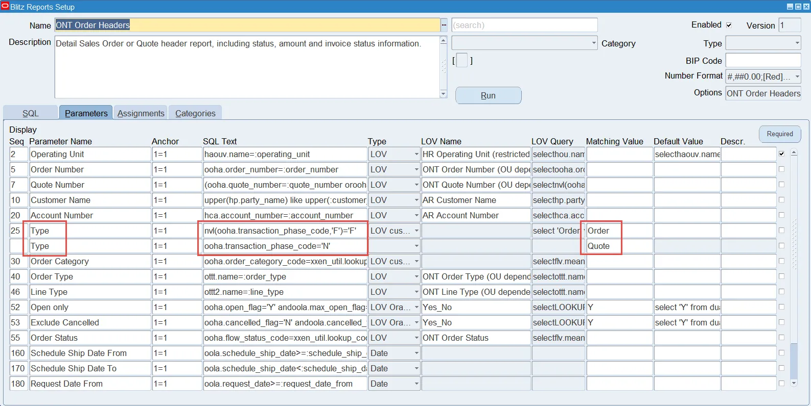

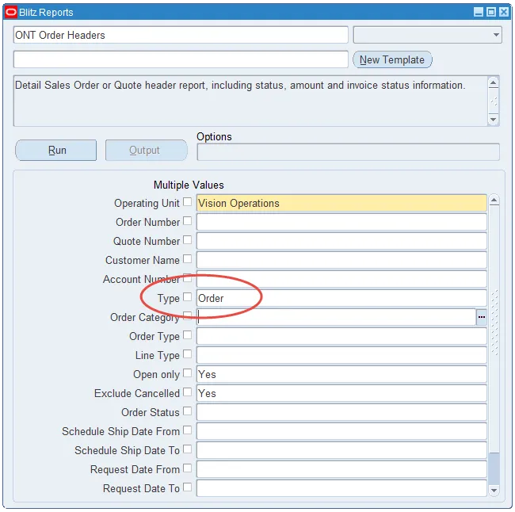

#### Default Value

Specifies a default parameter value. If the value starts with the keyword `select`, then Blitz Report would execute the SQL to derive the default value dynamically instead of using a fixed value.

Example - to get the current date in GL period format:

```sql
select to_char(sysdate,'MON-RR') from dual
```

Some functions can be used without selecting from dual:

```
abs, add_months, bitand, cast, ceil, chr, coalesce, decode, greatest, initcap, instr, last_day, least, length, lower, lpad, mod, months_between, nvl, nvl2, power, regexp_replace, regexp_substr, replace, round, rtrim, sign, substr, substrb, to_char, to_date, to_number, translate, trim, trunc, upper, userenv
```


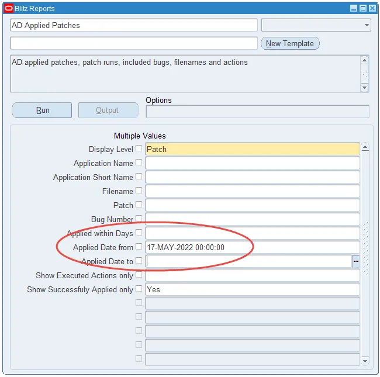

#### Description

Additional parameter description displayed in the bottom left message area of the Blitz Report run window.

#### Required

The required flag enforces a parameter value entry by the user, for example to prevent accidental report submission with insufficient parameter restrictions.

#### Advanced Required Parameters

Using the 'Required' button, you can define an advanced definition for required parameters by entering a logical expression based on parameter names.

Example of a logical expression forcing the user to enter either the parameter 'Customer Name' or 'Account Number':

```sql
:Customer_Name is not null or :Account_Number is not null
```

Parameters are referenced by their names (in the installed base language, usually US), prefixed with a colon and having spaces or other non-word characters replaced with a single underscore.

#### Dependent Parameters

Similar to Oracle standard's dependent parameter functionality, you can define parameter dependencies in LOV queries and default values using the syntax:

```
:$flex$.parameter_or_lov_name
```

Where `parameter_or_lov_name` is a reference to either the parameter name in US language or to the LOV name of the parameter, which the query depends on.


In case you want to use multiple values functionality for a parameter which the query depends on, `xxen_util.contains` function can help.


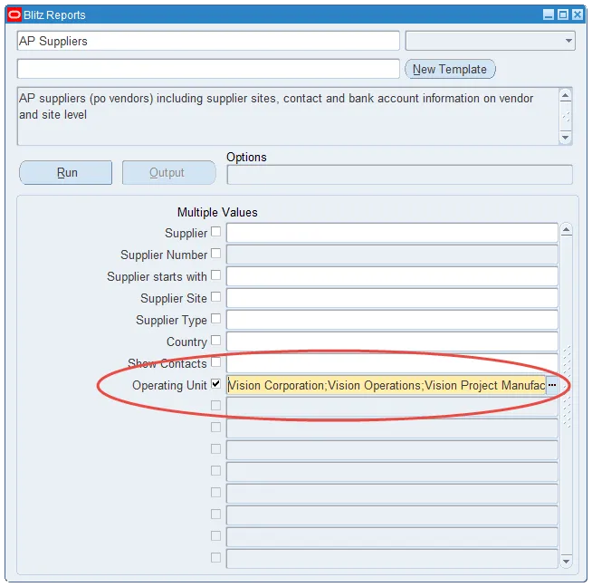

#### Dynamic Parameter SQL Text

Blitz Report provides a possibility to create parameters with dynamic SQL text which depends on a runtime value of a parameter.


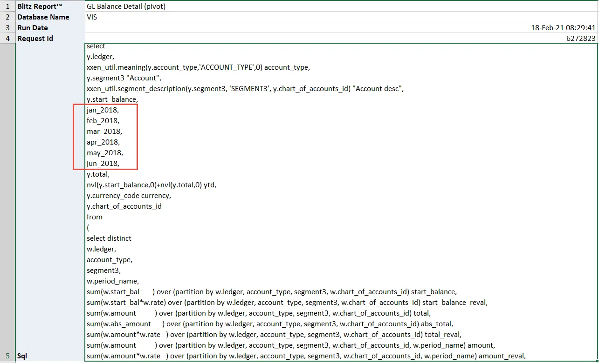

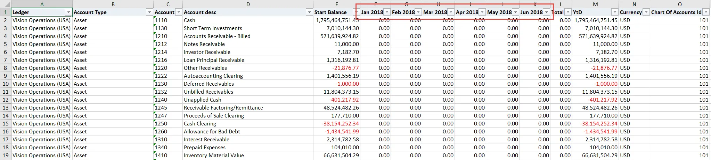

### 1.6 Assignments

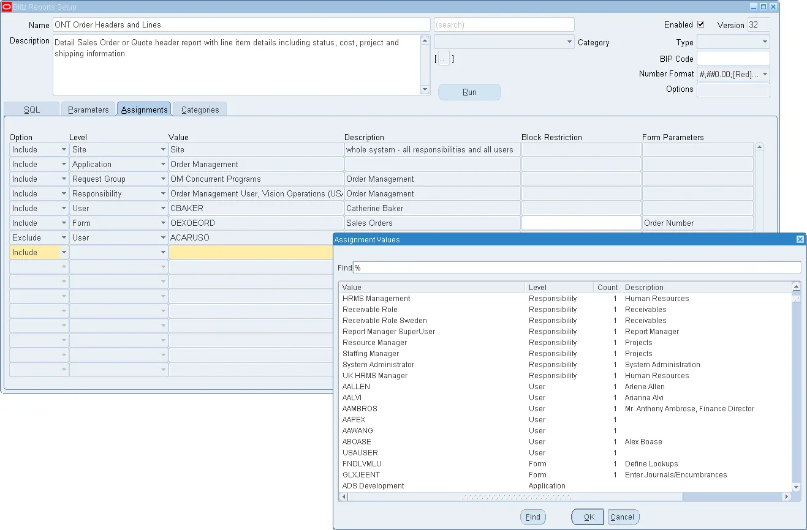

Access to individual Blitz Reports for normal users can be controlled using the following levels:

| Level | Description |
|-------|-------------|
| **Site** | All users in the system |
| **Application** | Users having a matching application (via their responsibilities) |
| **Operating Unit** | Users having access to the assignment operating unit |
| **Request Group** | Users having a responsibility linked to the assignment request group |
| **Responsibility** | Users having the assignment responsibility |
| **User** | Inclusion or exclusion by specific user |
| **Form** | Make report available from an Oracle standard form through the custom Blitz Report icon |

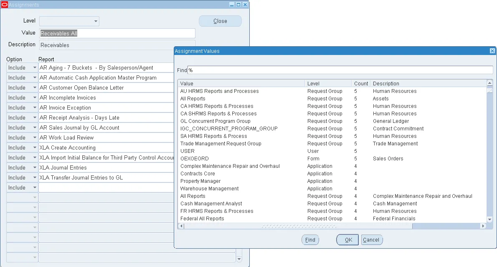

Exclusions take precedence over inclusions. A report included on Site level, but excluded for application 'Receivables', for example, would be accessible by all users in the system except from users only having responsibilities linked to the receivables application.

By default, inclusion assignments are implemented as a union, which means that the user can access a report if there is a match on any of the assignment levels.

For assignments on operating unit level in combination with request group or application, profile option 'Blitz Report Restrict Assignments by Operating Unit Level' can limit access to the combination or intersect of assignment level values instead of adding them.

#### Form Assignment

The forms assignment feature allows opening Blitz Reports directly from any Oracle EBS standard form.

To integrate a Blitz Report to a form:

1. First identify the standard form name through the top menu > Help > About Oracle Applications > Current Form > Form Name


2. Navigate to the assignment setup of the Blitz Report that you would like to integrate
3. Select the form name from the list of values
4. If needed, enter the name of that block in the Block Restriction field
5. You can pass default parameter values from the assigned form to the Blitz Report


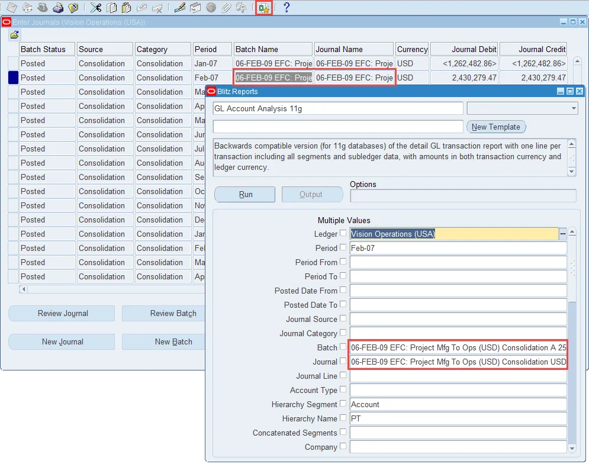

#### Default Assignments

The Blitz Report installation includes seeded reports developed by Enginatics, and their assignments to Oracle standard applications and forms. These default assignments allow business users to start working with the included reports without creating assignments for them individually.

#### Mass Assignments

Assignments can be loaded from Excel with the Blitz Report Assignment Upload.

### 1.7 Categories

If you have a large number of reports in your system, category assignments will help users to find the reports they require via the category drop-down list on the run window.

To create a new category, navigate to the menu Tools > Categories.

### 1.8 Multi-language Support

#### Report Data

If you have more than one language installed, Blitz Report offers multi-language support via the Oracle EBS translation menu icon for the following data:

- Report name
- Report description
- Parameter name
- Parameter description
- Category
- LOV description
- Column headers


#### User Messages

To add translations for user-facing messages, navigate to Application Developer > Application > Messages > query messages starting with XXEN and add translations for a different language as required.

#### User Interface Translations

The labels shown on the Blitz Report user interface can be translated via Application Developer > Application > Lookups > Application Object Library, query Lookup `XXEN_REPORT_TRANSLATIONS` and enter translations for the lookup code descriptions as required.


> **Note:** If you install an additional language in Oracle applications, in addition to running the adadmin 'Maintain multi-lingual tables' process, you need to run the concurrent request 'Blitz Report Maintain Multilingual Tables'.

### 1.9 Security and User Profiles

Blitz Report provides the following levels of security:

- The profile option 'Blitz Report Access' controls which users can consume a license, and which users have access to the report setup window.
- Assignments control which business users have access to which reports and uploads.
- Access to data within reports is secured through restricted LOVs (recommended) or by using Oracle's secured views and synonyms.
- Access to layout templates is controlled by the profile option 'Blitz Report Template Access'.
- Access to sensitive data can be restricted through additional VPD policies.

#### Access Profile Functionality Matrix

| Functionality \ Access Profile | User | User Admin | Developer | System |
|-------------------------------|------|------------|-----------|--------|
| Create modify or delete categories | no | yes | yes | yes |
| Edit licensing information | no | no | yes | yes |
| Run reports (Standard or Protected) | yes* | yes | yes | yes |
| Run reports (System) | no | no | no | yes |
| Upload data | yes* | yes* | yes* | yes |
| Assign reports (Standard or Protected) | no | yes | yes | yes |
| Assign reports (System) | no | no | no | no |
| Assign uploads | no | no | no | yes |
| Create modify or delete reports (Standard) | no | no | yes | yes |
| Create modify or delete reports (Protected or System) | no | no | no | yes |
| Create modify or delete uploads | no | no | no | yes |
| Create modify or delete column translations | no | no | yes | yes |
| Create modify or delete templates | yes** | yes** | yes | yes |

\* Users can see and run reports restricted to their assignments only.
\*\* Depending on the setup of profile option 'Blitz Report Template Access'.

### 1.10 Data Access Security

For increased flexibility and maintainability, we recommend using `_all` tables in report SQL queries, for example `ap_invoices_all`, instead of Oracle's VPD secured synonyms, such as `ap_invoices`.


Security is then applied by adding a required Operating Unit parameter in Blitz Report with an LOV that contains the allowed Operating Units only.


This approach allows greater flexibility, e.g. to enable certain users, such as in shared service centers, to see all data in the system, or to test SQL queries through database access tools, without having the application user session context initialized.

### 1.11 Securing Sensitive Information with Oracle Virtual Private Database

With Blitz Report, you can use Oracle Virtual Private Database (VPD) to control access to sensitive data. VPD policies are set up on database objects to automatically add restrictions before SQL execution, thus preventing visibility of sensitive information.

Blitz Report includes the following objects to maintain these:

- Lookup `XXEN_REPORT_VPD_POLICY_TABLES` to define the tables or columns to be secured
- Concurrent program **Blitz Report Update VPD Policies** to create or update VPD policies
- Concurrent program **Blitz Report Remove VPD Policies** to completely remove all Blitz Report VPD policies
- Database package `XXEN_VPD` containing the policy function code
- Profile option **Blitz Report VPD Policy Rule** to control data access

#### Steps to Secure Your Data

**1. Set up tables or column names in lookup XXEN_REPORT_VPD_POLICY_TABLES**

Application Developer > Application > Lookups > Application Object Library: Query lookup type `XXEN_REPORT_VPD_POLICY_TABLES` and enter one lookup value for each table or table column that need to be secured.


**2. Run concurrent program 'Blitz Report Update VPD Policies'**

System Administrator > Concurrent > Requests: Run concurrent program 'Blitz Report Update VPD Policies'. This program first removes all possibly existing Blitz Report VPD policies, creates the policy function package `XXEN_VPD` and then creates database policies for all tables and columns referenced in the lookup.

**3. Optionally set profile option 'Blitz Report VPD Policy Rule'**

System Administrator > Profile > System: Set profile option 'Blitz Report VPD Policy Rule' to 'Full access' for responsibilities or users who should have access to run Blitz reports on secured data.

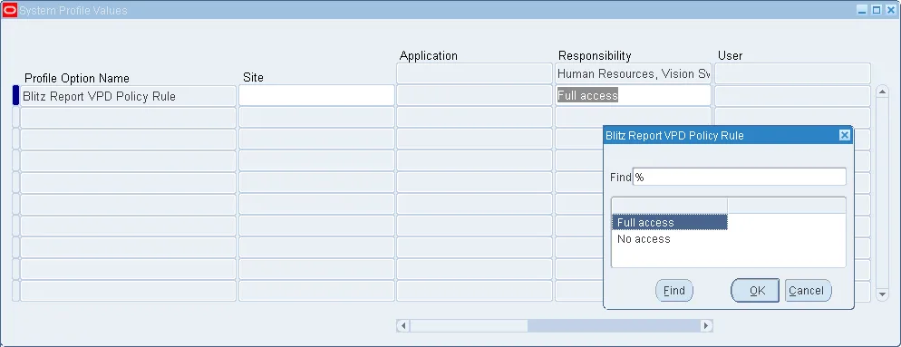


*Source: [Enginatics Blitz Report Developer Guide](https://www.enginatics.com/blitz-report-developer-guide/)*
