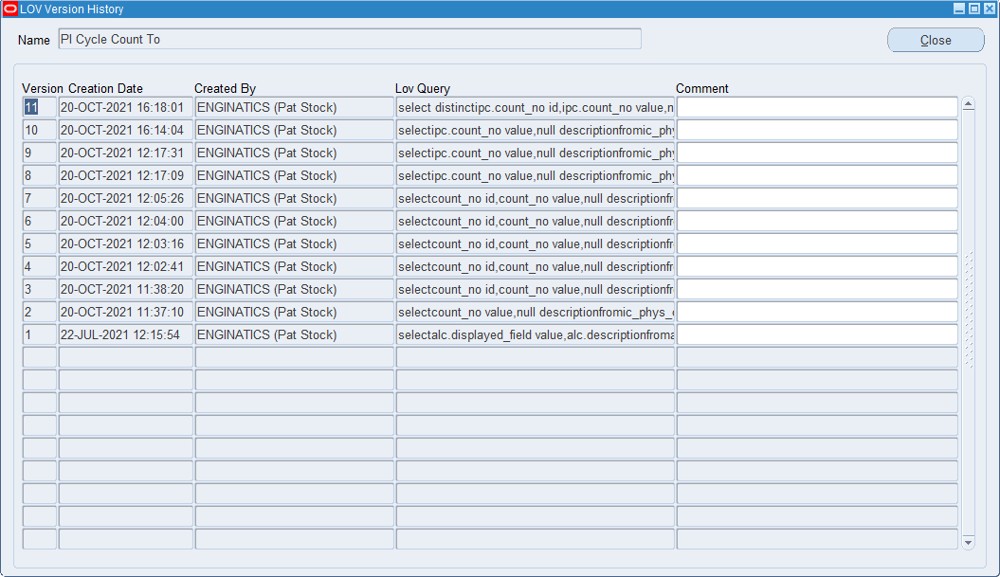
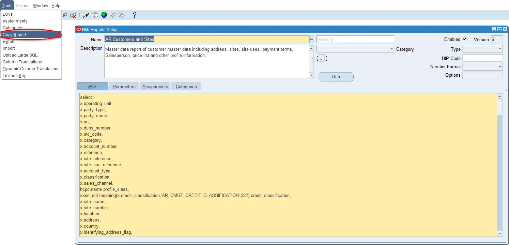
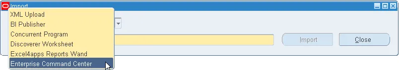
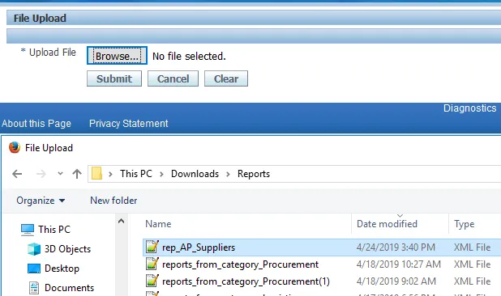
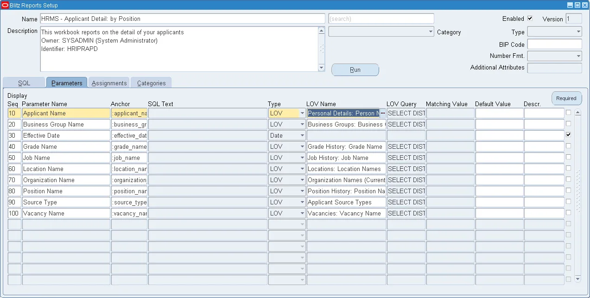
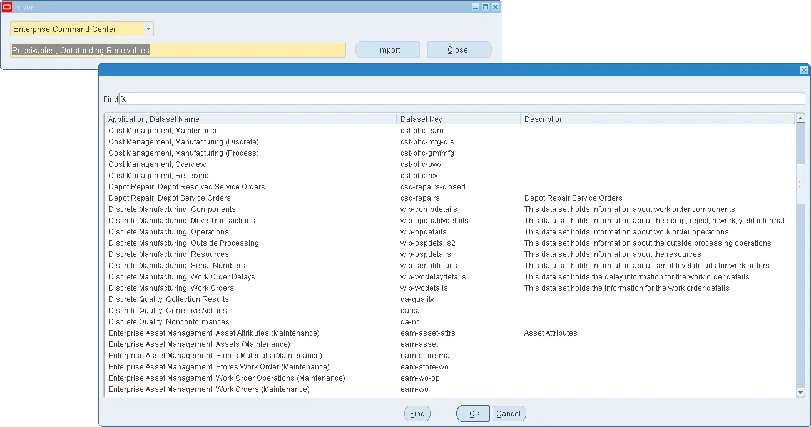
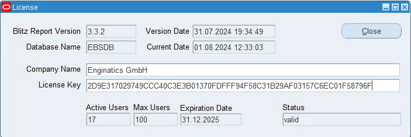
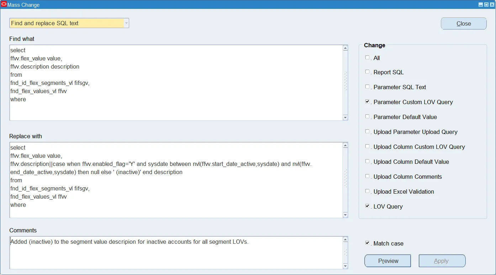

## 2. Tools Menu


### 2.1 LOVs

Use the LOV setup window to define list of values shared by different report parameters. Changes to a shared LOV affect all report parameters referencing the LOV.


#### Name

Unique name for shared LOVs.

#### Description

Description for shared LOVs. This description is displayed in the bottom left message area of the run window, if parameter description is left blank.

#### Validate From List

If checked, the parameter validation enforces selection of one record from the LOV and does not allow use of wildcards. If unchecked, the parameter value is not validated against the LOV and use of wildcards is allowed.

#### Filter Before Display

The Filter Before Display setting is used to avoid performance issues for large LOVs. If unchecked, which is the more user-friendly default, Blitz Report queries all possible parameter values from the LOV in the background when selecting a report on the run window. As this can be slow for large LOVs, checking the 'Filter Before Display' setting prompts the user to enter a (partial) value before LOV display, and the form then queries a restricted dataset instead of all records.

#### Used By

The 'Used By' button shows all reports and parameters referencing the LOV.

#### LOV Query

SQL query for LOVs, selecting the two mandatory columns 'value' and 'description', and it may include an optional 'id' column at the beginning of the select clause.

#### Version

Double click on a LOV version number to review the change history and previous LOV SQLs. Note that a LOV report version number is added and stored automatically at each update of a LOV's SQL. Other LOV modifications such as LOV name, description are not stored in the version history.



### 2.2 Tools > Assignments

The Assignment function in the Tools menu allows to mass-assign different reports to one assignment level, or to review existing assignments through the assignment value LOV.

Defines access to reports for users on a particular assignment level.

### 2.3 Tools > Categories

Categories can be defined to help users find reports, or to migrate specific reports between environments though the export and import options.

### 2.4 Copy Report

Creates a new copy of an existing report. This functionality should be used if user wants to do any changes to the existing Blitz report.

Seeded reports should not be modified as all updates will be removed as soon as new version of Blitz Report will be installed.



> **Note:** Assignments and category assignments are not copied.

### 2.5 Copy LOV

Creates a new copy of an existing LOV. This functionality should be used if user wants to do any changes to the existing LOV.

Seeded LOVs should not be modified as all updates will be removed as soon as new version of Blitz Report will be installed.


### 2.6 Export

The Blitz Report export functionality allows to generate XML files or SQL scripts for automated load of report definitions, LOVs, categories and other Blitz Report related setup for migration purposes.


The following items can be exported:

- Report
- Reports from Category
- Reports except Category
- Reports from Application
- Reports matching a search pattern with the use of wildcards
- LOVs
- Categories
- Column Translations
- Dynamic Column Translation Rules
- Assignments

#### Export Checkboxes

When choosing one of the Report export options, you can use checkboxes to decide which related object information you would like to include in the exported XML file:

| Option | Description |
|--------|-------------|
| **LOVs** | All list of value definitions used by parameters of the exported reports |
| **Categories** | All category definitions of the exported reports |
| **Assignments** | Includes all report assignments in the export |
| **Templates** | Includes all templates in the export |
| **Columns** | Includes optional multi language column translation and number format settings |


Examples:

To generate an XML file for migration of a single report, choose ‘Report’ and select the report name from the list of values.
To generate an XML file for migration of all reports starting with a specific text, for example FND%, choose ‘Report by Search pattern’ and enter that text in the form.


#### Blitz Report Library

To download XML files from the [Blitz Report library](https://www.enginatics.com/reports/), find the desired report and click on the XML icon in the 'Download' column.

#### Notes

- If a report already exists, the load script or import from the XML file updates it with the new definition while keeping the previous SQL in the version history.
- Report version numbers are generated automatically in each environment and thus may differ between environments.
- Report load scripts and XML files contain current report SQLs versions only. They do not include previous versions SQL history.
- The load of parameters based on shared LOVs requires the referenced LOV to be imported first.

#### Export API

To export Blitz Reports programmatically, use the following function in package `XXEN_API`:

```sql
function export_file_data(
  p_type in varchar2, --'SQLs', 'SQL Versions', 'Menu Entries', 'Profile Option Values', 'Reports', 'Templates', 'LOVs', 'Column Translations', 'Dynamic Column Translation Rules', 'Assignments', 'All Contents'
  p_ids in fnd_table_of_number default null,
  p_include_lovs in varchar2 default null,
  p_include_categories in varchar2 default null,
  p_include_assignments in varchar2 default null,
  p_include_templates in varchar2 default null,
  p_include_columns in varchar2 default null,
  p_creation_date in date default null,
  p_language in varchar2 default null
) return clob;
```

To export a single report:

```sql
function export_report_(
  p_report_id in number,
  p_include_lovs in varchar2 default null,
  p_include_categories in varchar2 default null,
  p_include_assignments in varchar2 default null,
  p_include_templates in varchar2 default null,
  p_include_columns in varchar2 default null,
  p_language in varchar2 default null
) return clob;
```

**Example - Export all reports containing "test" in their name:**

```sql
declare
  l_ids fnd_table_of_number:=fnd_table_of_number();
begin
  for c in (select xrv.report_id from xxen_reports_v xrv where lower(xrv.report_name) like '%test%') loop
    l_ids.extend;
    l_ids(l_ids.last):=c.report_id;
  end loop;
  dbms_xslprocessor.clob2file(xxen_api.export_file_data('Reports',l_ids,'Y','Y','Y'),'OUT_FILE_LOC','reports_which_have_test_in_their_name.xml',nls_charset_id('AL32UTF8'));
  l_ids.delete;
end;
/
```

**Example - Export to individual XML files:**

```sql
begin
  for c in (select xrv.report_name, xrv.report_id from xxen_reports_v xrv where lower(xrv.report_name) like '%test%') loop
    dbms_xslprocessor.clob2file(
      xxen_api.export_report_(
        p_report_id=>c.report_id,
        p_include_lovs=>'Y',
        p_include_categories=>'Y',
        p_include_assignments=>'Y',
        p_include_templates=>'Y'
      )
      ,'OUT_FILE_LOC',lower(xxen_report.space_to_underscore(c.report_name))||'.xml',nls_charset_id('AL32UTF8'));
  end loop;
end;
/
```

#### Import API

To import Blitz Report XML files programmatically from Linux:

```bash
$XXEN_TOP/bin/import_xml $APPS_PWD blitz_report_filename.xml
```

Or through PLSQL:

```sql
function import_xml(p_xml in clob) return varchar2; --returns null if successful, otherwise returns an error message
```


### 2.7 Import

The Blitz Report 'Import' menu option allows import of reports from XML files generated via export or downloaded from the Blitz Report library, or reports developed in other technologies such as BI Publisher, Oracle Discoverer, Enterprise Command Center or other third party tools.



During import, reports are assigned to categories automatically, depending on the originating concurrent program's application module. This automated category assignment is defined by lookup `XXEN_REPORT_APPLICATIONS`.

#### 2.7.1 XML Upload

**Blitz Report Setup > Tools > Import > XML Upload**

With XML upload, you can migrate reports exported from other EBS environments or downloaded from the Blitz Report library.




> **Note:** To avoid incompatibilities due to possible file format changes between different Blitz Report versions, please ensure that source and destination environment have the same or latest Blitz Report version installed.

#### 2.7.2 BI Publisher

Blitz Report imports BI Publisher reports of java executable `XDODTEXE` (XML Publisher Data Template Executable) by importing the report SQL from the corresponding XML data source.

Reports imported from BI Publisher show the original source code in field 'BIP Code' and Blitz Report uses this value to identify and execute beforereport triggers from the original XML data source.


**Import API:**

```sql
xxen_api.import_concurrent_program(
  p_application_short_name in varchar2,
  p_concurrent_program_name in varchar2,
  x_report_id out pls_integer,
  x_message out varchar2
);
```

#### 2.7.3 Concurrent Program

This option allows import of parameter definitions, LOVs and request group assignments of any concurrent program, and can be used to help migrating other reporting technologies, such as Oracle Reports .rdf files or custom report programs into Blitz Report.

Note that the report SQL can usually not be imported automatically for such technologies, and would need to be transferred manually.

#### 2.7.4 Discoverer Worksheet

Select 'Discoverer Worksheet' to import worksheets available from the selected end user layer. By default, the LOV shows worksheets that ran within the History Days timeframe only.


During import, Blitz Report derives parameter types from the Discoverer EUL items and creates LOVs automatically for the item classes used by the workbook parameters.



**Import API:**

```sql
xxen_api.import_discoverer_worksheet(
  p_workbook_owner_name in varchar2,
  p_workbook_name in varchar2,
  p_worksheet_name in varchar2,
  p_eul in varchar2 default 'eul_us',
  x_report_id out pls_integer,
  x_message out varchar2
);
```

#### 2.7.5 Discoverer Folders

The 'Discoverer Folders' import option allows consolidation of different workbooks during migration to Blitz Report by importing distinct folder or view object combinations only.


| Option | Description |
|--------|-------------|
| **EUL** | Specify the Discoverer End User Layer to import reports from |
| **History Days** | Number of days in the past to consider worksheet executions for the import |
| **Expand Views** | 'All' expands view definitions into subqueries; 'Custom' expands only XX% or custom application views |
| **Include Columns** | 'All' includes all folder columns; 'Active' includes only previously used columns |

**Import API:**

```sql
xxen_api.import_discoverer_folders(
  p_object_use_key in varchar2,
  p_history_days in pls_integer,
  p_expand_custom_view_sqls in varchar2,
  p_eul in varchar2,
  x_report_id out nocopy pls_integer,
  x_message out nocopy varchar2
);
```

#### 2.7.6 Discoverer Import Prerequisites

**Enable statistics collection:**

Blitz Report's Discoverer import uses information from table `EUL5_QPP_STATS`, which is populated by Discoverer Desktop or Discoverer plus with a history of worksheet query execution statistics.


**Discoverer server configuration file:**

Open `pref.txt` file under `$ORACLE_INSTANCE/config/PreferenceServer/$DISCO_COMP_NAME`:

```bash
nano /u01/disco/middleware/asinst_1/config/PreferenceServer/Discoverer_asinst_1/pref.txt
```

Update or add required parameters:

```ini
[Application]
SaveLastUsedParamValue = 1

[Database]
QPPEnable = 1
QPPCreateNewStats = 1
```

Run script `applypreferences.sh`:

```bash
/u01/disco/middleware/asinst_1/Discoverer/Discoverer_asinst_1/util/applypreferences.sh
```

Restart the Discoverer ias-component:

```bash
$ORACLE_INSTANCE/bin/opmnctl stopproc ias-component=Discoverer_asinst_1
$ORACLE_INSTANCE/bin/opmnctl startproc ias-component=Discoverer_asinst_1
$ORACLE_INSTANCE/bin/opmnctl status
```

**Discoverer Desktop Windows registry setting:**

Navigate to: `Computer > HKEY_CURRENT_USER > Software > Oracle > Discoverer 11 > Database`

Create or set `QPPCreateNewStats` and `QPPEnable` keys to value `1`.

**Index creation for better import performance:**

```sql
create index .xxeul5_documents_n1 on .eul5_documents (doc_name) tablespace apps_ts_tx_idx;
```

#### 2.7.7 Excel4apps Reports Wand

Blitz Report imports custom Excel4apps Reports Wand reports through the import menu option.


**Import API:**

```sql
xxen_api.import_concurrent_program(
  p_application_short_name in varchar2,
  p_concurrent_program_name in varchar2,
  x_report_id out nocopy pls_integer,
  x_message out nocopy varchar2
);
```

#### 2.7.8 Enterprise Command Center

Blitz Report imports Oracle's Enterprise Command Center dataset queries, allowing users to access ECC data of unlimited size and real-time in Excel.



**Import API:**

```sql
xxen_api.import_ecc_dataset(
  p_dataset_key in varchar2,
  x_status out nocopy varchar2,
  x_message out nocopy varchar2
);
```

#### 2.7.9 Polaris Reporting Workbench

Blitz Report imports Polaris Reporting Workbench reports either through the import menu option or an API.


The import process consolidates different RWB reports, which are based on the same database views, into single Blitz Reports. The RWB report specific column selections are imported as individual Blitz Report templates.

**Import API:**

```sql
procedure import_reporting_workbench(
  p_report_id in pls_integer,
  p_expand_view_sqls in varchar2, --none, all, custom
  x_report_id out nocopy pls_integer,
  x_message out nocopy varchar2
);
```


### 2.8 Upload Large SQL

**Blitz Report Setup > Tools > Upload Large SQL**

To upload report SQLs larger than Oracle's Forms limit of 32767 characters, select the 'Upload Large SQL' menu entry to open a browser window and select a SQL file for upload. If the SQL file contains non ANSI characters, it must be uploaded in UTF-8 encoding.


While the form displays the first 32767 characters only, a double click on the SQL downloads the full SQL text as a file.


### 2.9 Column Translations

Column Translations provide multi-language support for SQL column headers and report parameters and allows specifying number formats for numeric columns/parameters.

The number of existing translations is shown in column 'Count'. If you have a report selected before navigating to Tools > Column Translations, the columns/parameters are shown for that report only. You can query all existing column translations via Ctrl+F11.

> **Note:** Column translations and number formats are global, which means that they apply to all reports in the system.


### 2.10 Dynamic Column Translations

Dynamic column translation rules allow dynamic translation of parameters and report header column names based on individual rule SQLs.

The output of a rule SQL should contain two columns, the first for the column or parameter name, and the second for the translation.

This can for example be used to show GL segment names based on a selected ledger parameter. Translations are applicable for both, parameters and header columns in the report.


### 2.11 Resequence Parameters

**Blitz Report Setup > Tools > Resequence parameters**

Assigns new parameter sequence numbers automatically. Sometimes you cannot insert a new parameter because there is no spare sequence number. Then you can resequence parameters so they have room between sequence numbers again.


### 2.12 License Key

**Blitz Report Setup > Tools > License Key**

Enter the company name and license key information.


Double click on the active users count to open a detailed list of active Blitz Report users.



> **Note:** If you are using the free version of Blitz Report without a license key, you can still use Blitz Report's full functionality for storing and maintaining SQLs, but Blitz Report will generate an output for the 30 most recently created reports only (custom reports take precedence over Enginatics reports).


### 2.13 User License Assignment

The access to Blitz Report functionality and licenses is controlled by the profile option 'Blitz Report Access'.

#### Automatic License Assignment

The recommended way to maintain Blitz Report user licenses is to have them assigned automatically, whenever users run a report. This option requires:

- Set up the Blitz Report menu entry function in all menus of responsibilities that require to run reports or upload data
- Keep the 'Blitz Report Access' profile option setting to 'User' on site level
- Assign reports to users via the Assignments tab inside each report or via Blitz Report Setup > Tools > Assignments

#### Manual User License Assignment

If you have a large number of EBS users, but a limited number of Blitz Report licenses, you may want to assign licenses manually to individual responsibilities or users. In this case:

- Remove the 'Blitz Report Access' profile option value from the site level
- Set it up for each individual responsibility or user as required

> **Important:** Do not create custom Blitz Report responsibilities. Blitz Report is designed to work in the existing users' responsibilities.


### 2.14 Mass Change

**Blitz Report Setup > Tools > Mass Change**

The mass change functionality allows to update SQL text or List of Values for all reports.

- Use the check boxes to decide which data you would like to update
- For report SQL and LOV query updates, you can add an optional change comment
- Use the Preview button to see a list of changed objects, before applying the changes




*Source: [Enginatics Blitz Report Developer Guide](https://www.enginatics.com/blitz-report-developer-guide/)*
