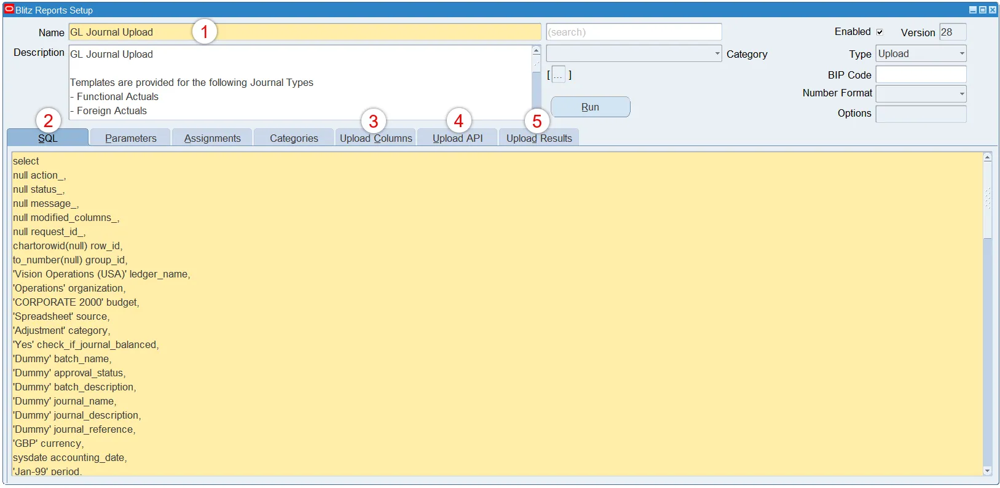
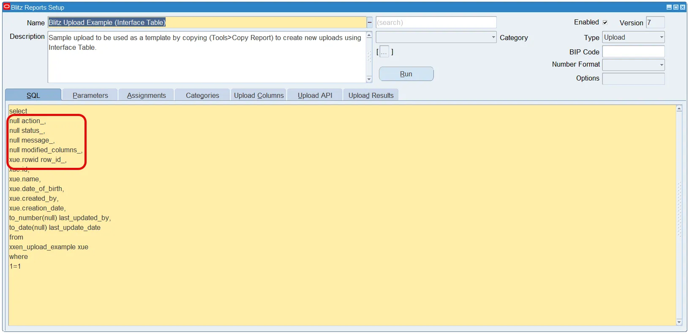
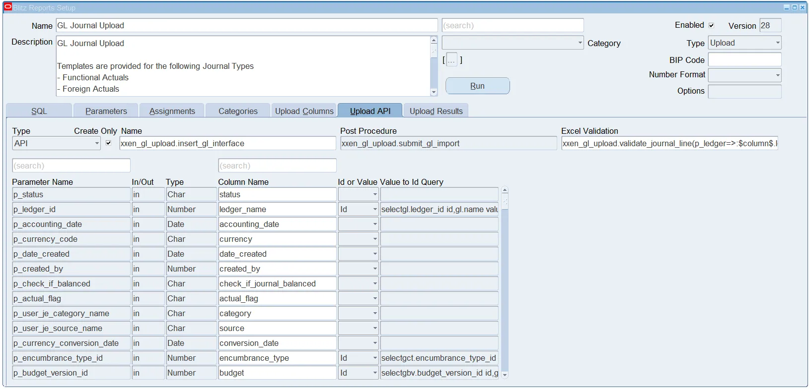
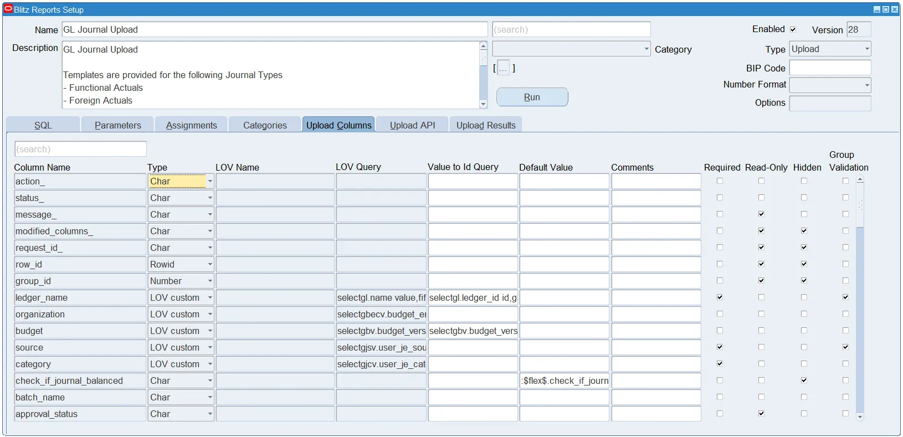
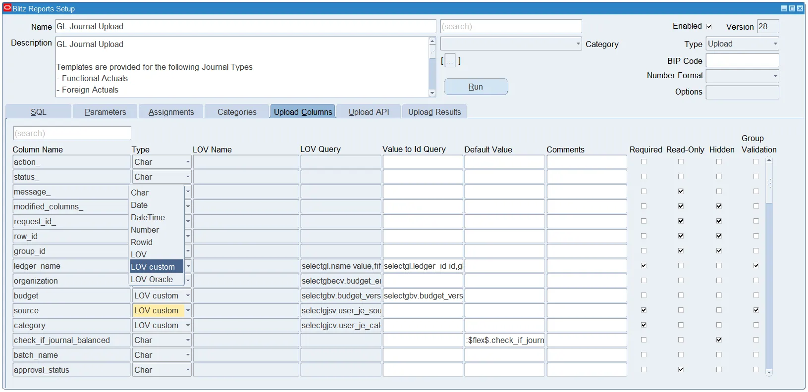

# 6. Creating a Blitz Upload

Blitz Upload is available with Blitz Report which is fully integrated with Oracle E-Business Suite. It enables your IT team to easily create and edit Uploads where they can choose to use an API or directly insert records into an Interface table. Blitz Upload runs as a concurrent process and upon completion generates output file using Blitz Report. The output file automatically downloads and opens in Excel.

With Blitz Upload, we created the most efficient and easy to use data upload solution for Oracle EBS. It leverages the reporting capabilities of Blitz Report to efficiently produce outputs while giving you a meaningful interpretation of the upload result.

A Blitz Upload consists of an SQL query defining the column structure of the Excel file for data entry, and three additional tabs that define Excel column validations, API processing and success and error reporting.

To create new Uploads, the profile option 'Blitz Report Access' must be set to 'System'. With this profile setting, the Blitz Report run window shows an additional 'Setup' button, which opens the setup window.

## Basic Steps to Create a New Upload



1. Enter a report **name**, an optional **description** and set the type as **Upload**
2. Enter the main extraction **SQL** - This query is used to export existing data to be updated. For create only scenarios the SQL defines the column names and types for data entry in Excel
3. Setup **Excel column validations** - This tab allows setting up column validations through LOVs, defining default values or specifying required and read-only columns
4. Define the **Upload API** and mapping from the Excel file columns to the API parameters
5. Enter **Success and Error SQLs** for upload result reporting
6. Optionally define a **post procedure** and review the mapping between SQL columns post procedure API parameters
7. Test the upload by clicking the **'Run'** button
8. Set up the user **access rights**

> **Note:** There are seeded example uploads which can be copied and modified to create new uploads:
> - Blitz Upload Example (API)
> - Blitz Upload Example (API with no parameters)
> - Blitz Upload Example (Interface Table)


## 6.1 Header

> **Note:** As all the setup fields have been explained in Blitz Report Developer Guide, this section focuses on the fields most relevant to Blitz Upload.


| Field | Description |
|-------|-------------|
| **Name** | Uniquely identifies uploads. Names should be short and descriptive. Good practice is to prefix names with the appropriate Oracle EBS module short code. |
| **Description** | An optional description of maximum 4000 characters may be set up to assist users in understanding and using the upload. |
| **Type** | Type should be 'Upload'. |


## 6.2 SQL Requirements

### For API Based Uploads

The SQL query to retrieve the existing records from database should always contain the columns `action_`, `status_`, `message_` and `modified_columns_` in the first four positions:

```sql
null action_,
null status_,
null message_,
null modified_columns_,
```

### For Interface Table Based Uploads

The SQL query should always contain the columns `action_`, `status`, `message_`, `modified_columns_` and `row_id_` columns in the first positions:

```sql
null action_,
null status_,
null message_,
null modified_columns_,
"table alias".rowid row_id_,
```


## 6.3 Upload Columns

The Upload Columns tab lists all available SQL columns derived from the main report SQL and allows you to define additional validation functionality in Excel:

| Feature | Description |
|---------|-------------|
| **Data type validations** | Enforce data type validation in Excel |
| **List of Values validations** | Through SQL queries |
| **Value to Id queries** | Convert display to id values before passing to upload API parameters |
| **Defaulting column values** | Including dynamic defaulting using SQL queries dependent on other column values |
| **Comments** | Shown when hovering over the column name header in Excel |
| **Required columns** | Specify mandatory columns |
| **Read only columns** | Stops flagging records for update when these columns are updated |
| **Hidden columns** | For internal processing of the upload |
| **Group Validation** | Reject all records with same column value in case of validation failures |

### Column Properties

| Property | Description |
|----------|-------------|
| **Column Name** | SQL column names are auto populated |
| **Type** | Auto populated based on SQL column data type. Can be changed. Also used to define LOV |
| **Value to Id Query** | SQL query for Value to Id conversion (must have Id and Value columns) |
| **Default Value** | Actual value or SQL query to derive the default value |
| **Comments** | Actual value or SQL query for comments displayed in Excel header |
| **Required** | Check for mandatory columns |
| **Read Only** | Check for columns that cannot be updated |
| **Hidden** | Check for internally used columns |
| **Group Validation** | Enable to group records for validation |




### LOV Query Example with Dependencies

The LOV query can contain report parameter reference (`:$flex$.`) or report column reference (`:$column$.`):

```sql
select
msiv.description value,
msiv.description description
from
mtl_system_items_vl msiv,
financials_system_params_all fspa,
hr_all_organization_units_vl haouv
where
haouv.name=:$flex$.operating_unit and
fspa.org_id=haouv.organization_id and
msiv.segment1=:$column$.item and
msiv.organization_id=fspa.inventory_organization_id
```


## 6.4 Upload API



| Field | Description |
|-------|-------------|
| **Type** | Determines if the upload will use an API or an Interface table |
| **Create Only** | Check if the upload does not support updating existing records |
| **Name** | Lists procedures or interface tables available based on Type selected |

### API Wrapper Procedure Requirements

If using an API, a custom wrapper procedure needs to be created with the below required parameters:

```sql
action_ in varchar2
status_ out varchar2
message_ out varchar2
```

| Name | Type | Data Type | How to use |
|------|------|-----------|------------|
| **action_** | in | varchar2 | Input values: `xxen_upload.action_create`, `xxen_upload.action_update` |
| **status_** | out | varchar2 | Populate based on processing outcome: `xxen_upload.status_error` for errors, `xxen_upload.status_success` for success |
| **message_** | out | varchar2 | Populate based on processing outcome - appears in Excel output after upload processing |

> **Reference:** See [XXEN_UPLOAD_EXAMPLE_API.zip](./images/XXEN_UPLOAD_EXAMPLE_API.zip) for usage example.

### 6.4.1 Upload Parameters

Parameters are auto populated on selection of the API or Interface table.


| Field | Description |
|-------|-------------|
| **Parameter Name** | Auto populated from API parameters or Interface table column names |
| **In/Out** | Auto populated - indicates if parameter is 'in', 'out' or 'in/out' |
| **Type** | Auto populated with data type of API parameter or Interface table column |
| **Column Name** | Auto mapped from SQL columns to API parameters - review and correct if required |
| **Id or Value** | Determines what to pass to API parameter based on LOV query. Default is Id if LOV contains Id column |

### 6.4.2 Post Procedure

Optionally define a post procedure in case a post process must be executed after the primary upload processing.

**Example:** Submit standard import interface concurrent request after completion of data upload in the interface table.

Choose between the available PL SQL procedures, and on selection it auto populates the parameters like the upload parameters.

### 6.4.3 Excel Validation

Excel Validation can be used to execute validations for the records directly on the server from the Excel when the file is saved. The call to the validation PL SQL function can be entered with the function parameters mapped to the SQL columns.

> **Note:** The validation function should return a message only in case of validation failure, otherwise it should return null.


## 6.5 Upload Results

The Upload Results SQL need to be defined to be able to display the success and error records after upload processing.


The Error and Success SQL's are automatically defaulted and contain placeholders for defining the join conditions. The SQL's need to be reviewed and amended as required by unchecking the Default checkbox.




**Data View:** This is an auto-generated database view which displays the data uploaded by the user and can be used in the Result SQLs to select the uploaded data. It has the same column structure as the report SQL and also shows the status and message returned by the API for the uploaded records.



### Pre-built Functions for Result SQL

Use these functions when working with 'status_' column:

| Function | Description |
|----------|-------------|
| `xxen_upload.status_new` | Returns status constant for new records |
| `xxen_upload.status_error` | Returns status constant for error records |
| `xxen_upload.status_success` | Returns status constant for success records |
| `xxen_upload.status_meaning(status)` | Returns meaning of status constant |

**Example:**

```sql
xxen_upload.status_meaning(xxen_upload.status_success)
```


# 7. Glossary

| Term | Meaning |
|------|---------|
| **LOV** | List of Values |
| **Anchor** | Placeholder in the extraction SQL that allows precise placement of additional parameterized SQL clauses at run-time |
| **Bind Variable** | Variable in SQL prefixed with colon (`:`) that gets bound with parameter values at run-time |
| **Lexical Parameter** | Placeholder starting with `&` that gets completely replaced with parameter SQL text at run-time |
| **VPD** | Virtual Private Database - Oracle security feature for row-level security |
| **EUL** | End User Layer (Discoverer) |
| **DFF** | Descriptive Flexfield |
| **API** | Application Programming Interface |
| **BLOB** | Binary Large Object |
| **CLOB** | Character Large Object |
| **EBS** | E-Business Suite |
| **SSO** | Single Sign-On |
| **SMTP** | Simple Mail Transfer Protocol |
| **CSV** | Comma Separated Values |
| **TSV** | Tab Separated Values |
| **XLSX** | Excel Open XML Spreadsheet format |


*Source: [Enginatics Blitz Report Developer Guide](https://www.enginatics.com/blitz-report-developer-guide/)*
