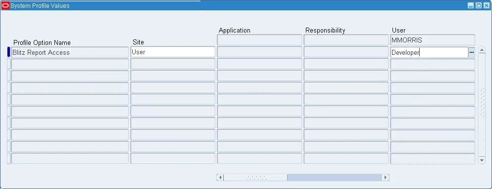
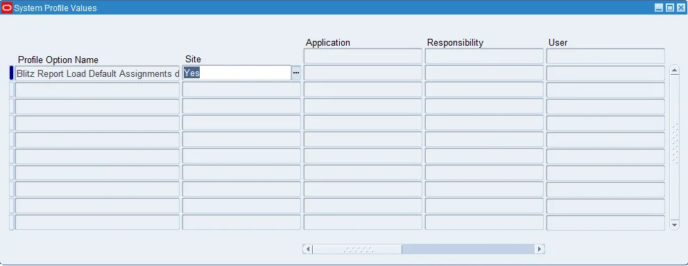
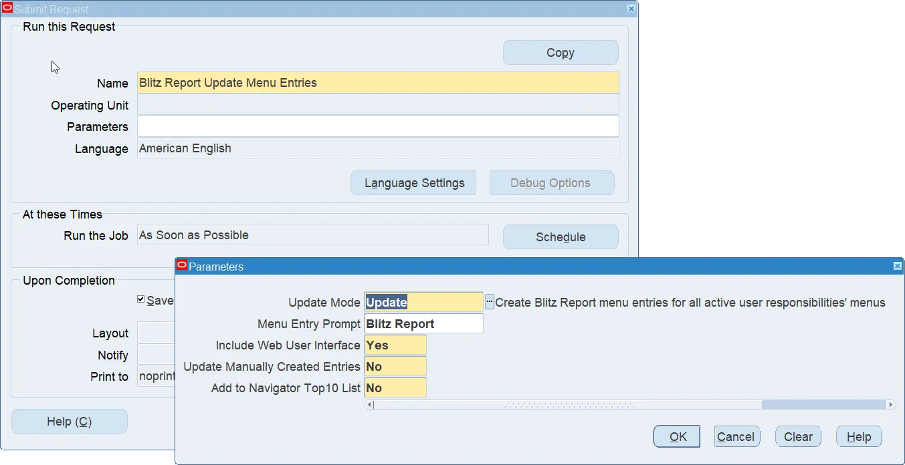
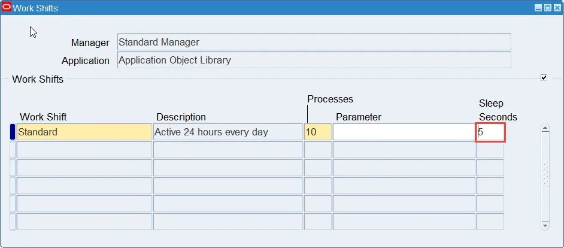
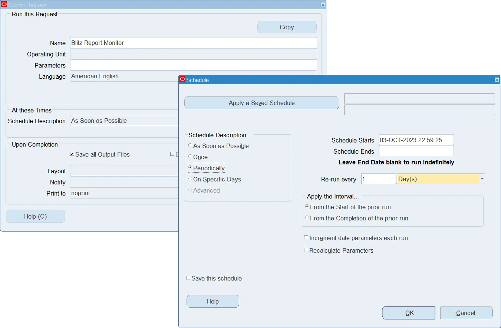
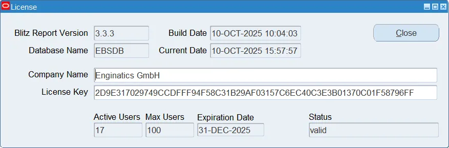
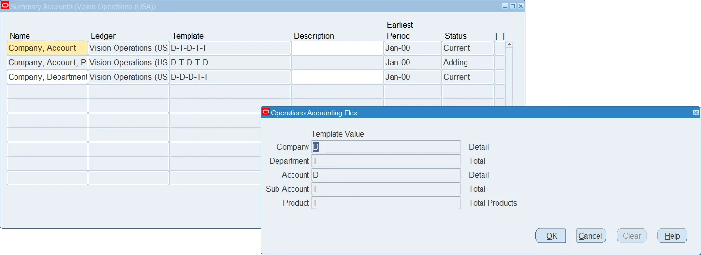
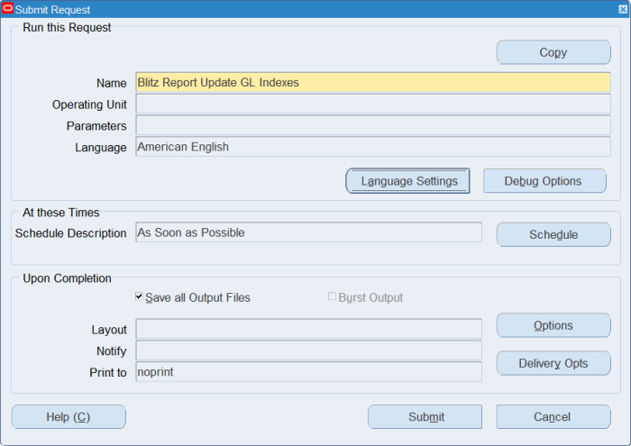
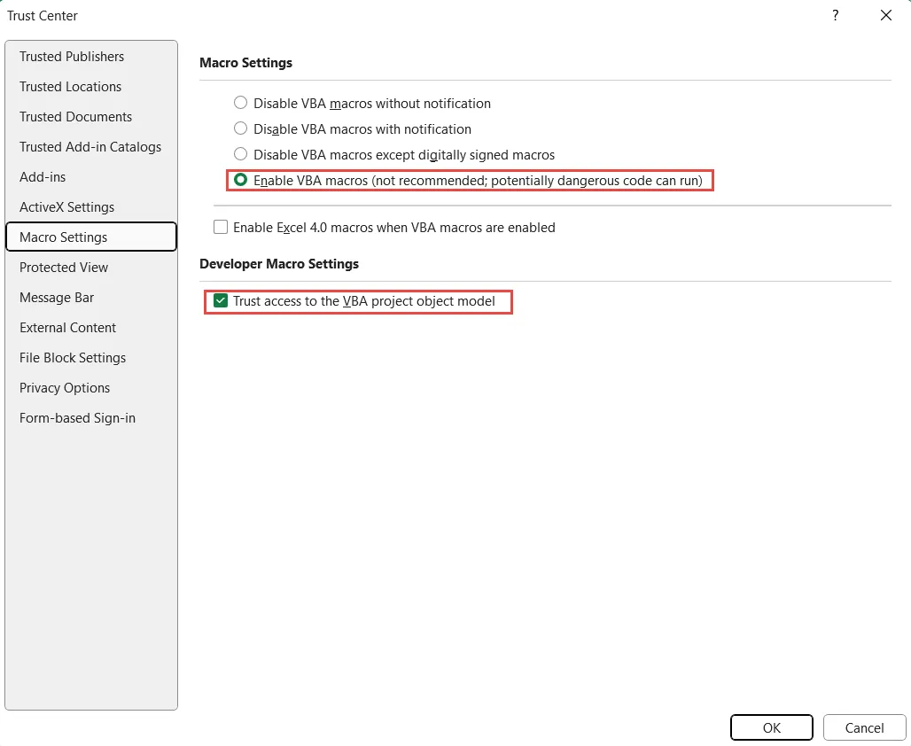
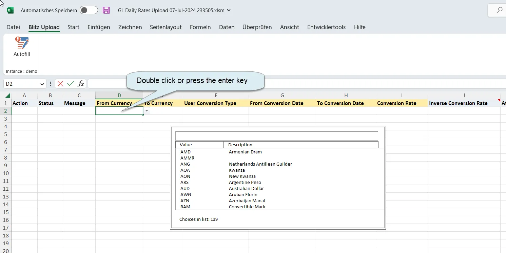

# 3. Application Setup

After running the installation script, additional configuration is required to grant users access to the application. A [training video](https://www.enginatics.com/tutorials/) explains the different access roles and license management.

**Summary of setup steps:**

1. Set the [Blitz Report Access](#31-access-profile-option) profile option to give administration access to privileged users and developers, and to control Blitz Report user license assignment.
2. Add the Blitz Report function and program to application menus and request groups. This can either be done automatically by the [Update Menu Entries](#33-update-menu-entries-concurrent-program) concurrent program (recommended), or, in case you would like to allow Blitz Report access from specific responsibilities only, you can perform this setup manually as described in [sections 5.7 and 5.8](part5_optional_configurations.md#57-menu-entry).
3. Reduce the [concurrent manager sleep time](#34-concurrent-manager-sleep-time) for better report performance and user experience.
4. Schedule the [Blitz Report Monitor](#35-monitor-concurrent-program) concurrent program to automatically remove unused licenses.
5. If you have purchased a license key, enter it on the [License Key](#36-license-key) window.
6. Create [GL Summary Accounts](#37-gl-summary-accounts) and run the Blitz Report Update GL Indexes concurrent program.
7. [Test the Integrated SOA Gateway](#38-test-integrated-soa-gateway-isg-connectivity) connectivity.

---

## 3.1 Access profile option

The profile option 'Blitz Report Access' controls which users can consume a license, and which users have access to the report setup window. During installation, this profile option is set to the value 'User' on site level, which allows users to run reports, but not to modify them. For developers, this profile option should be set to 'Developer', to enable access to create or maintain reports. The highest access level 'System' would allow to use and maintain the data upload functionality, and should only be given to users, who are trusted with full system access, for example system administrators.

**Navigation:** System Administrator > Profile > System

---

## 3.2 Default assignment load profile option

The Blitz Report installation includes assignments, which give access to seeded Blitz Reports, depending on the application of the current login responsibility, or from Oracle standard forms. These default assignments are automatically loaded during installation or upgrades, depending on the value of the profile option 'Blitz Report Load Default Assignments during Upgrades'. If you would like to benefit from the latest Enginatics default assignments during upgrades, keep the profile value as 'Yes'. If you would not like to have the default assignments reloaded during upgrades, clear out the profile value or set it to 'No'.

> **Note:** The load of default assignments will not modify any custom created assignments.

---

## 3.3 Update Menu Entries concurrent program

To make Blitz Report available to all active users automatically, run the 'Blitz Report Update Menu Entries' concurrent program.

### Parameters

| Parameter | Description |
|-----------|-------------|
| **Update Mode** | 'Update' adds the Blitz Report function and concurrent program to all menus and request groups, which are used by active responsibilities of active users. 'Remove' removes all Blitz Report menu and request group entries. Note: The program adds the Blitz Report form function only to menus which have at least one other form function assigned. |
| **Menu Entry Prompt** | Allows changing the menu entry prompt, or, if you keep the prompt blank, adding Blitz Report as a hidden menu entry to make it accessible through the Excel menu icon only. |
| **Include Web User Interface** | When set to 'No', only the Blitz Report form function is added to responsibility menus, but not the Blitz Report (Web) OAF UI function. Note: The program adds the Blitz Report OAF UI function only to OAF menus, which do not contain any other form function. |
| **Update Manually Created Entries** | When set to 'Yes', also manually created Blitz Report menu function entries are updated. |
| **Add to Navigator Top10 List** | When set to 'Yes', the Blitz Report form function is automatically added to all users' navigator top10 lists. |

After running the concurrent program, please wait for completion of Oracle's 'Compile Security' concurrent program before navigating to the Blitz Report menu function. This program is started automatically, can takes up to a few minutes to complete, and is required to access the Blitz Report menu entry.

After running the program, continue with additional manual setup steps in [section 5.8](part5_optional_configurations.md#58-request-group-entry).

---

## 3.4 Concurrent manager sleep time

For an optimal user experience, reduce the concurrent manager sleep time to 5 seconds. Users benefit greatly from a lower sleep time as requests start quicker, and the performance overhead of such a reduction is negligible on modern hardware.

**Navigation:** System Administrator > Concurrent > Manager > Define > Work Shifts

If you would like to run Blitz Report on a separate concurrent manager, you can run the [Blitz Report Create Manager](part5_optional_configurations.md#59-blitz-report-create-manager-program) concurrent program to create a dedicated manager for Blitz Reports and Uploads.

---

## 3.5 Monitor concurrent program

The Blitz Report Monitor concurrent program performs the following tasks:

1. Cancel Blitz Report concurrent requests that exceed given time limits
2. Mark as complete any terminated or error report runs
3. Purge outdated records from Blitz Report's internal logging tables
4. Purge the SQL history of deleted reports
5. Remove inactive users from the Blitz Report license user table
6. Purge outdated upload data
7. Remove orphan upload data views

Schedule this program from the System Administrator responsibility according to your business needs.

> **Note:** If your business uses the Blitz Report time limit feature, then it is recommended to have a short schedule, e.g. every 5 minutes, as reports exceeding given time limits will continue to run until the monitor program 'wakes up' to stop them.

If the time limit feature is not used, a longer schedule can be setup, e.g. daily. This prevents unnecessary monitoring, but still performs other actions as listed above.

**Navigation:** System Administrator > View > Requests > Submit a New Request > Single Request

Schedule concurrent 'Blitz Report Monitor' to run, for example, daily.

---

## 3.6 License key

**Navigation:** Blitz Report Setup window > Tools menu > License Key

The initial Blitz Report installation includes a trial license key valid for 10 users for three months, which is automatically loaded when you install the software. After the trial license key is expired, you can either purchase a valid key from Enginatics, or use the free version of Blitz Report. The free version allows full functionality for storing and maintaining SQLs, but generates an output for the most recently created 30 reports only (custom reports take precedence over Enginatics reports).

---

## 3.7 GL Summary Accounts

**Navigation:** GL Super User > Setup > Accounts > Summary

For optimal performance of the GL Financial Statement and Drilldown (FSG) report, create summary accounts having Detail values for the most frequently queried segment combinations.

After the creation of the summary templates is completed, navigate to the System Administrator responsibility and run the 'Blitz Report Update GL Indexes' concurrent program.

---

## 3.8 Test Integrated SOA Gateway (ISG) connectivity

To test if the Integrated SOA Gateway has been configured and is working correctly, execute the following steps:

**1.** Open the GL Daily Rates Upload and click on run. If you do not see this upload, assign the Blitz Report Access profile option to the value 'Developer' for your own user.

**2.** Make sure that you have VBA macro code execution activated in your Excel Trust Center Settings as follows:

You may also face [the following issue](part6_troubleshooting.md#637-run-time-error-1004-method-onkey-of-object-_application-failed) when opening the Excel macro enabled output. Please apply the suggested solution.

**3.** Double click in cell D2. If you see a list of currency values as below, the ISG is working correctly.

If you see an error message instead of the values, please review the [troubleshooting notes](part6_troubleshooting.md) for possible solutions, or contact our [support](mailto:support@enginatics.com).

---

*Previous: [Installation](part2_installation.md) | Next: [Upgrade](part4_upgrade.md)*
