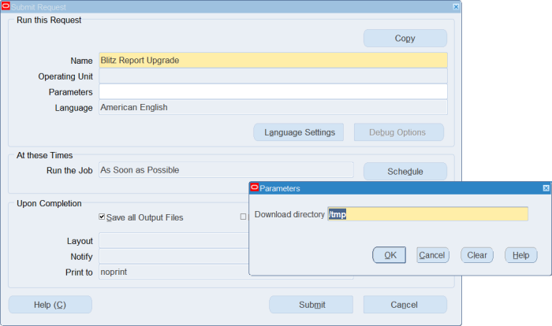

# 4. Upgrade

To Upgrade Blitz Report, you can run the 'Blitz Report Upgrade' concurrent program from the System Administrator responsibility.

This program automatically downloads and installs the latest available [Blitz Report version](https://www.enginatics.com/changelog/).

The program automatically disconnects any possibly active Blitz Report sessions and sets the 'Blitz Report Maintenance Mode' profile option to prevent users from accessing Blitz Report during the upgrade.

In case of any issues, please download and share the concurrent request's output .zip file with our [support team](mailto:support@enginatics.com).




## Manual Upgrade Steps

If you would like to upgrade in the traditional way through a terminal session, for example to upgrade production systems to a specific previously tested Blitz Report code version, please perform the following steps:

**1.** Log in to the application tier node as the application owner user e.g. applmgr.

**2.** [Download](https://www.enginatics.com/download/) the installation file 'blitz_report_*.zip' and copy or ftp it to a location of your choice on the EBS application server node.

**3.** Extract the .zip file, navigate to the folder 'blitz_report', located under the directory from where it is extracted and perform the upgrade by running install.sh:

```bash
unzip blitz_report_*.zip
cd blitz_report_*/
./install.sh
```

**4.** If you have more than one application server and the APPL_TOP is not shared, repeat Steps 1 to 3 in this section on all the other nodes. To reduce the installation time on additional nodes, you can add the parameter skip_db like this:

```bash
./install.sh skip_db
```

**5.** If you have more than one oafm nodes, run the following script on each of the nodes:

```bash
etc/generate_webservice_artifacts.sh
```

**6.** If you notice any errors or would like the Enginatics team to validate if the upgrade completed successfully, please send us the created `*_blitz_report_install_logs_*.zip` file using our [support channels](mailto:support@enginatics.com).


## Additional guidelines

### ORA-00955 errors

Ignore any 'ORA-00955: name is already used by an existing object' error messages.

### Blocking sessions

If you are not using the OAF UI version of Blitz Report, the upgrade can be done without a downtime, while the E-Business Suite application is in use.

The upgrade script sets the maintenance flag to make sure that no new users can use Blitz Report.

To avoid object locks from active Blitz Report users however, the upgrade should be done out of business hours. In case there are active Blitz Report sessions, the installation script will show a list of active sessions and ask if you would like to terminate them automatically before starting the upgrade process.

You can also use the following query to identify the currently active Blitz Report users and notify them to close their forms or disconnect their database sessions via the SQL command in the disconnect_db_session or kill_db_server_process column as required.

```sql
select distinct
xxen_util.user_name(gs.module, gs.action, gs.client_identifier) user_name,
xxen_util.module_type(gs.module, gs.action) module_type,
xxen_util.module_name(gs.module, gs.program) module_name,
gs.module,
gl.sid,
gp.spid,
'alter system disconnect session '''||gs.sid||','||gs.serial#||',@'||gs.inst_id||''' immediate;' disconnect_db_session,
'kill -9 '||gp.spid kill_db_server_process
from
dba_objects do,
gv$lock gl,
gv$session gs,
gv$process gp
where
do.object_name like 'XXEN%' and
gl.id1=do.object_id and
gl.inst_id=gs.inst_id and
gl.sid=gs.sid and
gs.inst_id=gp.inst_id(+) and
gs.paddr=gp.addr(+)
order by
user_name
```

### CUSTOM.pll update

In case you see a `Warning: CUSTOM.pll is already customized` in the error_summary.log file, then the Blitz Report related changed in the CUSTOM.pll are either missing or outdated and the changes described in [section 6.22](part6_troubleshooting.md#622-custom-library-attachment) would need to be (re-)applied. Please [contact us](mailto:support@enginatics.com) if you need help with this change.


*Previous: [Application Setup](part3_application_setup.md) | Next: [Optional Configurations](part5_optional_configurations.md)*
