# 5. Optional Configurations


## 5.1 Installation on Windows

Blitz Report runs on Oracle E-Business Suite installed on Windows with MKS Toolkit. Cygwin is not supported.

The commands to install Blitz Report are the same as for Linux. Before executing them, apply the applications environment file and start bash from the MKS toolkit as shown in the following screenshot:

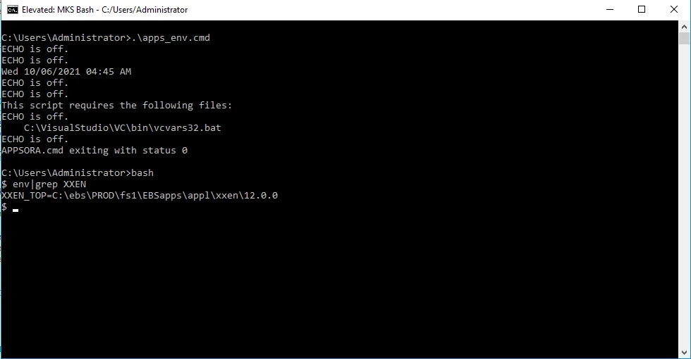


## 5.2 Running blitz reports on a standby database

If you plan running blitz reports on a standby database, please make sure that the following pre-requisites are met:

- EBS instance using Oracle database 19c or higher
- Active Data Guard is licensed. Note: Active Data Guard DML Redirection is not available for Non-Oracle Public Cloud Environments (Google Cloud Platform, Amazon AWS, Microsoft Azure, IBM Cloud, Alibaba Cloud, etc). It works either in the Oracle Cloud or on-premises.
- Active Data Guard Standby database with the real-time apply configured
- Oracle Active Data Guard DML Redirection for pluggable databases configured
- The database directory EBS_DB_DIR_UTIL path physically exists on both primary and standby database servers
- Patch 31632548 is applied to the both primary and standby databases
- The xxen_adg database link created in the primary database APPS schema. It should point to the standby pluggable database. E.g.:

```sql
create database link xxen_adg using '(DESCRIPTION= (ADDRESS=(PROTOCOL=tcp)(HOST=standby_server.standby_domain)(PORT=1522)) (CONNECT_DATA= (SERVICE_NAME=ebs_STANDBY_PDB) (INSTANCE_NAME=STANDBY)))';
```

- Event 10946 should be set on the CDB level in both primary and standby databases as explained in Doc ID 2525754.1 and Doc ID 2662860.1

```sql
alter system set events '10946 trace name context forever, level 8454144';
alter system set event='10946 trace name context forever, level 8454144' scope=spfile;
```

If you already have some other events defined, use this syntax:

```sql
alter system set event='10946 trace name context forever, level 8454144', '30580 trace name context forever, level 4096' scope=spfile;
```


## 5.3 Configure mod_plsql (EBS 11i only)

The Blitz Upload and Financial Statement features require the Oracle EBS Integrated SOA Gateway (ISG) to be configured. As it is unavailable in EBS 11i, mod_plsql needs to be configured as a replacement. Please refer to [the following blog post](https://www.enginatics.com/blog/configuring-mod_plsql-for-blitz-upload/) to configure mod_plsql in your EBS 11i instance.


## 5.4 SSO enabled profile option

The profile option 'Blitz Report SSO Enabled' allows connecting to EBS instances which have SSO (Single Sign-On) enabled. If the EBS instance is SSO enabled, then post installation, this profile option needs to be set at 'Site' level to 'Yes' so that Blitz Upload and FSG can connect to the EBS server.

**Navigation:** System Administrator > Profile > System

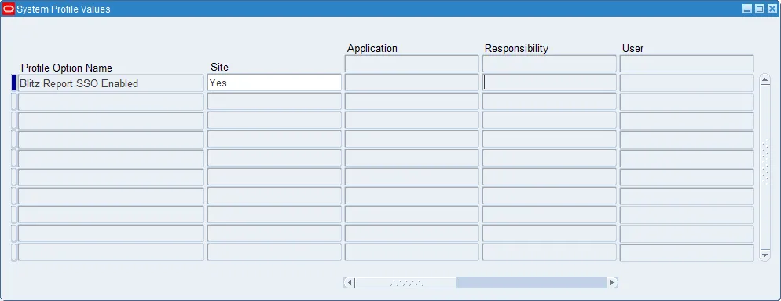


## 5.5 Mod plsql profile option

The profile option 'Blitz Upload Use mod_plsql' allows using the mod_plsql to connect to EBS server. If the EBS instance does not support Integrated SOA Gateway (ISG) however it has mod_plsql configured, then post installation, this profile option needs to be set at 'Site' level to 'Yes' so that Blitz Upload can connect to the EBS server using mod_plsql.

**Navigation:** System Administrator > Profile > System


## 5.6 Setup Blitz Report Advanced Email Delivery

By default Blitz Report uses the built in Oracle EBS Delivery functionality. It has some limitations. E.g. it is not possible to customize a email body. In order to improve the Blitz Report user experience we introduced the Blitz Report Advanced Email Delivery. To configure it, please setup the following profile options:

- Blitz Report Use Advanced Email Delivery
- Blitz Report SMTP Host
- Blitz Report SMTP Port
- Blitz Report SMTP use SSL
- Blitz Report Email Body Message
- Blitz Report Email Subject Message


## 5.7 Menu entry

If you would like to restrict access to Blitz Report to specific menus, assign the Blitz Report function manually, as shown below.

**Navigation:** System Administrator > Application > Menu


## 5.8 Request group entry

To enable users to schedule reports as a background concurrent process (e.g. for outbound interfaces or long running data extractions scheduled during the night), the concurrent program 'Blitz Report' needs to be added to request groups as required, for example 'Receivables All'.

**Navigation:** System Administrator > Security > Responsibility > Request


## 5.9 Blitz Report Create Manager program

If you would like to create a separate concurrent manager for the Blitz Report and Blitz Upload processing, you can run the 'Blitz Report Create Manager' program from the System Administrator responsibility.

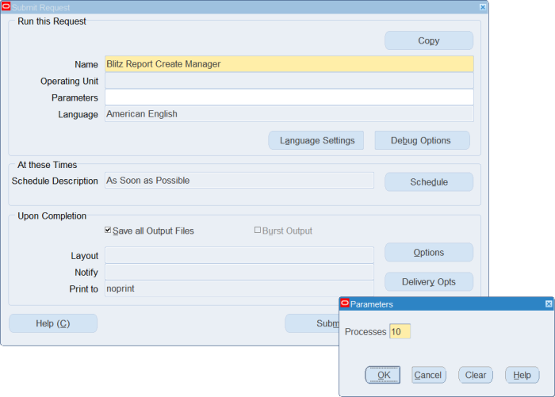

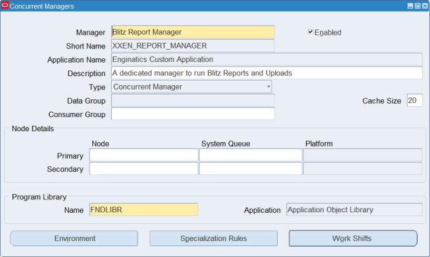


## 5.10 Creating a custom application manually (alternative to adsplice)

If you do not have adsplice available or prefer to create the custom application manually, follow these steps:

### Step 1: Create the database user

```sql
CREATE USER XXEN IDENTIFIED BY &password
DEFAULT TABLESPACE APPS_TS_TX_DATA
TEMPORARY TABLESPACE TEMP;

GRANT CONNECT, RESOURCE TO XXEN;
GRANT CREATE VIEW TO XXEN;
GRANT CREATE SYNONYM TO XXEN;
GRANT UNLIMITED TABLESPACE TO XXEN;
```

### Step 2: Register the Application

**Navigation:** System Administrator > Application > Register

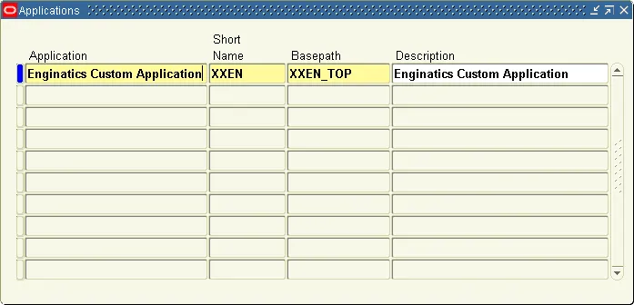

Create application with:
- Application: Enginatics Custom Application
- Short Name: XXEN
- Basepath: XXEN_TOP

### Step 3: Register the Oracle User

**Navigation:** System Administrator > Security > ORACLE > Register

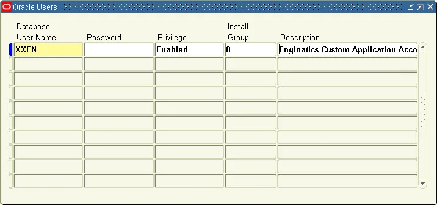

### Step 4: Add to Data Group

**Navigation:** System Administrator > Security > ORACLE > DataGroup

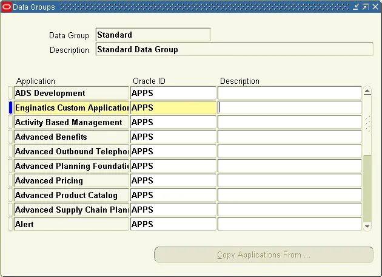

### Step 5: Link Application to Oracle User

**Navigation:** Alert Manager > System > Installations

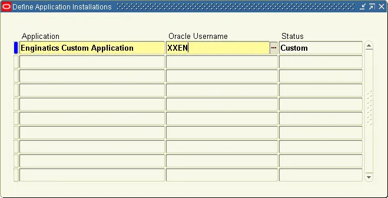

### Step 6: Create custom TOP via AutoConfig

**Navigation:** Oracle Applications Manager > Site Map > AutoConfig

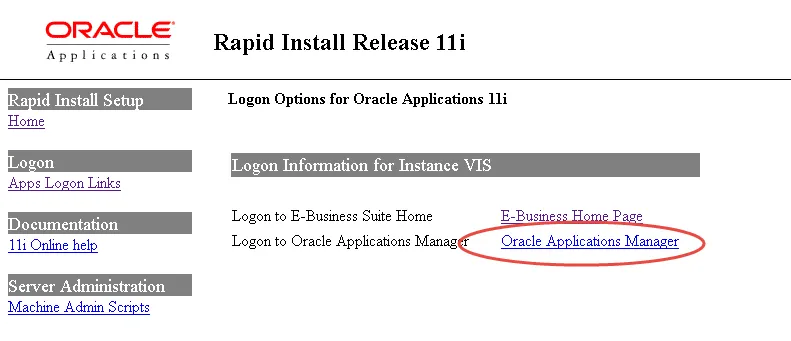

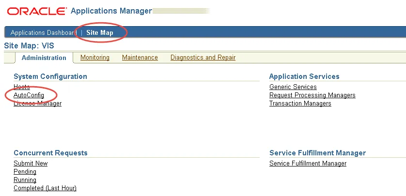

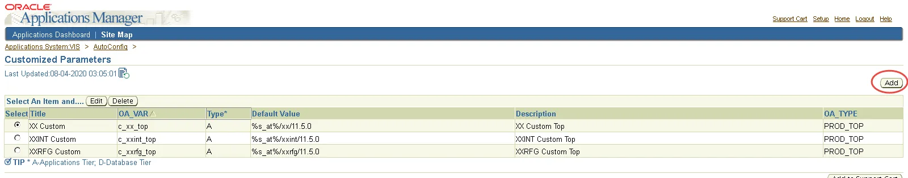

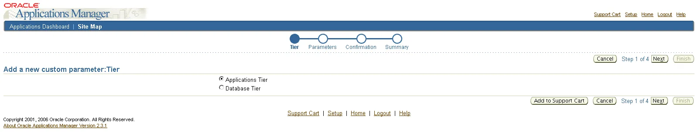

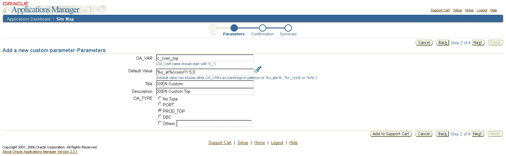

Create the following custom parameters:
- s_xxen_top
- c_xxen_top

Then run AutoConfig to apply the changes.


*Previous: [Upgrade](part4_upgrade.md) | Next: [Troubleshooting](part6_troubleshooting.md)*
