# 6. Troubleshooting


## 6.1 ORA-12154: TNS:could not resolve the connect identifier specified

If the forms compilation step fails with error ORA-12154, please follow Oracle note 431324.1 to correct the TNS_ADMIN variable setting in compilation script frmcmp_batch.sh. Unfortunately, the patch mentioned in this note does not replace the templates and the problem might appear again in cloned environments. To avoid this, we recommend also correcting the templates manually:

```bash
nano $ORACLE_HOME/bin/frmcmp_batch.sh
```

Replace following line:
```
TNS_ADMIN=$ORACLE_HOME/network/admin
```

with:
```
TNS_ADMIN=${TNS_ADMIN:-$ORACLE_HOME/network/admin}
```

To make the change persistent also for cloned environments, apply the same correction to associated template file:

```bash
nano $ORACLE_HOME/inventory/Templates/bin/frmcmp_batch.sh
```

Also correct following scripts and their templates mentioned in the Oracle note, in case you plan using them (not required for Blitz Report):
```
frmbld.sh,frmcmp.sh,frmcmp_batch.sh,frmplsqlconv.sh,frmplsqlconv.bat
```

For EBS R12.2, repeat above actions on both run and patch file systems.


## 6.2 Error: CUSTOM_SCHEMA could not be derived for custom application XX

If you encounter this error message during installation, please validate if you have setup the link between your custom application and the Oracle database username.

**Navigation:** Alert Manager > System > Installations

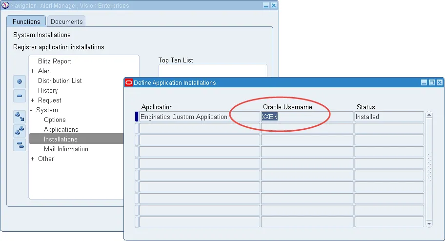

This required setup is done automatically when creating custom applications through adsplice, but is frequently missed for older applications created before AD Splice, as this step is missing in Oracle note 2519062.1 describing manual custom application creation. See [section 5.10](part5_optional_configurations.md#510-creating-a-custom-application-manually-alternative-to-adsplice) for complete instructions on how to create a custom application manually.


## 6.3 Concurrent Manager stops processing requests when the first Blitz Report is started

This happens if a new application is created for Blitz Report through adsplice, but the concurrent managers are not restarted after running autoconfig.

Creating a new application through adsplice requires autoconfig and a conc manager restart, to enable processing concurrents of the newly created application.


## 6.4 Blitz Reports ends with ORA-01843: not a valid month when using date parameters

When changing the ICX: Date format mask to something different than DD-MON-RR and using date parameters, Blitz Report ends with ORA-01843: not a valid month.

If this happens, you are missing Oracle patch 12678526: 1-OFF:12533040:12.1.3:12.1.3:FND_DATE OUTPUT FORMAT MASK IS NOT CONSISTENT IN


## 6.5 ORA-29855: error occurred in the execution of ODCIINDEXCREATE routine, DRG-11446

If you see this error in the installation log:

```
ERROR at line 1:
ORA-29855: error occurred in the execution of ODCIINDEXCREATE routine
ORA-20000: Oracle Text error:
DRG-11422: linguistic initialization failed
DRG-11446: supplied knowledge base file
/u01/app/oracle/product/11.2.0.4/dbhome_1/ctx/data/enlx/droldUS.dat not installed
ORA-06512: at "CTXSYS.DRUE", line 160
ORA-06512: at "CTXSYS.TEXTINDEXMETHODS", line 366
```

Please follow Oracle note 557239.1 to install the missing Text Knowledge Base files.

If you don't want to go through Oracle's whole installation procedure, you can also deploy just the missing files manually following these steps for Oracle Database 11.2.0.4:

**1.** Navigate to Oracle's Database 11g download page on MOS and download p13390677_112040_Platform Name_6of7.zip.

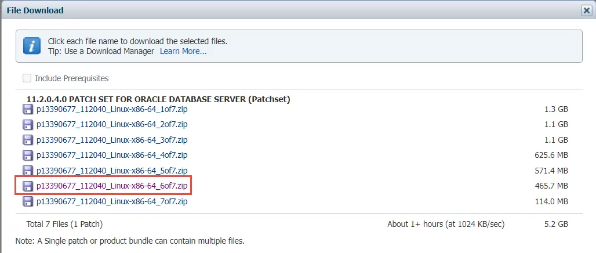

**2.** Unzip the file:
```bash
unzip p13390677_112040_Platform Name_6of7.zip
```

**3.** Go to the location for the CTX files and unzip filegroup1.jar:
```bash
cd examples/stage/Components/oracle.ctx.companion/11.2.0.2.0/1/DataFiles
unzip filegroup1.jar
```

**4.** Navigate to ctx/data/enlx and copy all files to $ORACLE_HOME/ctx/data/enlx:
```bash
cd ctx/data/enlx
cp * $ORACLE_HOME/ctx/data/enlx
```

Files to copy:
- drofdUS.dat
- drofiUS.dat
- droldUS.dat
- droliUS.dat
- drolkUS.dat
- drolsUS.dat

In case of RAC configuration, perform above steps on all RAC nodes.

**5.** Due to the missing files and the domain index being invalid during Blitz Report installation, the load of Blitz Report templates ends in error ORA-29861: domain index is marked LOADING/FAILED/UNUSABLE. To correct these and reload the Blitz Report templates, rerun the Blitz Report installation script again.


## 6.6 ORA-29855: error occurred in the execution of ODCIINDEXCREATE routine, DRG-10700 on 12c multitenant container db

If the Blitz Report installation doesn't show any report templates and you see this error in the installation log:

```
ERROR at line 1:
ORA-29855: error occurred in the execution of ODCIINDEXCREATE routine
ORA-20000: Oracle Text error:
DRG-10700: preference does not exist: CTXSYS.DEFAULT_LEXER
ORA-06512: at "CTXSYS.DRUE", line 160
ORA-06512: at "CTXSYS.TEXTINDEXMETHODS", line 366
```

Please follow Oracle note 1994919.1 to create the missing default lexer preference and rerun the installation.


## 6.7 FRM-40654: Record has been updated by another user, when saving and modifying reports

This happens if there is a mismatch between the DB and the application tier characterset. Oracle's Globalization Guide 393861.1 states in Section 2. Installing > Application Tier (Middle Tier) – APPL_TOP Character Set and ICX_CLIENT_IANA_ENCODING, that the APPL_TOP character set must be identical to the database character set.

To resolve this problem, correct your setup to align DB and application tier to use the same character set (e.g. correct the apps tier context file and run autoconfig).

To verify that you have this configuration problem, navigate to menu > Help > About Oracle Applications > Forms Server Environment Variables and compare the character set shown here with the database character set:

```sql
select vnp.* from v$nls_parameters vnp where vnp.parameter='NLS_CHARACTERSET'
```

For some customers, the forms server environment variables are not shown in the help menu's About Oracle Applications section. In such case, you can review the character set by below SQLs, extracting the setting from the context files:

```sql
--Application tier character set
select
focf.name,
decode(focf.ctx_type,'D','Database','A','Application') type,
focf.node_name,
focf.path,
focf.last_synchronized,
extractValue(XMLType(focf.text),'//NLS_LANG[@oa_var="s_tools_nlslang"]') s_tools_nlslang,
extractValue(XMLType(focf.text),'//NLS_LANG[@oa_var="s_weboh_nlslang"]') s_weboh_nlslang,
extractValue(XMLType(focf.text),'//NLS_LANG[@oa_var="s_nlslang"]') s_nlslang
from
fnd_oam_context_files focf
where
focf.status='S' and
focf.name not in ('TEMPLATE','METADATA') and
focf.ctx_type='A';

--Database character set
select
focf.name,
decode(focf.ctx_type,'D','Database','A','Application') type,
focf.node_name,
focf.path,
focf.last_synchronized,
extractValue(XMLType(focf.text),'//NLS_LANG[@oa_var="s_db_nlslang"]') s_db_nlslang
from
fnd_oam_context_files focf
where
focf.status='S' and
focf.name not in ('TEMPLATE','METADATA') and
focf.ctx_type='D';
```


## 6.8 FRM-99999: Error 408 occurred, when deleting reports or parameters

This is an issue related to incorrect context index (CTXSYS) synchronization code in your database version, as described in Oracle notes 2031953.1 and 1586704.1. To resolve this problem, please follow the instructions described in note 1586704.1.


## 6.9 PLS-00306: wrong number or types of arguments in call to 'SYNCRN', when loading reports

This is the same as issue 6.8 and resolved by following the instructions described in note 1586704.1.


## 6.10 APP-FND-02901: You do not have access privilege to any operating unit, when opening the Blitz Report form

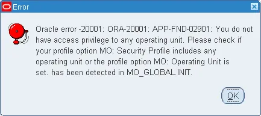

According to various Oracle support notes, this error showing fnd message MO_ORG_ACCESS_NO_DATA_FOUND can have following reasons:

1. There is a security profile set, which does not give access to any operating unit, note 1511078.1.
2. Concurrent 'Security List Maintenance' did not run after changing the security profile setup, note 887512.1.
3. There is a mismatch between profile options settings for 'MO: Security Profile' and 'HR: Security Profile', note 2022551.1.


## 6.11 Error: The Blitz Report function is not available under the responsibility

After adding the Blitz Report function to menus, Oracle EBS automatically starts concurrent program 'Compile Security', which inserts records into table fnd_compiled_menu_functions to allow access to the new function. This process can take a few minutes to run and if you try to access Blitz Report before it completes, above error message is shown. This error is then cached on the server side, which means that the problem persists, even after the request completes as explained in note 454285.1.

The resolution is described in note 2530744.1, which is to clear the cache manually from the responsibility:

**Navigation:** Functional Administrator > Core Services > Global Configuration > Caching Framework > Clear All Cache

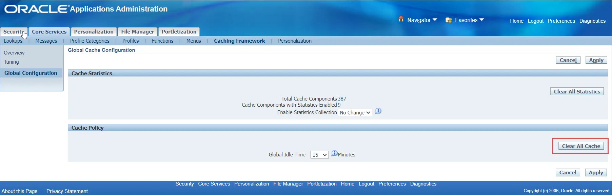

If it does not work please try the following action plan as per Doc ID 454285.1:
- Manually run the 'Compile Security' concurrent program, set the parameter to YES. Verify that it completes normally.
- If it does not work please try restarting Apache.
- If it still does not work, try restarting all the application services.


## 6.22 CUSTOM library attachment

If you see a warning about CUSTOM.pll in the installation log, you need to update the CUSTOM.pll to include the Blitz Report library attachment.

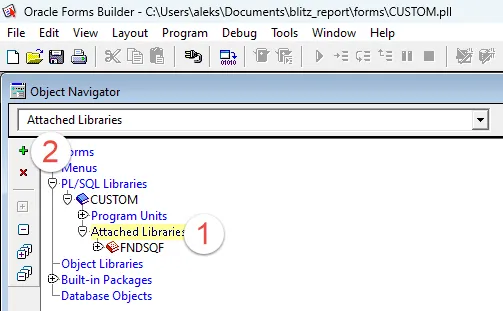

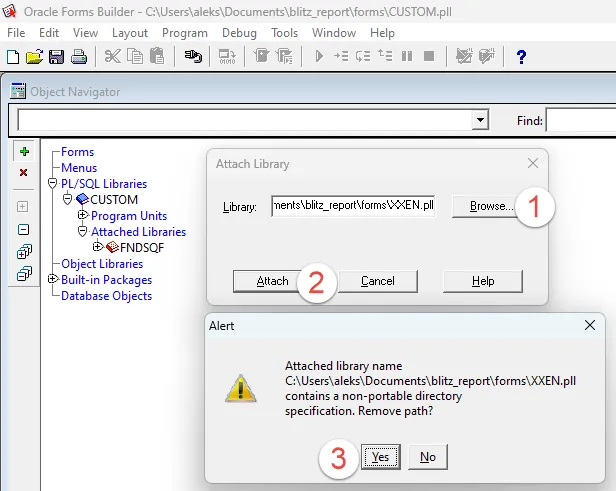

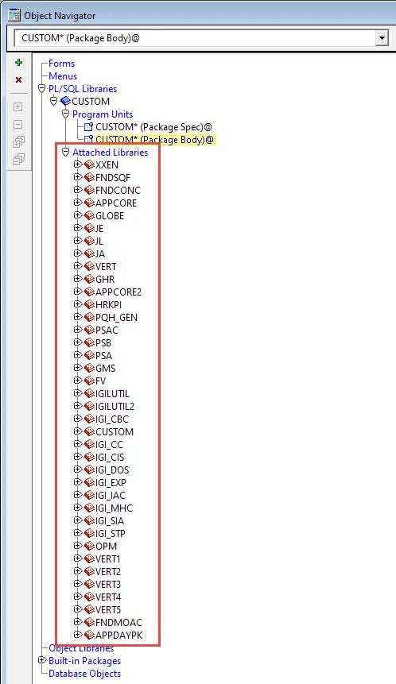

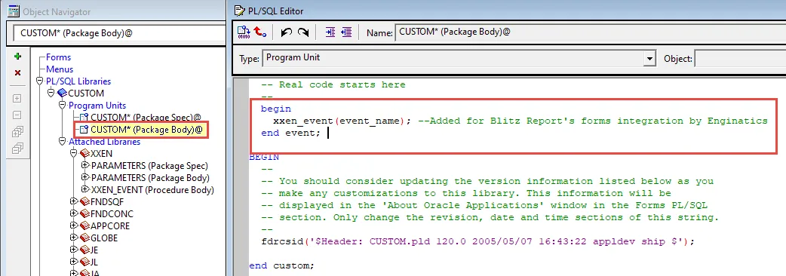

### Fix CUSTOM.pll library attachment

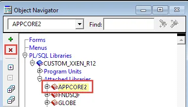

Reattach the library:

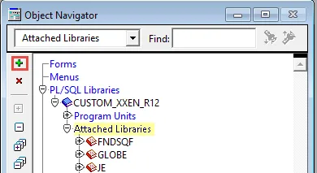

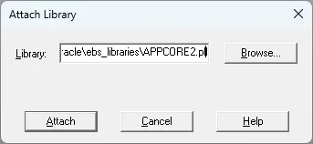

Remove the directory path when prompted:

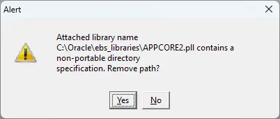

Copy and recompile the updated CUSTOM.pll.


## 6.30 ORA-28003: password verification for the specified password failed

When running adsplice for creating a custom application the following error message is displayed:

```
ORA-28003: password verification for the specified password failed
```

**Solution:** Temporarily disable the password verification function as per Doc ID 2698389.1.


## 6.31 java.lang.SecurityException: User: ISGADMIN~~EBSDB, failed to be authenticated

When running the installation script, the following error message is displayed:

```
java.lang.SecurityException: User: ISGADMIN~~EBSDB, failed to be authenticated.
```

The following query returns N, which means that the password from the FND vault does not work in EBS:

```sql
select fnd_web_sec.validate_login('ISGADMIN',fnd_vault.get('ISG','ISGADMIN')) login_successful from dual;
```

### Solution: Change the EBS ISGADMIN password

1. Query the password for the ISGADMIN user with the following query as APPS:
```sql
select fnd_vault.get('ISG','ISGADMIN') from dual;
```

2. Login to EBS as SYSADMIN. Go to System Administrator > Profile > System. Query the profile options starting with 'Signon Password%' for ISGADMIN user.

3. Change the profile option 'Signon Password Hard To Guess' to 'No' for ISGADMIN user.

4. Change the profile option 'Signon Password Length' to 8 for ISGADMIN user.

5. Change the profile option 'Signon Password Custom' to an empty value at the Site level.

6. Go to System Administrator > Security > User > Define and update the ISGADMIN password to the one retrieved by the above query as per Doc ID 2708647.1.

7. Revert the 'Signon Password Custom' profile options value back at the Site level. It is recommended to leave the changed profiles at the ISGADMIN user level.

8. Rerun the Blitz install.sh script.

9. Review the logfiles to ensure that the xxen_webservices webservice has been deployed successfully.


## 6.32 ISG_SERVICE_EXECUTION_ERROR

When clicking on the Blitz Upload Excel output LOV, the following error message is displayed:

```
ISG_SERVICE_EXECUTION_ERROR
```

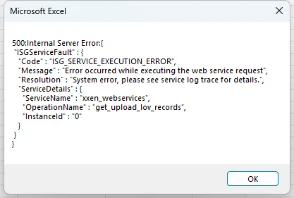

### Solution

Clear the middle tier cache using the Functional Administrator responsibility.

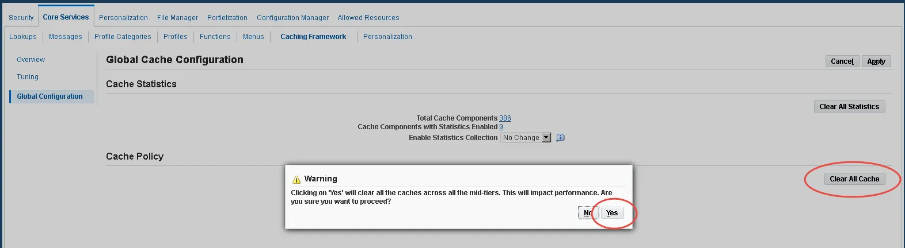

If clearing the cache does not help please try to reset the ISGDatasource from the weblogic admin console:

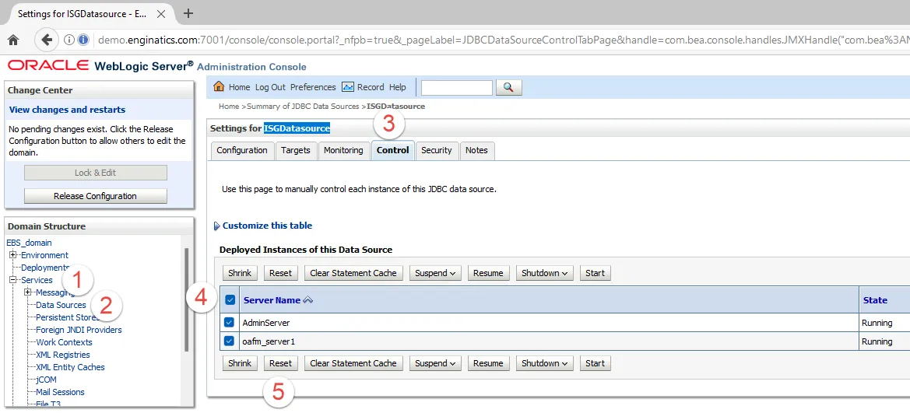

If resetting the ISGDatasource does not help then please run FND SOA Runtime Error report and share the output with our [support](mailto:support@enginatics.com) for the investigation.


## 6.33 ORA-04088: error during execution of trigger

The following error message is displayed in the Blitz Report installation logfile:

```
ORA-08002: sequence FND_LOBS_S.CURRVAL is not yet defined in this session
ORA-06512: at "APPS.NOTE_1342126_1_AUDIT_TRIG", line 2
ORA-04088: error during execution of trigger 'APPS.NOTE_1342126_1_AUDIT_TRIG'
ORA-06512: at "APPS.XXEN_REPORT", line 4934
ORA-06512: at "APPS.XXEN_REPORT", line 5780
ORA-06512: at "APPS.XXEN_REPORT", line 5780
ORA-06512: at line 1
```

### Cause

This trigger was created for an investigation to identify incorrect custom code as per Oracle note 1342126.1. Such investigation triggers should be kept only for a limited time and be removed after investigation is completed.

### Solution

1. Drop or, in case it is still required, disable the problematic custom trigger:
```sql
alter trigger apps.note_1342126_1_audit_trig disable;
```

2. Rerun the Blitz Report install.sh script.

3. If the trigger is still required, enable it again:
```sql
alter trigger apps.note_1342126_1_audit_trig enable;
```


## 6.34 ISG_SERVICE_AUTH_FAILURE

When clicking on the Blitz Upload Excel output LOV, the following error message is displayed:

```
ISGServiceFault
ISG_SERVICE_AUTH_FAILURE
User is not authorized to execute the service
Please check whether the user has the requisite grants
```

### Solution

The issue can be resolved by one of the below options:

1. Check the Blitz Report installation log file if it contains a warning about missing GLOBAL user. If it does, then create the GLOBAL user per MOS Doc 2287614.1 via the Security > User > Define form.

2. Clear the cache using Functional Administrator responsibility.


## 6.35 ISG_INVALID_ALIAS or ISG_FILE_ACCESS_ERROR

When clicking on the Blitz Upload Excel output LOV, the following error message is displayed:

```
ISGServiceFault
ISG_INVALID_ALIAS
An invalid alias has been used to invoke the service
Please pass a valid alias
```

Another possible issue:

```
500:Internal Server Error
ISGServiceFault
ISG_FILE_ACCESS_ERROR
Error occurred while accessing file
Please check the file permissions
```

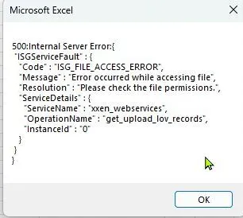

The following error may be observed in the Blitz Report installation logfile if you try to run install.sh:

```
[java] Exception occurred.
[java] Exception message is : Password for user:ASADMIN is not configured.
```

### Solution

Please configure the Integrated SOA Gateway (ISG). See [section 1.3](part1_prerequisites.md#13-configure-oracle-ebs-integrated-soa-gateway).


## 6.36 FND_SOA_AUTHORIZATION_FAILURE

When clicking on the Blitz Upload Excel output LOV, the following error message is displayed:

```
ISGServiceFault
FND_SOA_AUTHORIZATION_FAILURE
User not authorized to execute service
```

### Cause

This error may occur after Blitz Report upgrade and webservice redeployment.

### Solution

1. Clear the cache using Functional administrator responsibility.

2. If the above does not help, reboot the OC4J containers for r12.1.3 and Weblogic servers for EBS 12.2.


## 6.37 Run-time error '1004': Method 'Onkey' of object '_Application' failed

When opening the Blitz Upload excel workbook, the following error appears:

```
Run-time error '1004': Method 'Onkey' of object '_Application' failed
```

There is a security warning in the file properties notifying that the file is blocked.

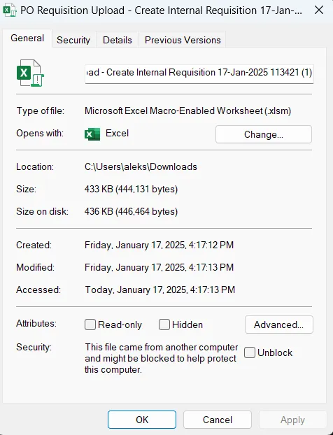

### Cause

This error appears if the Protected View is enabled in excel, and the EBS url is not added to the trusted sites.

### Solution

Add the EBS url to the trusted sites or ask your system administrator to do it. The required steps may differ depending on your operating system version. The below screenshots show the steps on Windows 11. To access the required configuration screen please type 'Internet Options' in the Windows search box.

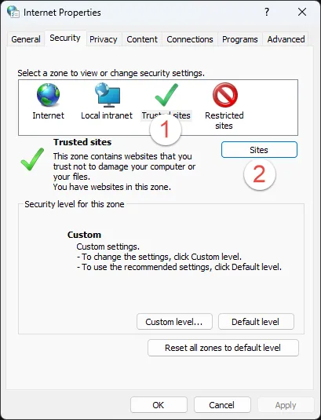


Close all opened Excel workbooks for the changes to take effect.

### Workaround

If it is not possible to modify the trusted sites, then open Excel File > Options > Trust Center > Trust Center Settings > Trusted Locations.

Add the location where the Blitz output files are downloaded.

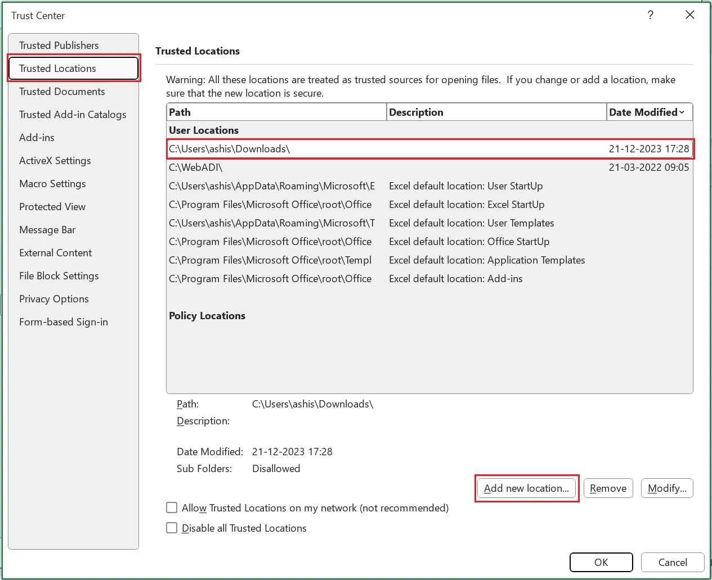


## 6.38 ORA-00001: unique constraint (SYS.I_OBJAUTH1) violated

The following warnings may be displayed in the Blitz Report installation logfile when trying to recompile a package:

```
ORA-00604: error occurred at recursive SQL level 1
ORA-00001: unique constraint (SYS.I_OBJAUTH1) violated
```

### Solution

Please execute the following workaround to recreate the failing package. E.g. for XXEN_UTIL:

```bash
cd [blitz_report_unzipped_installer_dir]/sql
sqlplus APPS/*******
drop package XXEN_UTIL;
set define off;
@XXEN_UTIL.pks
@XXEN_UTIL.pkb
```


## 6.39 SECURITY WARNING Macros have been disabled

The following warning may be displayed in Excel while opening a Blitz Upload XLSM output:

```
SECURITY WARNING Macros have been disabled.
```

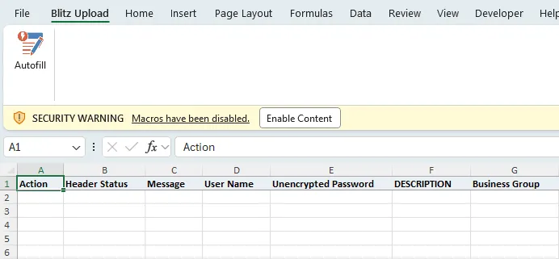

### Solution

You may click on the 'Enable Content' button to allow running macros one time.

For a permanent solution please go to the Excel menu: File > Info > Enable Content > Advanced Options.

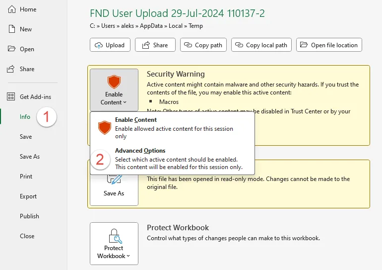

Then choose: 'Trust all documents from this publisher'.

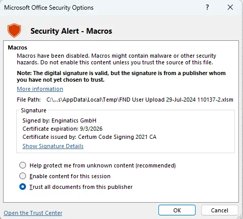

If your company's security policy does not allow you to update Excel settings, please ask your infrastructure team to import the Enginatics Certum Code signing public certificate to the Trusted Publishers certificate store.


## 6.40 504: Gateway Time-out

When querying general ledger balance data in Blitz FSG, the following error message may be shown:

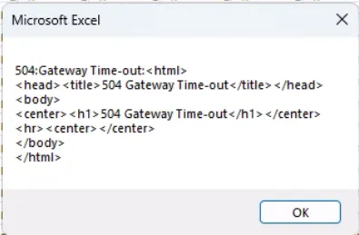

### Solution

Increase the OAFM servers Java Heap Size.


## 6.41 FRM-30085: Unable to adjust form for output

The following error may appear when installing or upgrading Blitz Report:

```
Form: XXEN_REPORTS
FRM-30085: Unable to adjust form for output.
Form not created
```

To fix this issue please run the following script as APPS:

```sql
set echo on
alter package XXEN_REPORT compile;
show errors;
alter package XXEN_UTIL compile;
show errors;
alter package XXEN_API compile;
show errors;
alter package XXEN_XDO compile;
show errors;
alter package XXEN_REPORT_EBS compile;
show errors;
alter package XXEN_REPORT_OAF compile;
show errors;
alter package XXEN_UPLOAD compile;
show errors;
alter package XXEN_WEBSERVICES compile;
show errors;
alter package XXEN_FSG compile;
show errors;
alter package XXEN_REPORT compile body;
show errors;
alter package XXEN_UTIL compile body;
show errors;
alter package XXEN_API compile body;
show errors;
alter package XXEN_XDO compile body;
show errors;
alter package XXEN_REPORT_EBS compile body;
show errors;
alter package XXEN_REPORT_OAF compile body;
show errors;
alter package XXEN_UPLOAD compile body;
show errors;
alter package XXEN_WEBSERVICES compile body;
show errors;
alter package XXEN_FSG compile body;
show errors;
exit;
```

Then please run these commands on the apps server to recompile the XXEN_REPORTS form. Adjust XXEN_TOP to the actual CUSTOM_TOP name for the Blitz Report.

```bash
read APPS_PWD

FORMS_PATH=$AU_TOP/$APPLFRM/US:$FORMS_PATH; export FORMS_PATH
frmcmp_batch.sh module=$XXEN_TOP/$APPLFRM/US/XXEN_REPORTS.fmb userid=apps/$APPS_PWD output_file=$XXEN_TOP/$APPLFRM/US/XXEN_REPORTS.fmx module_type=form compile_all=yes
```


*Previous: [Optional Configurations](part5_optional_configurations.md)*
