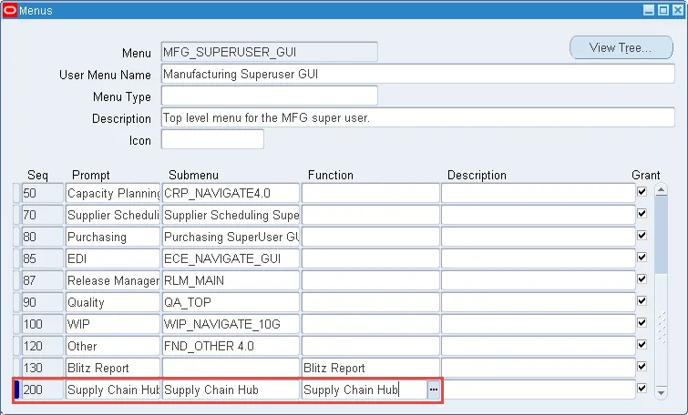
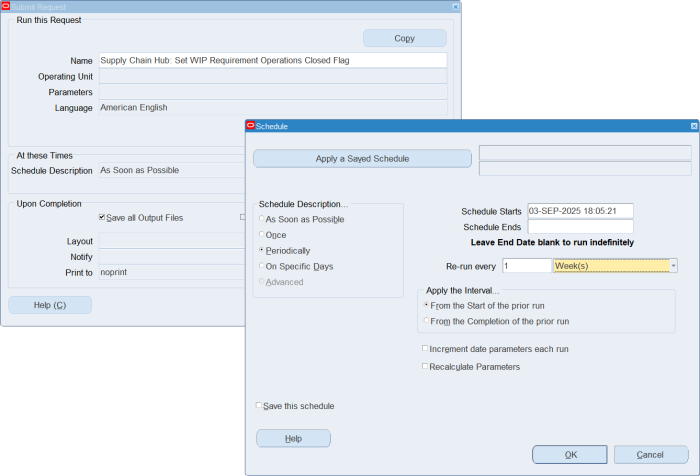
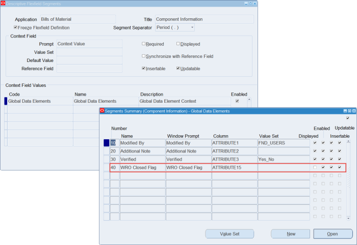

# 3. Application Setup

In order to make Supply Chain Hub available to the users, you need to add the Supply Chain Hub form function and sub-menu to application menus.

## 3.1 Menu Entry

Assign the Supply Chain Hub function and sub-menu manually, as shown below, to the menus you would like to access the Supply Chain Hub from.

**Navigation:** System Administrator > Application > Menu

## 3.2 Choosing ASCP or MRP as the Planning Source

By default the Supply Chain Hub will use ASCP as the planning source.

If you are using MRP instead of ASCP, the following profile option should be set at site level to instruct Supply Chain Hub to look at MRP as the planning source instead of ASCP.

| Profile Option | Value |
|----------------|-------|
| Supply Chain Hub: Use MRP for Planning Source | Yes |

## 3.3 Set WIP Requirement Operations Closed Flag Concurrent Program

For optimal performance of the WIP Demand KPI display in the Supply Chain Hub's item search results, there is an additional descriptive Flexfield required to store a WIP Job's closed indicator in the `wip_requirement_operations` table.

Please schedule the **'Supply Chain Hub: Set WIP Requirement Operations Closed Flag'** from the System Administrator responsibility to perform the required Flexfield set up and update the `wip_requirement_operations` table, for example on a weekly basis.

This program automatically detects the existing DFF setup and registers a new flexfield segment 'WRO Closed Flag' in a free attribute column of the 'Component Information' flexfield.

*Previous: [2. Installation](part2_installation.md) | Next: [4. Profile Options](part4_profile_options.md)*
