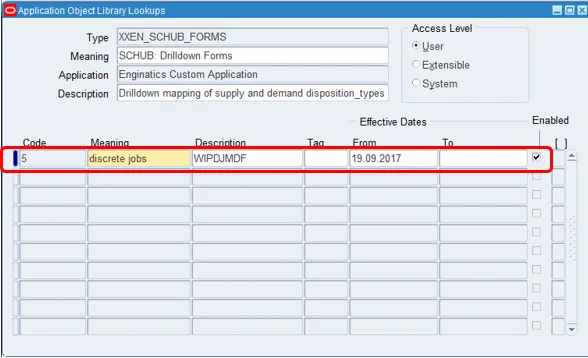
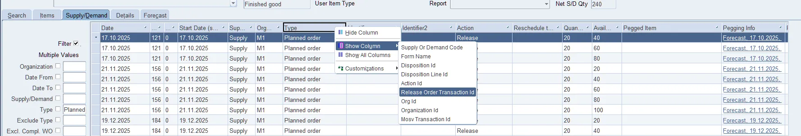
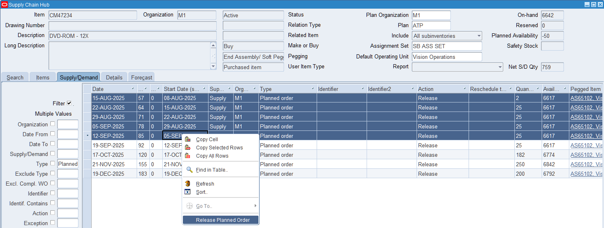
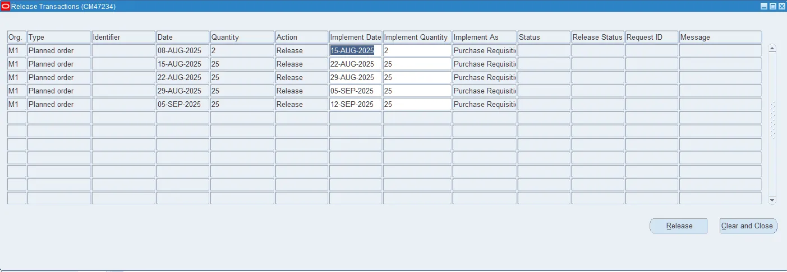
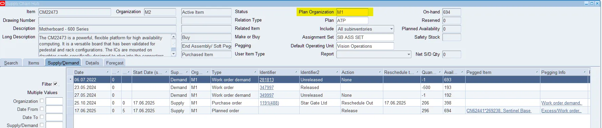
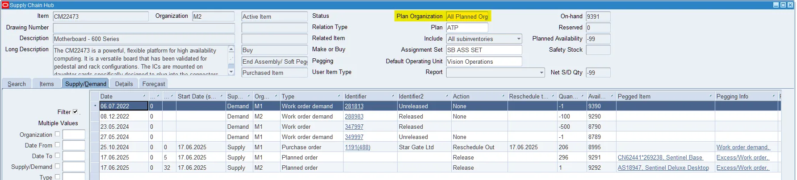
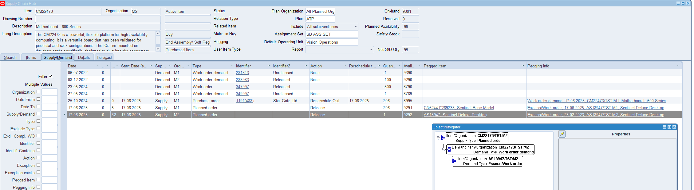

# 7. Troubleshooting

---

## 7.1 PL/SQL ERROR 302, when compiling XXEN_SCHUB_WIPDJMDF.fmb

For some clients on older patching levels, the custom form `XXEN_SCHUB_WIPDJMDF.fmb` may fail compilation during the installation of Supply Chain Hub.

In the event this error is encountered, the following setup change should be made to use the standard WIP Discrete Jobs form in place of the custom form for drilldowns.

| Setting | Value |
|---------|-------|
| Responsibility | Application Developer |
| Menu | Application – Lookups – Application Object Library |
| Lookup Type | XXEN_SCHUB_FORMS |
| Lookup Code | 5 |

Query back the Lookup type and the Lookup Code specified above.

Change the description of the Lookup Code from `XXEN_SCHUB_WIPDJMDF` to `WIPDJMDF` as shown below and save the change.



---

## 7.2 Index Synchronization Performance Issues

If you face performance issues with mass updates of item descriptions (e.g. updating items' long description via the EGO Spreadsheet Java Concurrent Program), you can reduce the intermedia index synchronization frequency from on commit to daily.

The following commands schedule the synchronization daily at 2 AM:

```sql
sqlplus system/*****
grant create job to inv;
alter index inv.xxen_mtl_sys_items_tl_t1 rebuild parameters('replace sync(every "trunc(sysdate)+1+2/24")');
alter index inv.xxen_mtl_sys_items_tl_t2 rebuild parameters('replace sync(every "trunc(sysdate)+1+2/24")');
```

---

## 7.3 Planned Orders

### If using MRP (on-prem):

- Only Work Orders are currently supported for release.
- Purchase Requisitions are not supported yet for release from SCHUB (see image below – hidden column Release Order Transaction ID must be present).
- EBS user must have update access to the SCP Workbench for the Planned Organization.



### If using ASCP (centralized or distributed):

- Blitz Report must be installed in the ASCP instance.
- The EBS user must exist in ASCP with the same username and be granted the `APS_RELEASE` responsibility (does not need to be active).
- User must have update access to the SCP Workbench under some responsibility in ASCP.
- Supports release to both Work Orders and Purchase Requisitions, including batch releases, date/quantity overrides.





---

### Understanding Supply/Demand Grid Behavior

- The **Release Order Transaction ID** column determines if a planned order can be released.
- If this column is not populated, the order cannot be released.
- Right-click on the Supply/Demand grid headers to make this column visible.

---

### Make vs Buy Confusion Across Orgs

- The Make or Buy attribute is organization-specific.
- A part might be Make in one org (e.g., Plant 006) and Buy in another (e.g., Plant 001).
- SCHUB reflects the selected Plan Organization from the top-right Planning Fields.



- If set to All Planned Orgs, it shows Supply/Demand across all Orgs.
- Item attributes shown in the Supply/Demand tab are relative to the selected Plan Org, not necessarily the org from the search tab.



---

### Visibility of Cross-Org Fulfillment

Use the **Pegging Info** column in the Supply/Demand tab to trace fulfillment sources.

- Click the hyperlink to navigate the object chain and verify originating demand (e.g., internal requisition linking Plant 001 to Work Order in Plant 006).



---

### Known Gaps & Upcoming Enhancements

- Backport of Purchase Requisition release for MRP is in progress.
- This update will also include:
  - Batch release support
  - Ability to modify quantity and dates at release time

---

*Previous: [Upgrade](part5_upgrade.md) | Back to: [Introduction](README.md)*
