# 1. Running Blitz Report

Basic steps to run a Blitz Report are:

1. Select a report
2. Select a template (optional)
3. Enter parameters
4. Run the report and review the output

> There is a [training video](https://www.enginatics.com/tutorials/) available on selecting and running reports.


## 1.1 Selecting a report

When opening Blitz Report for the first time, a selection of available reports is displayed automatically. The list can be restricted further by typing the first characters of the desired report name.

When subsequently opening Blitz Report, the last report executed will default in the report name field. If you open the reports LOV, all of your "most frequently used" reports will be listed at the top of the list. You can still scroll down, or use the following selection options for finding and selecting reports:

- Perform a text search by typing into the report name field. This executes a full text search on report name and description, parameters, SQL definition, template name and description, enabling you to search by column names, for example. The search is not case sensitive and allows creation of logical expressions using keywords 'and' or 'or' and use of brackets to group sub-expressions.
- Double click into the report name field
- Use the LOV attached to the report name
- Press the F1-key
- Pick a Category from the dropdown list
- Use the find/torch menu symbol
- Run a query on the report name or description fields via F11, Ctrl+F11

By default, users can select from reports assigned to their current logon responsibility only, but the LOV of reports can be extended by setting profile option **Blitz Report Filter Reports by Responsibility** to 'No'. This way, users will see all the reports assigned to them, regardless of their current logon responsibility.

**Text search example:**


Scrolling further to the right in the search results shows the matching score and fields in which the keywords are found.

When entering multiple keywords, the search matches all keywords by default.

Above example lists all reports containing both words, 'item' and 'invoice'.

To search on either of the keywords, combine them with 'or'.

To search for an exact match in the order of keywords e.g. 'item' directly followed by 'invoice', enclose them into quotation marks such as "item invoice".


## 1.2 Parameter values

Report parameters filter, limit or define the extracted data. Parameters can have lists of values that either enforce selection of one particular value (e.g. account number) or that allow matching by wildcards such as '%' or '_'.

To display the LOV for a parameter, double click either into the parameter value field or on the three LOV dots on the right.

Some parameters may allow entry of multiple values, depending on the definition of the parameter.

To run a report for a list of account numbers for example, check the 'Multiple Values' checkbox next to the parameter and either select account numbers one by one from the LOV or enter a semicolon-separated list of numbers manually.


Larger lists of multiple parameter values up to a length of 32000 characters can be entered using the 'Edit Field' menu function.

Multiple values can be separated by semicolon or line feed. Using the 'Edit Field' menu icon, you can for example copy and paste a list of parameter values directly from an Excel sheet.

Users can store their own default parameter values using the **Actions > Save User Parameter Defaults** menu option.


Once a template is selected it is also possible to store default parameter values against a template using the **Actions > Save Template Parameter Defaults** menu option.


## 1.3 Running and viewing the output

A click on the **Run** button launches a background concurrent process to extract the report data. The output XLSX file opens automatically upon program completion.

While the report concurrent process is pending or running, the request status is displayed on the output button. Once the report is complete, the output button can also be used to re-download the output file.


## 1.4 Options

The Options window is accessed by clicking on the grey options field. It allows controlling the report generation process and the output format at run time, for example email delivery and output formats. Some options are available only for developers. The runtime options inherit their default values from the Blitz Report Setup Window options with the same names.

**User view:**


**Developer view:**


### Email

Enter an e-mail address that you wish to send the report output to. Multiple email addresses can be entered as a comma-separated list. Developers can define a default email address for individual reports, or you can set up a default email through profile option **Blitz Report Default Email Address**.

> **Note:** For scheduled reports, the output file is sent only if the report retrieves data. If the output file is empty (zero rows), the delivery is suppressed. Profile option **Blitz Report Suppress Empty File Delivery** allows to change this default behavior.

The default email subject for Blitz Reports is stored in FND message **XXEN_REPORT_EMAIL_SUBJECT**. To change this text, navigate to **Application Developer > Application > Message** > query message XXEN_REPORT_EMAIL_SUBJECT and edit the message text.

You can use the following placeholders for automated replacement at run-time:

| Placeholder | Description |
|-------------|-------------|
| `&REPORT_NAME` | Report name |
| `&ROW_COUNT` | Number of rows in output |
| `&DB_NAME` | Database name |
| `&USER_NAME` | User who submitted the report |
| `&REQUEST_ID` | Concurrent request ID |
| `&SITE_NAME` | Oracle EBS site name |

You can also create new custom messages. Prefix these with XXEN_REPORT_EMAIL and use them as default email subjects by setting the profile option **Blitz Report Email Subject Message**.

### Output Format

Output file format. Possible options: **CSV**, **TSV**, **XLSX**

### Row Limit

You can restrict the number of rows in the output file by indicating that option.

### Time Limit

Indicates timeout in seconds. Program is terminated by the 'Blitz Report Monitor' after indicated time. This avoids excessive server loads if e.g. user submits report with insufficient parameter restrictions.

A time limit can also be set when running reports or using profile option **Blitz Report Time Limit**. If there are values set on different levels, the order of precedence is as follows:

1. Run window options time limit
2. Profile option on user level
3. Time limit on report level
4. Profile option on responsibility level
5. Profile option on site level

### Disable Column Translations

Disabling translation of the report's header if multi-language setup is in place. E.g.: interface requirements.

### Exclude Column Headers

Removing header column from the output file. E.g. for interface requirements.

### Custom Postprocess

A custom post-processing shell script can be set up to run after report completion, for example to distribute or transform the output file to a different format, such as generating a report in PDF format.

The script must be placed under the `$CUSTOM_TOP/bin/custom/` directory, for example `$XXEN_TOP/bin/custom/generate_and_send_pdf.sh`, and it allows the use of variables as shown in the following example:

```bash
 You can use a custom postprocess script to perform additional actions on the Blitz Report output files
 e.g. scp them to a different server, transform them to .pdf via external tools etc.
 This script is called with following parameters:
 $FCP_LOGIN                    example: APPS/w#*fe=+~12fweDg
 $p_report_name                example: AP Suppliers
 $p_template_name              example: Pivot by supplier type
 $p_request_id                 example: 6590137
 $outfile_name                 example: /d01/oracle/VIS/inst/apps/VIS_r12/logs/appl/conc/out/AP_Suppliers_6590142.xlsx
 $output_filename              example: AP_Suppliers_6590142.xlsx
 $additional_outfile_name      example: /d01/oracle/VIS/inst/apps/VIS_r12/logs/appl/conc/out/AP_Suppliers_20191117.xlsx
 $parameter1 ... $parameter87

 Example of copying output xlsx file to an interface directory on a remote server:
 scp "$outfile_name" user@remoteserver.com:/interface_dir
```

To add a new custom postprocess script name to the runtime options LOV, add it to lookup **XXEN_REPORT_POSTPROCESS_SCRIPT**.


### Output Filename

Defines the Excel output file name, downloaded to the client desktop. Tokens can be used to create a filename dynamically, for example based on report parameter values.

### Additional Out. Directory on APPS Server (Developer access only)

Saves a copy of the report output file in the specified directory on the application server. This setting can be defaulted by the profile option **Blitz Report Additional Output Directory APPS Server**. Tokens can be used to create a directory path dynamically, for example based on report parameter values. If the resulting directory does not exist on the filesystem, it is created.

### Additional Out. Directory on DB Server (Developer access only)

Saves a copy of the report output file in the specified directory on the database server. This setting can be defaulted by profile option **Blitz Report Additional Output Directory DB Server**. The list of the available directories is fetched from the dba_directories table.

### Additional Out. Filename (Developer access only)

Naming convention for output files if additional output directories are defined. Tokens can be used to create a filename dynamically, for example based on report parameter values.

### Reset button

This button is used to set runtime options to the default values based on the profile option or report level settings.

### Freeze flag

When checking the freeze flag, option values are not changed or reset to their defaults when navigating to a different report.

### Tokens

You can use any of the below tokens to dynamically generate values for the following runtime options: Output Filename, Additional Out. Directory on APPS Server, Additional Out. Filename.

| Token | Description |
|-------|-------------|
| `<report name>` | Report name |
| `<report_name>` | Report name, all spaces are replaced to underscores |
| `<template name>` | Template name |
| `<template_name>` | Template name, all spaces are replaced to underscores |
| `<request_id>` | Concurrent request id |
| `<parameter name>` | Value of the specified parameter name |
| `<parameter_name>` | Value of the specified parameter name, all spaces are replaced to underscores |
| `<date format string>` | Actual run date in the specified Oracle date format string |

**Example filename using tokens:**

`<report_name>–<template_name>–<request_id>-for-<Operating_Unit>-on-<DD-MM-YYYY>`

**Resulting filename:**

`AP_Suppliers-Operating_unit_only-6317575-for-Vision_Operations-on-06-10-2022.xlsx`

**Example directory using tokens:**

`/interface/<report_name>_<DD-MM-YYYY>`


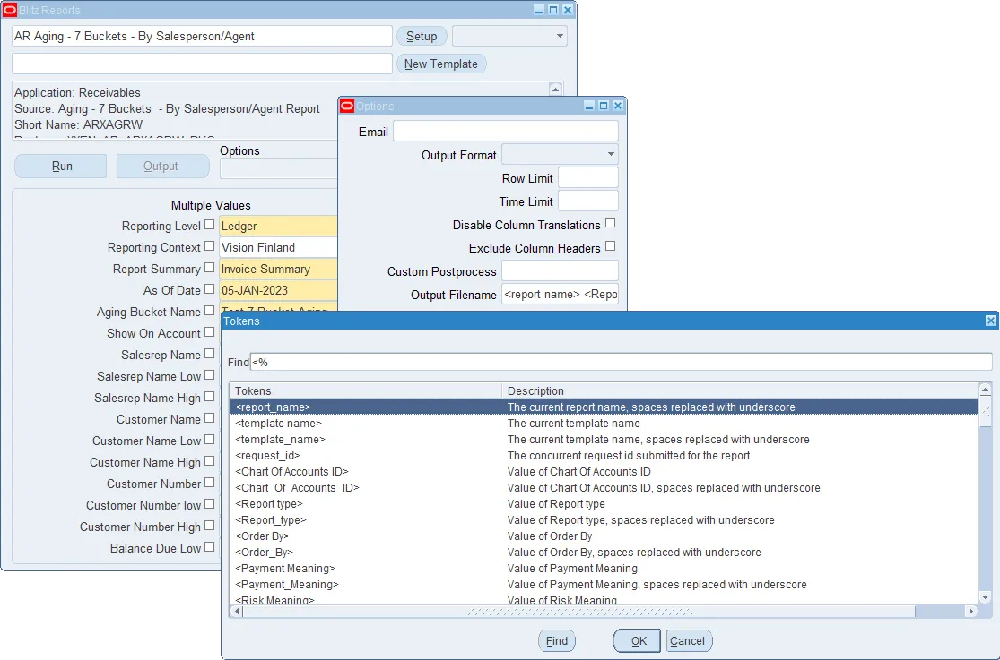

Manually entered tokens are validated against the LOV values, and an error message is displayed in case a token is not valid.


> **Note:** There are three different output files, which can have different names in Blitz Report:
> 1. The file name that is downloaded to the client desktop when opening the Blitz Report output.
> 2. The output file on the concurrent processing server in directory $APPLCSF/out. This is the attachment file name when sending Blitz Reports via email and the Oracle EBS delivery option.
> 3. An additional output file placed into a directory either on the application or database server.


## 1.5 Templates

From the options window, you can either select an existing template to edit, or, if the template name is empty, create a new template by clicking on the 'New' button.

> There is a [training video](https://www.enginatics.com/tutorials/) available on creating and sharing layout templates.


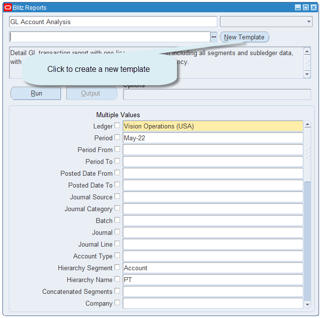

### Template layout

A template allows users to select the data columns, the level of reporting (detail transactional or summarized), aggregation calculations, and to define a pivot table output. Using templates, report columns can be selected and/or de-selected, summarized, and sorted as well as pivoted.


The template window contains the following elements:

| Element | Description |
|---------|-------------|
| **Name** | Name of the template |
| **Description** | Description of the template |
| **Global Default** | Sets the template as the default for all report users (available for developers only) |
| **Distinct** | Suppresses duplicate rows in the report |
| **Owner** | Shows who created and owns the template |
| **Available Columns** | List of columns that are available for display, but are not selected yet |
| **Displayed Columns** | List of columns that are selected and included in current report output |
| **Column search** | Can be used to quickly find specific available or displayed columns |
| **Aggr.** | Used for summary reports and specifies how to aggregate the data (average, count, min, max, sum) |
| **Sort Order** | Determines the order of the output data (ascending / descending) |
| **Sort Priority** | Determines the sort priority if more than one sort order is selected |
| **Sheet Break** | Allows splitting the output file into different sheets for every column value change |
| **Arrow buttons** | Move columns between "available" and "displayed", as well as changing their display order |
| **Reset button** | Recover the initial column layout |
| **Hide All button** | Deselect and move all data off of the "selected" columns and back to the "available" column |

### Pivot table

The Filters, Columns, Rows and Values fields are used to create and deliver the data in pivot table format with full drill down to details.

| Section | Description |
|---------|-------------|
| **Filters** | Columns you will use to filter the data (GL account, Department, Customer, etc.) |
| **Columns** | Defines which data should appear in separate columns (Period, Project, etc.) |
| **Rows** | Defines the data summary level for each row in the pivot table |
| **Values** | Defines the numeric data that will be summarized |
| **Aggr.** | For the "values" section, how to aggregate the data (average, count, min, max, sum) |

**Sample pivot table output:**

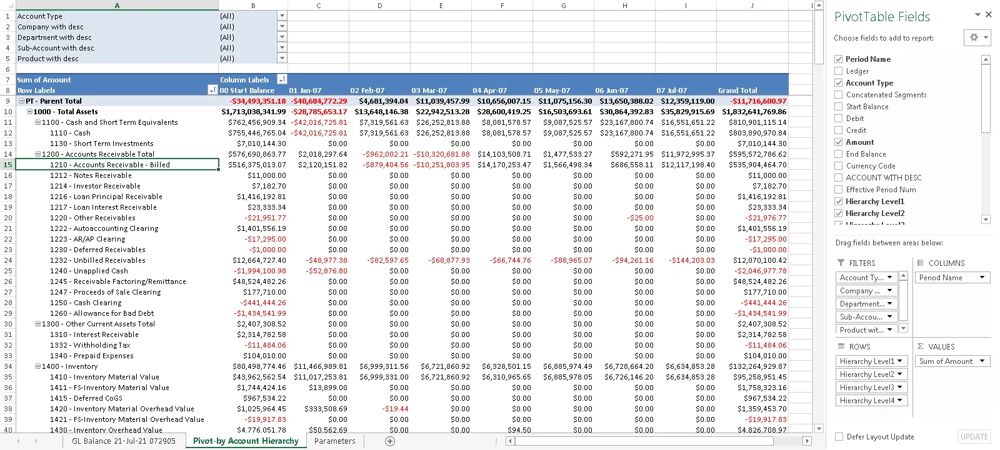

### Excel upload

The Excel template upload functionality allows creation of additional sheets with graphs, pie charts, macros or any other Excel functionality.

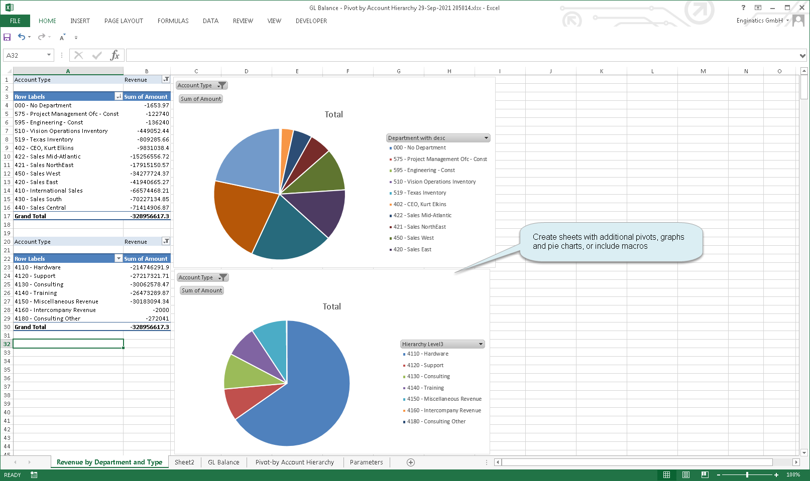


### Datasheet

The excel template upload functionality also allows custom template definitions to the datasheet. The excel functions, pictures, screenshots, charts, header footer texts, comments, notes and freeze panes can be defined in the datasheet.


> **Note:** If the excel functions are used in the datasheet template then hit "CTRL + SHIFT + R" to refresh them in the report output.

### Template sharing

Templates can be shared across the following levels:

- **Site:** all users in the system
- **Responsibility:** users having the responsibility
- **User:** inclusion or exclusion by specific user


### Excluded parameters

You can exclude certain parameters for a template. When the template is selected on the Run window, the excluded parameters are not displayed.


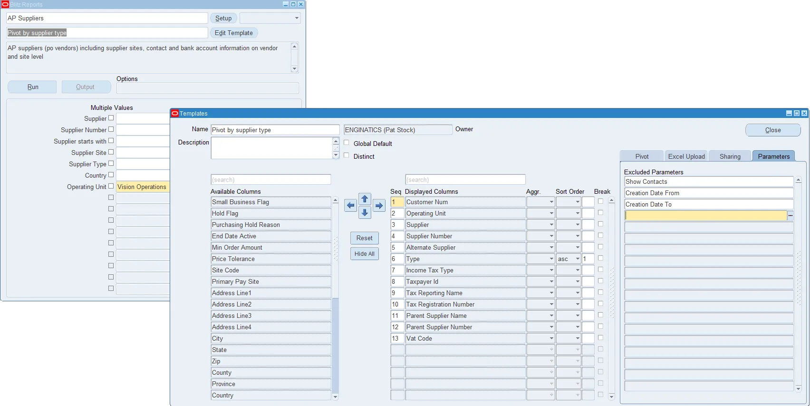


## 1.6 Scheduling a report

Blitz Reports can be scheduled as background processes to run at a certain date or time. This feature can be used to run time-consuming reports during non-office hours, or to automatically distribute files by email or place them into a folder on the file system.

> There is a [training video](https://www.enginatics.com/tutorials/) available on scheduling and output file distribution.

The easiest way to schedule a report is to run the Blitz Report first, and to then copy the submitted concurrent request and schedule it:

1. Run a report from the Blitz Report run window with parameter restrictions as required
2. Navigate to **menu > view > requests > submit a new request > single request > Copy > Find** > select the concurrent request submitted in step 1
3. Update schedule and delivery options as required and re-submit the request

Alternatively, you can submit a new 'Blitz Report' concurrent request, populating its parameters manually. Select the required report name from the LOV and populate parameters 1 to 87 with values in exactly the same order as they appear on the Blitz Report run window.


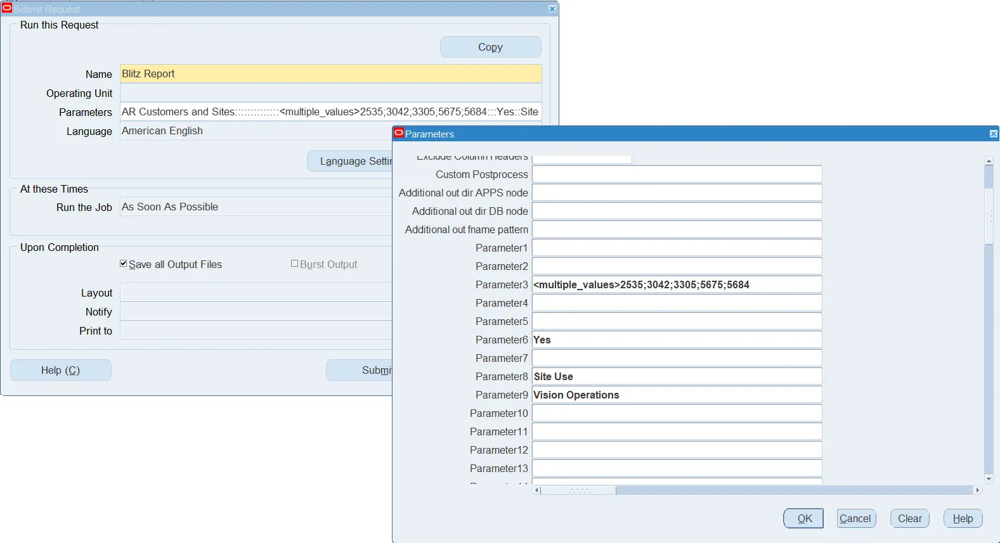

> **Note:** For date parameters in scheduled Blitz Reports, you can use Oracle's increment date functionality.

### Delivery options and output distribution

Oracle's delivery options allow sending the report output e.g. as an email attachment, to an FTP location or uploading it to a WebDAV cloud storage.

If a scheduled report does not retrieve any data, Blitz Report does not send an empty output file. In case you also want to send empty output files for scheduled reports, set profile option **Blitz Report Suppress Empty File Delivery** to 'No'.


## 1.7 Using Blitz Upload

Blitz Upload provides an efficient way to create and update data in Oracle E-Business Suite directly from Excel. It combines the familiar Excel interface with powerful server-side bulk processing, making data operations significantly faster than traditional tools like Web ADI.

> There is a [training video](https://www.enginatics.com/tutorials/) available on using Blitz Upload.

### Accessing Blitz Upload

Blitz Upload is accessed through the same Blitz Report interface. When you click on the Excel icon in Oracle EBS navigation, uploads are displayed alongside reports and can be selected from the list.

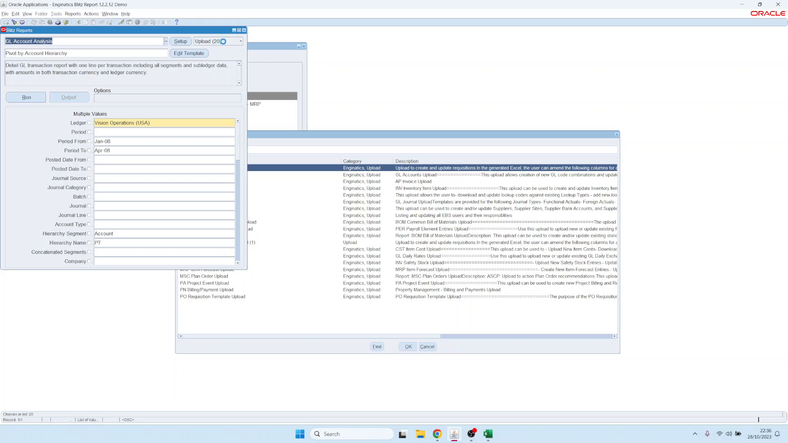

### Upload Modes

When you select an upload, you can choose how you want to work with the data:

| Mode | Description |
|------|-------------|
| **Create** | Create new records only. The tool generates an empty Excel file with the required column structure for data entry. |
| **Create or Update** | Query existing records and modify them, or create new records. This mode downloads existing data that you can update. |

### Understanding the Excel Output

When you run an upload, Blitz Upload generates a macro-enabled Excel file with color-coded columns:

| Color | Meaning |
|-------|---------|
| **Gray** | Read-only columns. These cannot be modified for existing records (e.g., requisition number). |
| **Yellow** | Required columns. You must provide values for these columns when creating new records. |
| **White** | Optional columns. You may enter values but they are not required. |

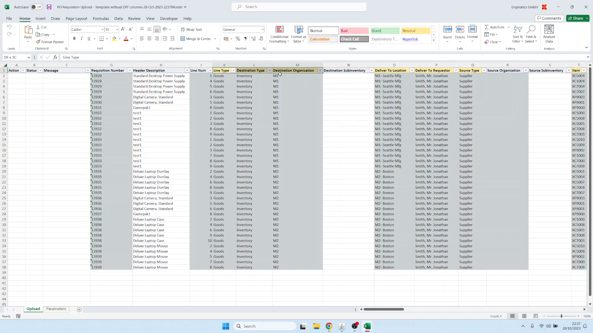

Similar to Oracle Forms, Blitz Upload provides List of Values (LOV) validation directly in Excel for fields like inventory organizations, locations, requesters, suppliers, and inventory items.

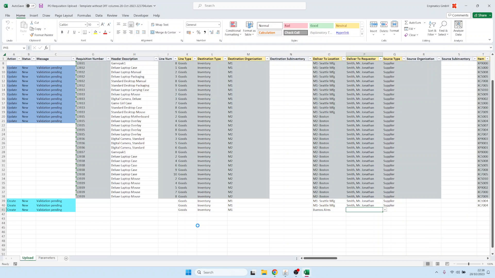

### Data Entry and Upload Process

1. **For existing records**: The tool automatically detects which records you modified. Only modified records are processed during upload.
2. **For new records**: Add new rows, fill in all yellow (required) columns, and optionally fill in white (optional) columns.
3. **Save** the Excel file and click the **Upload** button in the Blitz Upload window.
4. Select the saved file from your downloads folder.

Blitz Upload processes the entire dataset in bulk on the server, enabling updates of hundreds of thousands of records efficiently.

### Viewing Results and Handling Errors

After the upload completes, a new output file is generated showing the **Status** (Success or Error) and **Message** for each record.

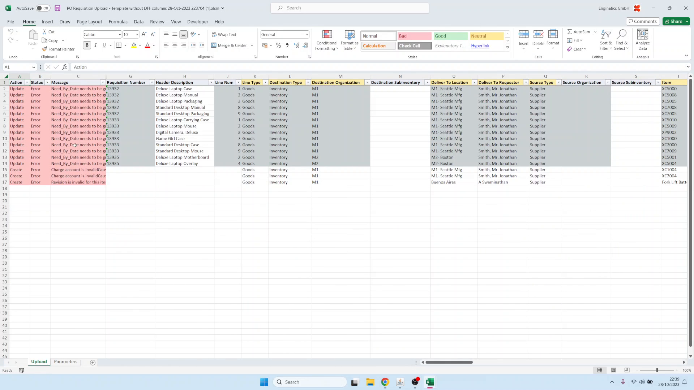

If records fail validation:

1. Review error messages in the output file
2. Correct the data directly in the output file
3. Save and upload again

Common errors include invalid dates, invalid charge accounts, and missing required fields. The iterative error correction process allows you to quickly resolve issues and reprocess records until all are successful.

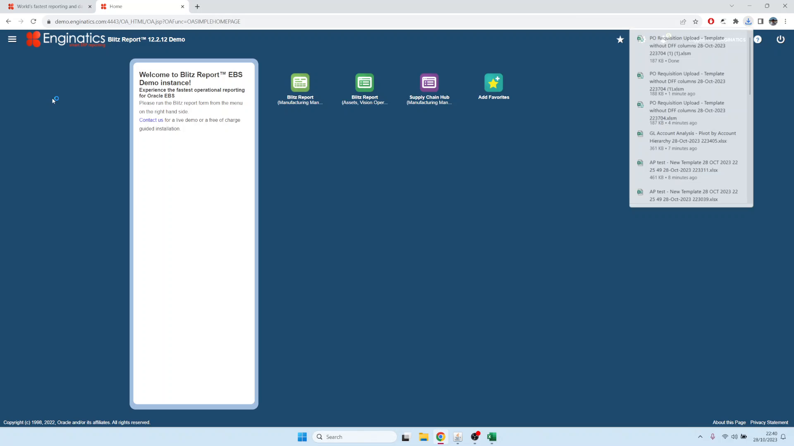

> For detailed information on creating uploads, see [Developer Guide: Creating a Blitz Upload](../developer_guide/part6_upload_glossary.md#6-creating-a-blitz-upload).