## 2. GL Financial Statement and Drilldown (FSG)

The GL Financial Statement and Drilldown (FSG) Report empowers users to generate comprehensive reports on financial balances while providing detailed insights through drilldown capabilities. This tool allows users to link Excel cells directly to Oracle data via built-in functions, ensuring that data can be refreshed as needed to reflect the most up-to-date information.

**Key features include:**

1. **Balance and Detail Reporting:** Generate high-level balance reports and drill down into the details, including journal entries and subledger transactions.
2. **Oracle Data Integration:** Seamlessly link Excel cells to Oracle data, with the ability to refresh the data for real-time updates.
3. **Drilldown Functionality:** Access detailed information at various levels, including balances, journal entries, and subledger details.
4. **Migration Tools:** Converters are available to migrate reports from Oracle FSG, GL Wand, and Spreadsheet Server to this solution.

For a quick demonstration, refer to the YouTube video: https://youtu.be/dsRWXT2bem8

> **Note:** Please do not delete the "Financial Statement Generator" sheet or modify the Advanced Custom Properties in the Excel output, as these are essential for the proper functioning of the report.

### 2.1 Accessing Blitz FSG

#### Running the Default GL Financial Statement and Drilldown (FSG) Report in Blitz Report

1. Select Report Name GL Financial Statement and Drilldown (FSG).
2. The Template Name field is left blank to use the default template.
3. The ledger Name is defaulted based on the responsibility. The selected ledger will be defaulted to the output of GL Financial Statement and Drilldown (FSG).
4. Clicking "Run" generates the output with drilldown capabilities to Oracle-linked Excel data.

5. Build your templates either by converting from legacy tool or by creating a new template using the tools present in Blitz FSG custom ribbons.

#### Running the GL Financial Statement and Drilldown (FSG) Report for uploaded templates in Blitz Report

1. Select Report Name GL Financial Statement and Drilldown (FSG).
2. Select the previously uploaded Template.
3. The ledger Name is defaulted based on the responsibility. The selected ledger will be defaulted to the output of GL Financial Statement and Drilldown (FSG).
4. Clicking 'Run' generates the output with drilldown capabilities to Oracle-linked Excel data.

5. Customize report parameters (e.g., Segment, Company, Period Name) to fit your analysis needs.
6. Update Financial Data Instantly with Blitz FSG's Refresh Tools.

#### Running the GL Financial Statement and Drilldown (FSG) Report for templates stored locally

The template can be built and stored locally on your computer or saved to a shared drive for team access. Locate and open the template file.

1. Click on Login button
2. On the Authentication form:
   - Enter the User Name and Password
3. Click on Submit

If the Single Sign On is enabled in the organization and the profile 'Blitz Report SSO Enabled' is set to 'Yes' then the connection is established by Clicking on Login Button.

> **Note:** Maintaining a local copy may result in version discrepancies between your file and the Oracle EBS application. Any such differences will be highlighted as shown below. To resolve this, you must upload your locally saved template to the Oracle EBS Blitz Report 'GL Financial Statement and Drilldown (FSG)' template.

#### Exit

Click 'Exit' to end the connection between Oracle EBS and the Excel workbook template.

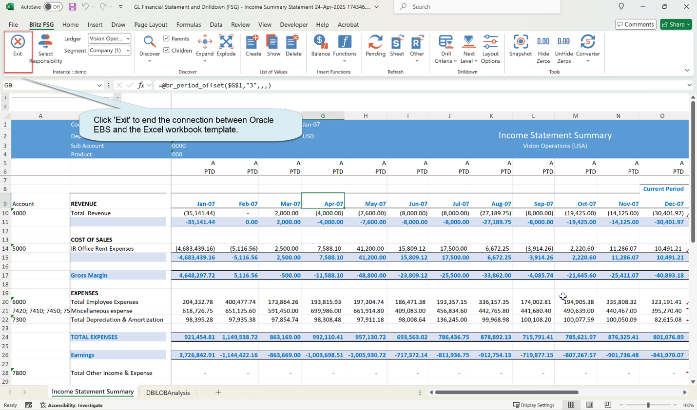

### 2.2 Responsibility, Ledger and Segment Selector

Once logged in, the Ledger and Segment dropdown menus will populate based on your assigned responsibilities. The responsibility is defaulted with the responsibility from which the report was run.

#### Select Responsibility

The list displays all responsibilities you have access to in Oracle, including those with Account Inquiry functionality. By default, the system selects the responsibility from which the report was launched.

You can:
- Select a different responsibility using the checkboxes
- Choose all responsibilities by clicking the 'Select All' button

After making your selection, click OK to load the corresponding ledgers in the dropdown. Your selection will be saved and automatically set as the default for future use.

#### Ledger

The Ledger dropdown dynamically displays available ledgers according to your access permissions:

1. **Single Responsibility Access:** Shows only ledgers assigned to your current responsibility
2. **Multiple Responsibilities:** Lists all ledgers from all responsibilities you've selected
3. **Oracle R12 Environment:** If selected responsibility's data access set contains multiple ledgers, all will appear.

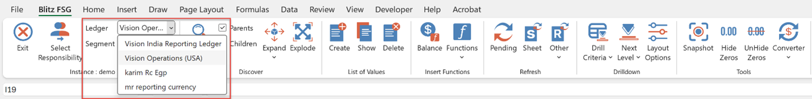

#### Segment

The dropdown list displays all available segments for the currently selected ledger. Each segment is labeled with its corresponding segment number in parentheses (e.g., 'Company (1)'). It also contains the special 'Period' value for period name discovery.

### 2.3 Discover

The Discover Tools enable you to:
- Extract segment information directly from Oracle
- Automatically populate Excel cells with the retrieved data

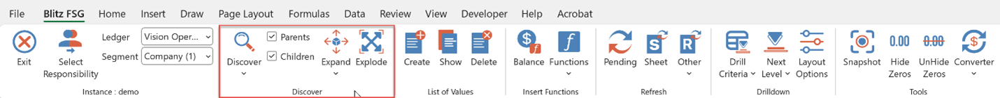

#### Key Functionality

##### Discover

This feature enables you to:
- Populate Excel spreadsheets directly with chart of accounts values and period name.
- Streamline report building and segment value review processes

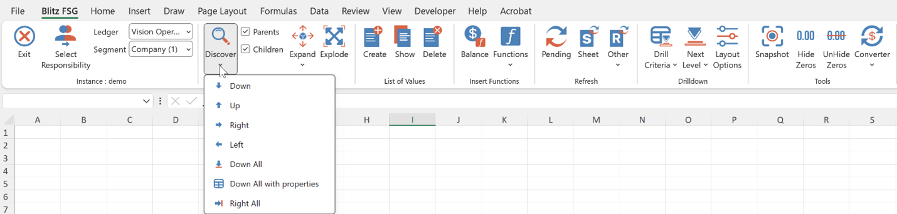

**Key Features:**
- Automatic population of adjacent cells (down or to the right)
- Configurable hierarchy discovery:
  - Child values only
  - Parent values only (Adjust via Discover Level setting check the box to decide the level)

| Button | Description |
|--------|-------------|
| **Down** | Discover the next value Down for the currently selected segment or period. |
| **Up** | Discover the previous value Up for the currently selected segment or period. |
| **Right** | Discover the next value to the Right for the currently selected segment or period. |
| **Left** | Discover the previous value to the Left for the currently selected segment or period. |
| **Down All** | Discover All segment values Down for the currently selected segment. |
| **Down All with properties** | Allows a variety of information to be extracted about the selected segment values: Segment Value, Segment description, Parent indicator (Y means the segment value is a parent), Enabled indicator (Y means that the segment value is enabled). |
| **Right All** | Discover All segment values to the Right for the currently selected segment. |

**Discover Functionality Best Practices:**

1. **Segment Matching** - Ensure the segment selected in the Ledger and Segment Selector matches the segment in your active Excel cell.
2. **Parent Values Identification** - Parent values appear in bold font; Regular font indicates child values.
3. **Batch Discovery** - To discover multiple values simultaneously: Highlight a range of cells, Click any discover button.
4. **Complete Value Discovery** - For all available values: Use Discover Down All (vertical) or Discover Right All (horizontal).
5. **Text Format Requirement** - All segment values must be in text format to preserve formatting:
   - Option 1: Pre-format cells as Text (Number Format > Text)
   - Option 2: Prefix values with an apostrophe (')
   - Example: For "001", enter '001
   - Note: Without this, leading zeros will be lost and discovery may fail

#### Expand

To expand to child segment values:

1. Select a cell containing a parent segment (e.g., 'Account(3)') value
   - Ensure adjacent columns contain related Blitz FSG functions (segment description, balance, etc.)
2. Click 'Expand > Down' to reveal all child values in the hierarchy

When expanded, the child values will be inserted while automatically copying all adjacent formulas and content to the new rows.

**Multi-Row Expand Option:** You can select multiple rows before executing an Expand operation. Blitz FSG will automatically expand each selected row individually.

**Undo:** Clicking Undo Expand removes the results of the most recent Expand operation.
- Supports multiple undo levels.
- Repeated clicks will step backward through previous Expand results.

#### Explode

The Explode feature duplicates the current worksheet for each child value of your selection. Your selection can be:
- Parent segment value
- Segment Value range
- Child segment Value
- Any combination of these

1. Select a cell containing a segment value (e.g., a parent account)
2. Choose the corresponding segment from the list (e.g., "Department")
3. On Click of Explode button, Blitz FSG will:
   - Retrieve all child values from Oracle
   - Create a new worksheet for each child value in the current workbook

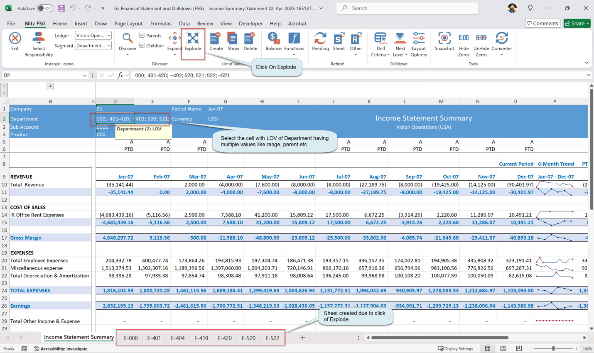

### 2.4 List of Values

The 'Create' feature converts a cell into a List of Values (LOV) cell, marked by a note prefixed with the LOV name (e.g., 'Amount Type LOV', 'Company (1) LOV').

To access the values:
1. Double-click the cell, or
2. Select the cell and click 'Show' from List of Values on the ribbon.

The LOV will display values specific to the data type assigned to that LOV cell.

There are 3 different types of List of Values:

#### Single Value

1. Refine selections using the search field or select from the list.
2. Click OK to apply selections to the cell.

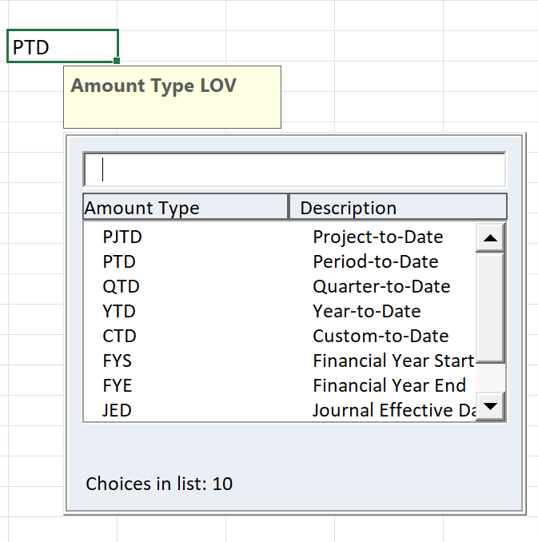

#### Multiple Value

1. Select values individually or use Add Range for bulk inclusion.
2. Exclude specific entries with Add Exclude.
3. Refine selections using the search field.
4. Click OK to apply selections to the cell.

> **Note:** The format rules are as follows:
> - **Range:** Defined with a hyphen (-). Example: 4/11/2025-4/20/2025
> - **Exclusion:** Prefix with a tilde (~). Examples:
>   - Single: ~4/14/2025
>   - Range: ~4/11/2025-4/20/2025
> - **Multiple Values on the cells:** Separated by semicolons (;). Example: 4/11/2025; 4/20/2025

#### Segment Values

The Segment List of Values (LOV) enables selecting account ranges or individual values. It supports hierarchical navigation, multi-selection, and exclusions.

1. You could select a hierarchy (e.g., Cash and Short Term Equivalents) to narrow the account list.
2. Select values individually or use Add Range for bulk inclusion.
3. Exclude specific entries with Add Exclude.
4. Refine selections using the search field.
5. Click OK to apply selections to the cell.

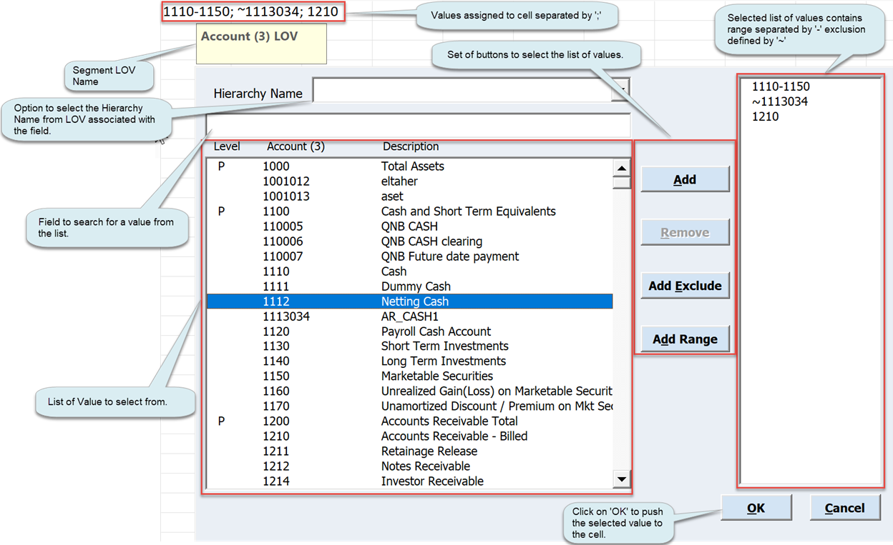

> **Note:** The format rules are as follows:
> - **Range:** Defined with a hyphen (-). Example: 1110-1150
> - **Exclusion:** Prefix with a tilde (~). Examples:
>   - Single: ~1113034
>   - Range: ~1110-1120
> - **Multiple Values on the cells:** Separated by semicolons (;). Example: 1110-1150;1210;1211;~1111;~1120-1130

#### Adding Range in Multiple Values and Segment List of Values

1. First select multiple values from the list, then click 'Add Range' to form your chosen value range.

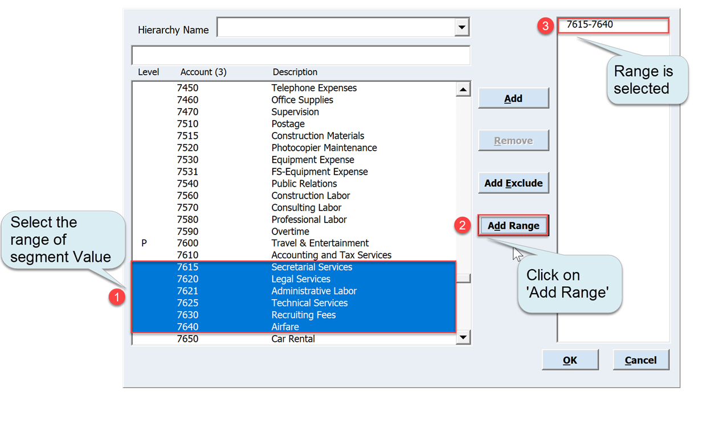

2. Select from and to values from the list, then click 'Add Range' to form your chosen value range.

3. Select and 'Add' the from value, then the to value, click on selected value and finally click on 'Add Range' to form your chosen value range.

4. Select and 'Add Exclude' the from value, then the to value, click on selected value and finally click on 'Add Range' to form your chosen value range.

#### Delete List of Values

To delete the list of values from the cell then you can click on 'Delete' from List of Values on the ribbon.

### 2.5 Insert Functions

Blitz FSG provides a suite of custom Excel functions that enable dynamic data extraction from Oracle. To use these functions click on dedicated function button like 'Balance' or select one from the 'Functions' dropdown menu.

#### Using the Function Form

1. **Parameter Selection**
   - Choose values from list of values, which are dynamically populated with valid options for each parameter pulled directly from Oracle.
   - **Cell Referencing** - Click the Link button to bind a parameter to an Excel cell.
   - For ranges: Press F4 to toggle between absolute/relative referencing (standard Excel behavior).
   - The field highlighted yellow are required parameters.
   - **Range:** Defined with a hyphen (-). Example: 1110-1150
   - **Exclusion:** Prefix with a tilde (~). Examples: Single: ~1113034, Range: ~1110-1120
2. **Multiple Values on the cells:** Separated by semicolons (;).
3. If you want to choose all the values you could choose to keep the parameter as blank, this is same as passing '%'

#### Balance

As the cornerstone of Blitz FSG, the Balance function retrieves General Ledger balances—either individually or aggregated—based on your specified parameters. To begin, click the Balance button on the Blitz FSG toolbar to open the function form.

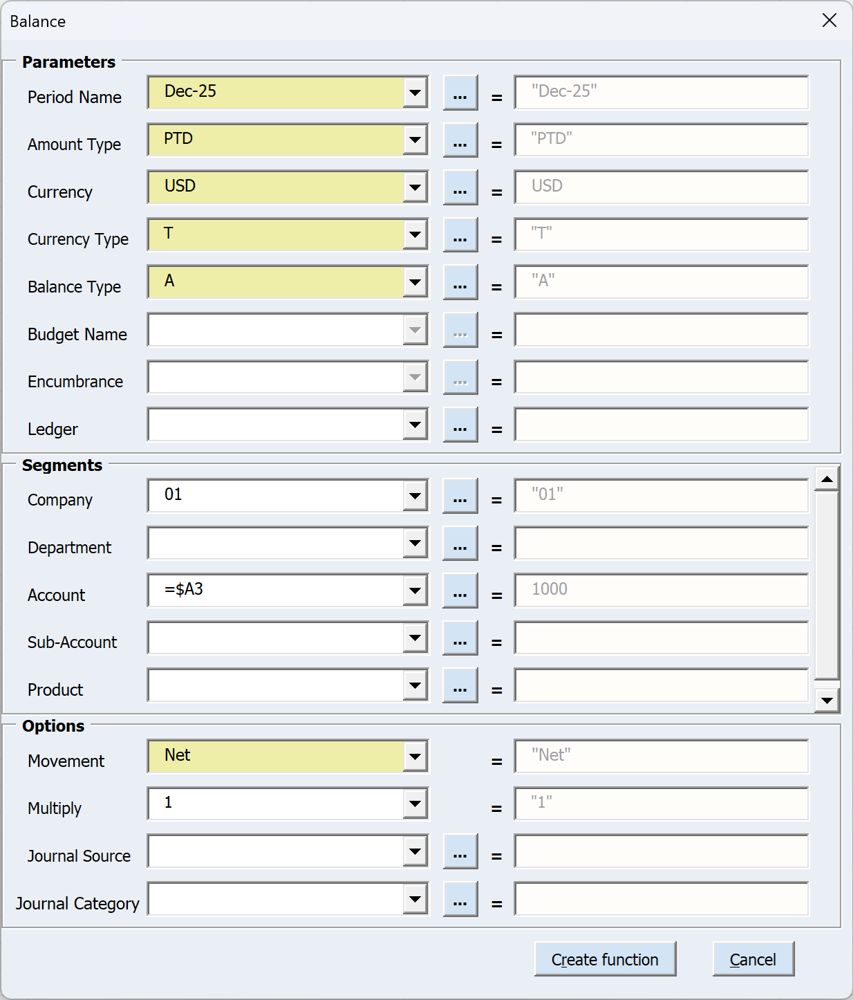

**Formula:** `br_balance("Dec-25","PTD","USD","T","A",,,,"Net","1",,,"01",,$A3,,,,,,,,,,,,,,,,,)`

**Parameters:**

| Parameter | Description |
|-----------|-------------|
| **Period Name** | The period name must exactly match the format configured in Oracle. For instance, if your Oracle system uses "Jan-07" as the period format, entering variations like "JAN-2007", "January-07", or "jan-07" will result in no data being returned and will trigger an "invalid (Period)" message. When used with the custom balance type CTD (Custom to Date), you can specify a custom period range such as "Feb-07-Aug-07" to aggregate movement data across multiple periods. This parameter supports multiple period ranges and lists, including wildcard entries like "Jan-0%" or "%-07" for flexible period matching. For the special balance types "JED", "JEDU", or "JEDP" (Journal Effective Date), the period parameter functions as a date parameter. |
| **Amount Type** | Balance Type Parameters (All values must be in uppercase): YTD (Year-to-Date), QTD (Quarter-to-Date), PTD (Period-to-Date), PJTD (Project-to-Date), CTD (Custom-to-Date), FYS (Fiscal Year Start), FYE (Fiscal Year End), JED (Journal Effective Date), JEDP (Posted Journal Effective Date), JEDU (Unposted Journal Effective Date). |
| **Currency** | Oracle currency code (uppercase) – Example: USD |
| **Currency Type** | E: Entered amount (original transaction value), T: Translated amount, C: Converted amount (functional currency equivalent of foreign currency amounts) |
| **Balance Type** | A – Actual, B – Budget, E – Encumbrance |
| **Budget Name** | If Balance Type is selected as 'B', this field will be enabled for input. Enter one or more budget names. |
| **Encumbrance** | If Balance Type is selected as 'E', this field will be enabled for input. Enter one or more encumbrance types. |
| **Ledger** | If this parameter is left blank, the system will calculate balances using the ledger selected in the dropdown menu. |
| **Segments (1-20)** | Enter segment value in these fields. Format the value exactly as configured in Oracle, including all leading zeros. Accepted Formats: Single value, Range (e.g., "1100-1300"), List (e.g., "1500;1510;1590"), Exclusions (e.g., "1100-1300;~1200"), Combinations. |
| **Movement** | Debit – Dr, Credit – Cr, Both – Net |
| **Multiply** | 1 or -1 – Use this parameter to switch the sign of the balance |
| **Journal Source** | Limits the result to journal sources. |
| **Journal Category** | Limit the results to journal categories. |

#### Segment Description

Returns the description and corresponding value for the specified segment within the applicable ledger context.

**Formula:** `br_segment_description("Account (3)",A3,)`

**Parameters:**

| Parameter | Description |
|-----------|-------------|
| **Ledger** | If this parameter is left blank, the system will evaluate using the ledger selected in the dropdown menu. |
| **Segment** | The segment name. |
| **Segment Value** | The segment value. |

#### Period Offset

Returns the period name located a specified number of periods before (negative values) or after (positive values) a reference point.

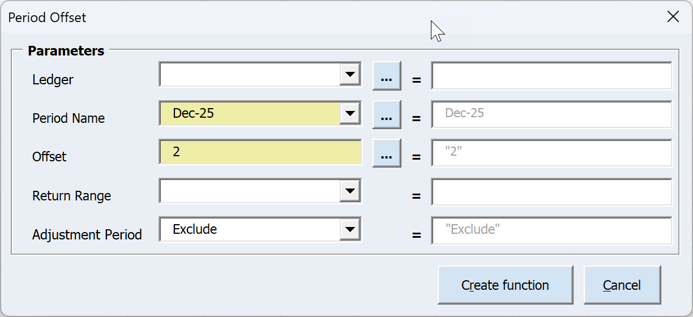

**Formula:** `br_period_offset("Dec-25","2",,"Exclude",)`

**Parameters:**

| Parameter | Description |
|-----------|-------------|
| **Ledger** | If this parameter is left blank, the system will evaluate using the ledger selected in the dropdown menu. |
| **Period Name** | The period name must exactly match the format configured in Oracle. |
| **Offset** | Enter a numerical value: Positive numbers return future periods, Negative numbers return past periods, 0 returns the current period. |
| **Return Range** | When enabled (Yes), formats results as a period range spanning from offset to base period. Example: Mar-08 with offset -2 returns 'Jan-08-Mar-08'. |
| **Adjustment Period** | Use this parameter to control how adjustment periods are handled. Exclude: Adjustment periods are filtered out. |

#### Period by Date

Returns the accounting period name corresponding to the specified date.

**Formula:** `br_period_from_date("23-Apr-2025",,"2")`

**Parameters:**

| Parameter | Description |
|-----------|-------------|
| **Ledger** | If this parameter is left blank, the system will evaluate using the ledger selected in the dropdown menu. |
| **Date** | The date that you want the period name for. |
| **Offset** | Enter a numerical value to retrieve period names relative to your specified criteria. |

#### Period Name

Returns the accounting period name for a specified year and period number.

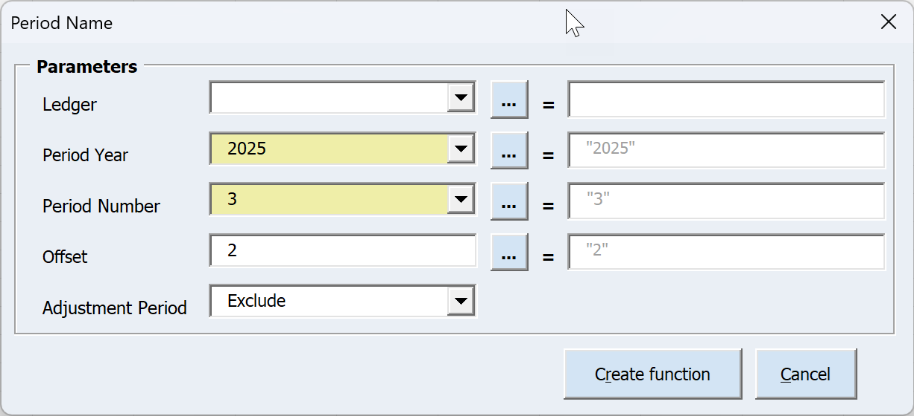

**Formula:** `br_period_name("2025","3",,"2","Exclude")`

**Parameters:**

| Parameter | Description |
|-----------|-------------|
| **Ledger** | If this parameter is left blank, the system will evaluate using the ledger selected in the dropdown menu. |
| **Period Year** | The year that you want the period name for. |
| **Period Number** | The period number that you want the period name for. |
| **Offset** | Enter a numerical value to retrieve period names relative to your specified criteria. |
| **Adjustment Period** | Use this parameter to control how adjustment periods are handled. Exclude: Adjustment periods are filtered out. |

#### Daily Rate

Returns the daily currency conversion rate for the selected currencies, date and conversion type.

**Formula:** `br_daily_rate("USD","EUR","Corporate","23-Apr-2025")`

**Parameters:**

| Parameter | Description |
|-----------|-------------|
| **From Currency** | The currency to convert from. |
| **To Currency** | The currency to convert to. |
| **Conversion Type** | The currency conversion type. |
| **Currency Date** | The date to convert the currencies. |

### 2.6 Refresh

The refresh buttons provide granular control over which cells are updated.

#### Refreshing Data with Pending Calculations

To refresh only cells requiring recalculation (marked as "(pending)"):
1. Click the Pending refresh button.

#### Refreshing a Sheet

To calculate an entire sheet:
1. Select the desired sheet
2. Click the Sheet refresh button

#### Refreshing Specific Ranges

To calculate selected cells:
1. Highlight your target range
   - For multiple ranges: Hold Ctrl while selecting (standard Excel behavior)
2. Click the Range refresh button

#### Refreshing the Entire Workbook

To refresh all calculations in the workbook:
1. Click the Workbook refresh button

### 2.7 Drilldown

In Blitz FSG, drilldown data is extracted through Blitz Reports such as 'GL Journal (Drilldown)' and 'GL Account Analysis (Drilldown).' Each of these reports has templates that define which columns are displayed, their sequence, and sorting order. Users can create custom templates to add, remove, sort, or reorder columns as needed. Although the report is designed to be comprehensive and cover all possible data columns, users with developer access can create a custom copy of the drilldown reports to add any missing columns if required.

#### Drill Criteria

There are two types of drill criteria sheets available:

##### Balance Drill Criteria

The Balance Criteria Sheet enables rapid extraction of detailed general ledger balances that meet specific criteria. This is particularly useful when working with large volumes of GL data, as it returns values faster than multiple individual Get Balance formulas.

**How to Use:**

1. **Enter Extraction Parameters**
   - Criteria mirror the Get Balance function parameters and operate identically.
   - Manually type values or select from a list by double-clicking the target cell.

2. **Define Your Criteria**
   - Period: Enter the fiscal period.
   - Amount Type: YTD (extracts all journal lines for the year), QTD (extracts journals for the quarter).
   - Currency Code: Enter the currency code.
   - Balance Type: E (Entered) or T (Translated); use Total for Oracle R12. A (Actual), B (Budget), or E (Encumbrance).
   - For B/E, specify the Budget Name or Encumbrance Type.
   - Segment Values: Populate as needed.
   - Ledger: Adjust if required.
   - Journal Source/Category: Optional filter to narrow results.

3. **Execute**
   - Click Execute Drilldown to run the report.
   - From there, you can further drill down into: Individual journals, Related subledger entries, Journal attachments.

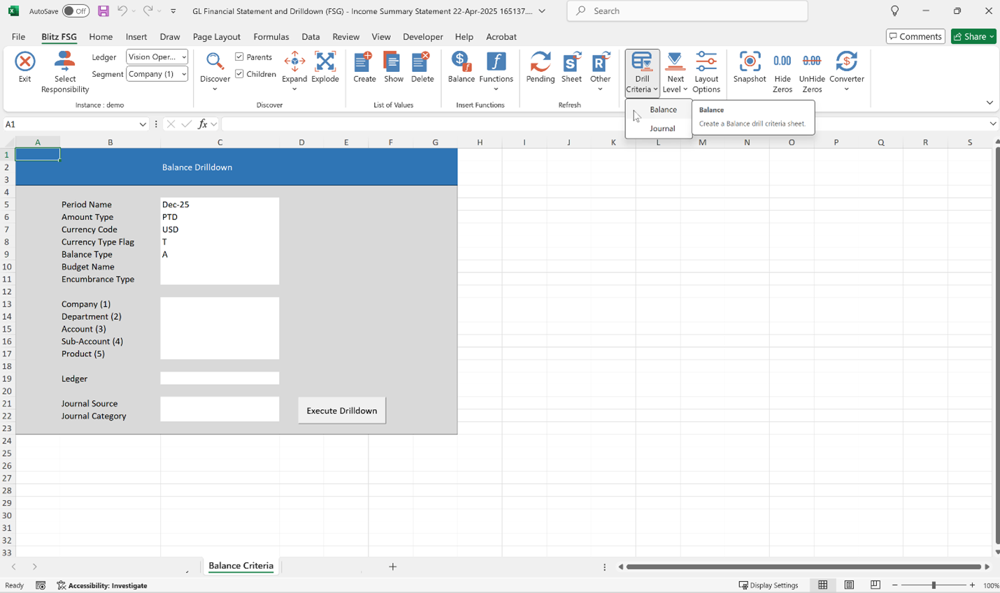

##### Journal Extract Drill Criteria

The Journal Extract Drill Criteria Sheet enables users to extract journal entries based on specified criteria.

**How to Use:**

1. **Enter Extraction Parameters**
   - Manually type values or select from a list by double-clicking the field (where applicable).
   - Single values supported for parameters like Batch and Journal Name.
   - Ranges/lists are supported for journal parameters like Source, Category, Budget Name and Encumbrance.
   - Date Parameters like Date Created / Posted Date: Dates are treated as inclusive. Time components are ignored.
   - Created By: Enter a valid Oracle username.

2. **Execute**
   - Click Execute Drilldown button to run the report.
   - From there, you can further drilldown into: Associated subledger entries, Journal attachments.

#### Next Level Drilldown

To drill down to Balance, Journal, or Subledger data from the balance sheet:

1. **Single selection:**
   - Select one balance
   - Choose Next Level Drilldown > [desired option]

2. **Multiple selections:**
   - Select multiple balances
   - Click Next Level Drilldown > [desired option]

To drill down further for multiple rows on the Balance/Journal Drilldown sheet:
1. Select the desired cells.
2. Right-click and choose "Journal Drilldown" from the context menu.

Select a Next-Level Drilldown Option from the Journal Drilldown Sheet:
1. Subledger
2. Journal Attachment
3. Full Journal

- For a single-cell drilldown: Click the 'Execute Drilldown' hyperlink.
- For multiple-cell drilldown: Select the desired cells, right-click, and choose the next-level drilldown option.

Drill down to transaction details and access the relevant Oracle EBS form for deeper analysis.

#### Layout Options

After defining the templates in Blitz Reports, follow the steps below to select your preferred drilldown data.

1. Click on 'Layout Options' to select the report and template for displaying the customized drilldown data.

2. The Blitz Report used for drilldown is specified here and cannot be modified by user. However, an Admin can change the referenced report through updating the below profiles settings for the corresponding drilldown:

| Drilldown Level | User Profile Name |
|-----------------|-------------------|
| GL Journal | Blitz FSG Drilldown Report GJ |
| GL Full Journal | Blitz FSG Drilldown Report GFJ |
| GL Journal Attachment | Blitz FSG Drilldown Report GJA |
| Subledger Details | Blitz FSG Drilldown Report SD |

3. Select the template created in Blitz Report assigned to the drilldowns by clicking on the dropdown menu.

4. Click 'Save' to confirm your selection as the chosen drilldown template.

5. The double-click action for a balance cell can be set to either drill down or launch the Balance Function form.

6. The drilldown can be configured to open in either a new workbook or a new worksheet.

7. The 'View Transaction' drilldown can be configured to open the transaction form either in the default responsibility or in any GL responsibility with Subledger drilldown access.

### 2.8 Tools

Under Blitz FSG Tools you can:

#### Snapshot

Use the Snapshot tool to convert your Blitz FSG report into static values.

This feature:
- Removes all Blitz FSG functions from the workbook, replacing them with the returned values.
- Preserves all other Excel formulas and formatting (only Blitz FSG functions are affected).
- Functions similarly to Excel's Paste Values, but targets Blitz FSG content exclusively.

Ideal for:
- Finalizing reports for distribution.
- Reducing file size or improving performance.
- Archiving data without live Oracle connections.

#### Hide Zeros

Hide Zeros allows you to hide rows in a report that contain only zero values. This feature is especially useful for streamlining reports with many empty rows—such as those with no balances in a given period. With just one click, you can instantly remove all zero-value rows, improving readability and presentation.

#### Unhide Zeros

This will show the rows previously hidden by the Hide Zeros feature.

### 2.9 Converter

The Blitz FSG Converter allows you to import Financial Statement Generator (FSG) report definitions from Oracle FSG, as well as third-party tools like GL Wand and Spreadsheet Server.

#### Oracle FSG

1. Click on 'Oracle FSG'

2. Select a value by double-clicking the field or clicking the dropdown to display available Oracle FSG.

3. Type to search or select from list to convert Oracle FSG.

4. Click 'Convert' to migrate to Blitz FSG

This will identify the Oracle FSG report's row set, column set, and content set, then automatically replicate the draft template.

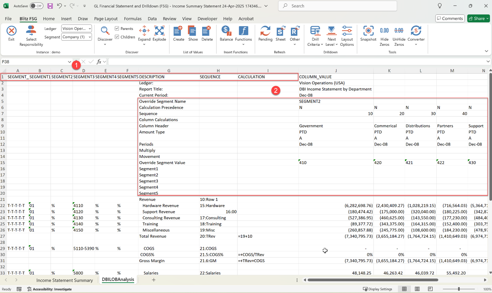

**Row set information mapped between Oracle form and Blitz FSG Excel template:**

| Oracle Row Set | Converted Blitz FSG Excel Template |
|----------------|-----------------------------------|
| Row Set > Rows > Account Assignments | Column B to Column F based on the defined chart of account segments. |
| Row Set > Rows > Account Assignments > Display | Column A – Segment Type |
| Row Set > Rows > Line Item | Column G – Description |
| Row Set > Rows > Line : Row Name | Column H – Sequence |
| Row Set > Rows > Calculations | Column I – Calculations |

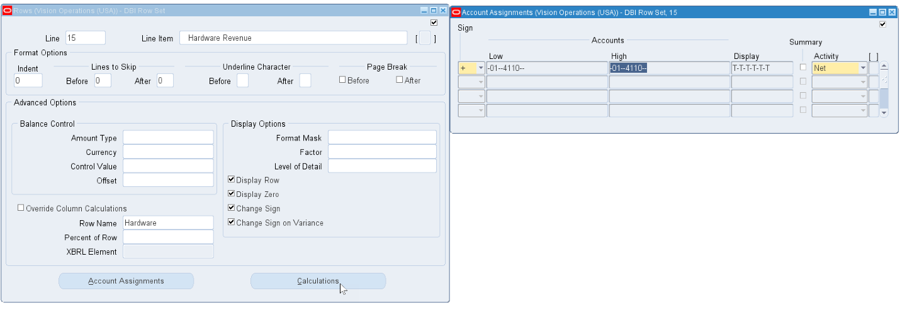

**Column set information mapped between Oracle form and Blitz FSG Excel template:**

| Oracle Column Set | Converted Blitz FSG Excel Template |
|-------------------|-----------------------------------|
| Column Set > Override Segment | Row 5 : Override Segment Name |
| Column Set > Column > Override Row Calculations | Row 6 : Calculation Precedence |
| Column Set > Column > Sequence | Row 7 : Sequence |
| Column Set > Column > Calculation | Row 8 : Column Calculations |
| Column Set > Column > Column Name | Row 9 : Column Header |
| Column Set > Column > Amount Type | Row 10 : Amount Type – Calculated based on the Amount type |
| Column Set > Column > Amount Type | Row 11 – Calculated based on the Amount type |
| Column Set > Column > Offset | Row 12 : Periods – Calculated based on the defined offset. If Offset is not defined this is equated to Period Name LOV Cell. If Offset is defined then the formula br_period_offset is used. |
| Column Set > Column > Account Assignments > Sign | Row 13 : Multiply |
| Column Set > Column > Account Assignments > Activity | Row 14 : Movement |
| Column Set > Column > Override Value | Row 15 : Override Segment Value |
| Column Set > Column > Account Assignments | Row 16 to Row 20 based on the defined chart of account segments. |

**Content set information mapped between Oracle form and Blitz FSG Excel template:**

For Rows 50–54 in the example above, the template should be repeated for each populated segment. The values should then be expanded based on the display settings assigned to the segment value.

The balance formula is prepopulated based on the defined row set and column set.

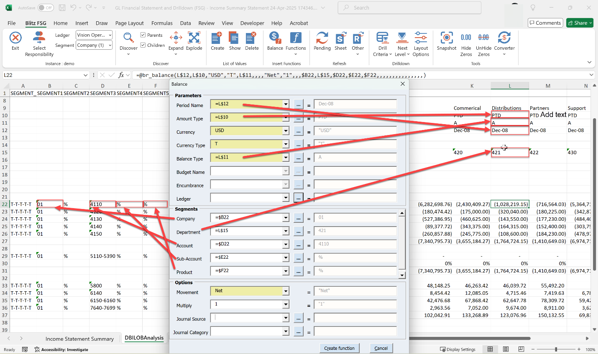

The calculations defined for the Row Set needs to be done manually as shown in below example:

**Row Calculation Examples:**

1. Row 27 Column I = +19+10 -> This indicates the row 27 should have sum of calculations of row identified between sequence 10 to 19.
2. Row 30 Column I = +COGS/TRev -> This indicates the row 27 should divide the value present in the row identified with Row Name COGS with Row Name TRev.
3. Row 31 Column I = +TRev+COGS -> This indicates the row 27 should add the value present in the row identified with Row Name COGS with Row Name TRev.
4. Row 37 Column I = 27+22 -> This indicates the row 37 should have sum of calculations of row identified between sequence 22 to 27.
5. Row 46 Column I = 98+29 -> This indicates the row 46 should add row identified by sequence 98 and 29.
6. Row 47 Column I = +COGS+T-OE+T-Employee Exp -> This indicates the row 47 should add row identified by Row Name COGS, T-OE and T-Employee Exp.
7. Row 48 Column I = +TRev+TExp -> This indicates the row 48 should add row identified by Row Name TRev and TExp.
8. Row 49 Column I = OpenM/TExp -> This indicates the row 49 should divide the value present in the row identified with Row Name OpenM with Row Name TExp.

After completing manual adjustments using the supporting information from Oracle FSG's Row Set, Column Set, and Content Set, delete any temporary rows and columns that were added solely for reference or template construction.

Complete any remaining modifications, then finalize your templates for future use.

Upload the migrated template to make it available for later use:

1. Open Template screen.
2. Open the Excel Upload tab.
3. Click Upload.
4. Browse and select the migrated template file.
5. The template can also be shared to grant user access.

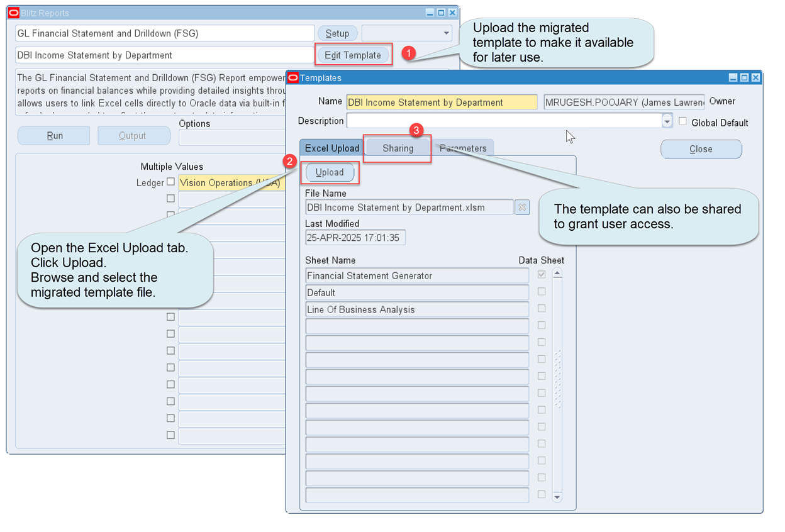

#### GL Wand & Spreadsheet Server

Open the workbook which has the legacy template and follow the below:

1. Right Click on Sheet Name and click 'Select All Sheets' in the legacy template.
2. Right Click on Sheet Name and click 'Move or Copy…'
3. Check the box 'Create a copy'
4. Select the Blitz FSG Workbook in the 'To book' list.
5. Click on 'OK' button to copy the file from legacy to Blitz FSG Template.

After copying the legacy sheets into GL Financial Statement and Drilldown (FSG) workbook in Blitz FSG:
1. Go to the Converter.
2. Select the source legacy tool (GL Wand, Spreadsheet Server) to start the migration.

## Related Links

- [Blitz Report Features](https://www.enginatics.com/blitz-report-features/)
- [Blitz Report Training Videos](https://www.enginatics.com/tutorials/)
- [Blitz Report Developer Guide](../developer_guide/README.md)
- [Blitz Report Installation Guide](https://www.enginatics.com/installation-guide/)
- [Blitz Report FAQ](https://www.enginatics.com/faq/)

*Source: [Enginatics Blitz Report User Guide](https://www.enginatics.com/blitz-report-user-guide/)*
